# TeamAgents: AI Team Crafter

<p align="center">
  <strong>Não gerencie prompts. Governe times digitais.</strong><br />
  A primeira plataforma completa para desenhar, operar e governar times de agentes de IA como produto em um workspace multi-tenant.
</p>

<p align="center">
  <a href="#por-que-existe">Por que existe</a> |
  <a href="#o-que-e-o-teamagents">O que é</a> |
  <a href="#como-um-time-digital-opera">Como opera</a> |
  <a href="#jornada-operacional">Jornada operacional</a> |
  <a href="#principais-modulos">Módulos</a> |
  <a href="#arquitetura-tecnica-do-projeto">Arquitetura técnica</a> |
  <a href="#rodando-localmente">Rodando localmente</a>
</p>

<p align="center">
  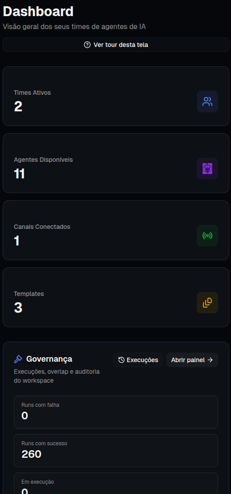
</p>

<p align="center">
  <em>O cockpit central para acompanhar times, agentes, canais, execuções e conhecimento em um só lugar.</em>
</p>

<!-- Support -->
<p align="center">
  <a href="https://www.buymeacoffee.com/almerindo" target="_blank">
    
  </a>
</p>

<!-- Core stack -->
<p align="center">
  <strong>Core Stack</strong><br />
  <a href="https://www.typescriptlang.org/">
    
  </a>
  <a href="https://nodejs.org/">
    
  </a>
  <a href="https://nextjs.org/">
    
  </a>
  <a href="https://fastify.dev/">
    
  </a>
</p>

<!-- AI / Agents -->
<p align="center">
  <strong>AI / Agents</strong><br />
  
  
</p>

<!-- Channels / Adapters -->
<p align="center">
  <strong>Channels / Adapters</strong><br />
  
  
  
  
  
  
  
  
  
</p>

<!-- License -->
<p align="center">
  <strong>License</strong><br />
  <a href="./LICENSE">
    
  </a>
</p>

---

## Por que existe

A IA atual é poderosa, mas muitas empresas ainda tentam operar inteligência artificial como se tudo fosse apenas um prompt bem escrito.

Isso cria três problemas recorrentes:

| Problema | Impacto na operação |
| --- | --- |
| **Prompts isolados** | Não escalam para fluxos complexos, times maiores ou processos contínuos. |
| **Caixa preta** | Ninguém sabe exatamente quem executou, quando executou, qual decisão foi tomada e por quê. |
| **Conhecimento disperso** | A IA depende de improviso, memória individual e documentos desconectados da operação. |

O TeamAgents nasce para resolver isso: transformar agentes de IA em **times operacionais estruturados**, com papéis claros, ferramentas, canais, memória institucional, execução auditável, governança e observabilidade.

---

## O que é o TeamAgents

O **TeamAgents: AI Team Crafter** é uma plataforma para empresas, builders e líderes de operação que querem sair da fase de experimentos com prompts e avançar para uma operação real com times digitais.

Em vez de criar apenas um chatbot, você desenha uma equipe: agentes especialistas, responsabilidades, ferramentas, canais de entrada, grafo de colaboração, trilhas de execução, templates reutilizáveis e conhecimento corporativo conectado.

> **Da era do prompt para a era da operação.**
>
> O futuro da IA corporativa não é apenas gerar respostas. É operar processos com visibilidade, controle e responsabilidade.

### Para quem é

- **Líderes de operação** que precisam colocar IA em produção com segurança e rastreabilidade.
- **Builders de IA** que querem criar times digitais reutilizáveis e conectados a ferramentas reais.
- **Squads de produto e engenharia** que precisam modelar fluxos com agentes, integrações, canais e observabilidade.
- **Empresas multiárea ou multicliente** que precisam separar workspaces, equipes, permissões, templates e conhecimento.

### O que a plataforma entrega

| Capacidade | O que resolve |
| --- | --- |
| **AI Team Crafter** | Cria times de agentes a partir de um objetivo de negócio. |
| **Catálogo de agentes** | Organiza especialistas digitais por função, competência e papel operacional. |
| **Catálogo de times** | Permite visualizar e reutilizar equipes digitais prontas para diferentes demandas. |
| **Orquestração em grafo** | Mostra como responsabilidades, coordenação e validação se conectam. |
| **Tools integradas** | Dá mãos e ação aos agentes para consultar APIs, sistemas e bancos de dados. |
| **Canais de entrada** | Conecta WhatsApp/SMS, e-mail, Slack/Teams e sistemas web à operação. |
| **Escritório virtual** | Permite acompanhar o trabalho dos agentes em tempo real, sem caixa preta. |
| **Execuções auditáveis** | Mantém histórico do que foi rodado, por quem, quando e com qual resultado. |
| **Governança** | Define regras, limites, aprovações, trilhas e evidências. |
| **Observabilidade** | Acompanha saúde da operação, métricas, gargalos e tendências. |
| **Second Brain** | Conecta documentação, políticas, contexto e memória institucional aos agentes. |
| **Templates** | Transforma operações bem-sucedidas em modelos escaláveis e reutilizáveis. |

---

## A grande mudança: de prompt solto para time governado

| Ontem: era do prompt | Hoje: padrão TeamAgents |
| --- | --- |
| Prompts soltos e isolados | Times operacionais estruturados |
| Execução em caixas pretas | Visibilidade total do raciocínio e da execução |
| Improviso e tentativa/erro | Fluxos modelados, revisáveis e auditáveis |
| Conhecimento disperso | Second Brain como memória viva da corporação |
| Chatbot genérico | Especialistas digitais com papéis, ferramentas e missão |
| Automação frágil | Operação com governança, métricas e melhoria contínua |

---

## Como um time digital opera

Um time digital recebe demandas por canais reais, passa por um agente coordenador e distribui o trabalho para especialistas com papéis claros. Cada execução pode consultar tools, usar conhecimento do Second Brain, registrar evidências e alimentar governança e observabilidade.

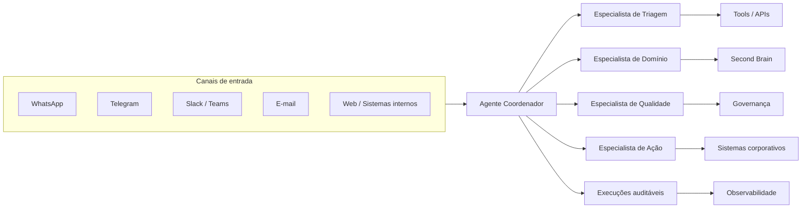

---

## Jornada operacional

O TeamAgents organiza o ciclo completo de adoção de IA operacional em cinco etapas:

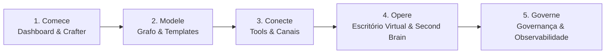

1. **Comece** descrevendo o objetivo de negócio e entendendo o estado atual do workspace.
2. **Modele** responsabilidades, coordenação, validação e caminhos de execução no grafo.
3. **Conecte** agentes a tools, APIs, sistemas internos e canais reais de entrada.
4. **Opere** acompanhando execuções no escritório virtual e mantendo contexto no Second Brain.
5. **Governe** com métricas, regras, limites, evidências e observabilidade.

---

## Principais módulos

### Cockpit central de operações

O dashboard reúne times, canais, execuções e conhecimento em uma única tela. É o ponto de partida para líderes e builders entenderem o que está ativo, o que precisa de atenção e quais módulos devem ser acessados.

<p align="center">
  
</p>

### AI Team Crafter

Não comece do zero. Descreva a necessidade da empresa e deixe o Crafter sugerir uma estrutura inicial de agentes, papéis, responsabilidades e colaboração.

Exemplo:

> “Preciso de um time de suporte técnico que faça triagem, resolva dúvidas recorrentes e escale incidentes críticos.”

A plataforma pode transformar esse objetivo em uma equipe com agente de triagem, agente de resolução, agente de qualidade, agente coordenador e tools adequadas.

### Catálogo de agentes

Abandone chatbots genéricos. Organize especialistas digitais com função clara, escopo definido, competências, tools e papel dentro da operação.

<p align="center">
  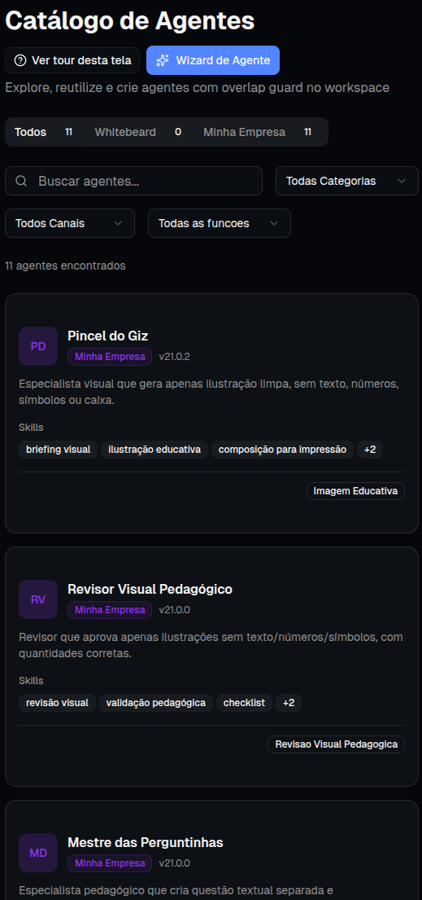
</p>

### Catálogo de times

Visualize e compare equipes digitais prontas para diferentes áreas: backoffice, vendas, atendimento, análise documental, suporte, jurídico, financeiro ou qualquer fluxo corporativo.

<p align="center">
  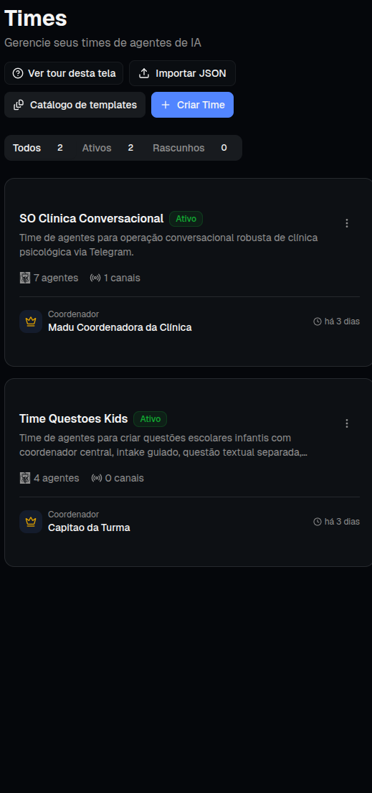
</p>

### Console do time

Cada time possui uma área operacional própria, com missão, membros, capacidades, sinais de execução e atalhos para grafo, escritório virtual, ferramentas e integrações.

<p align="center">
  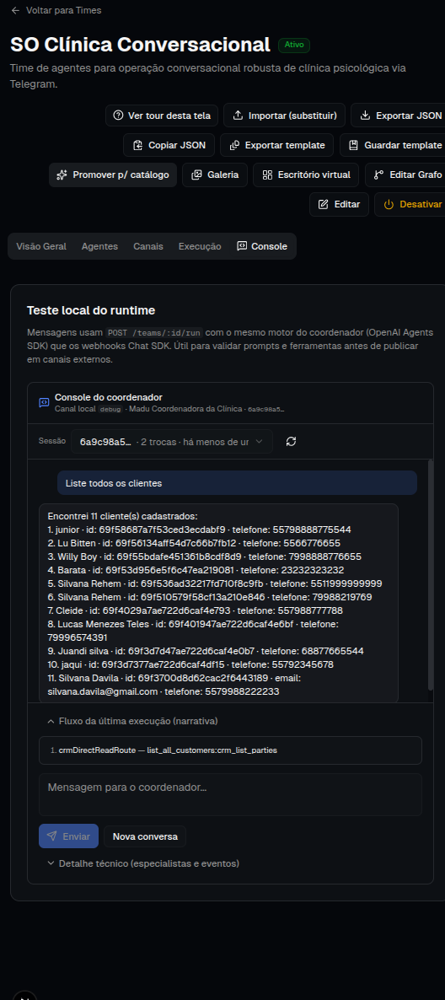
</p>

### Orquestração em grafo

Chega de achismos. O grafo mostra como os agentes colaboram, quem coordena, quem executa, quem valida e quais caminhos a execução pode seguir.

<p align="center">
  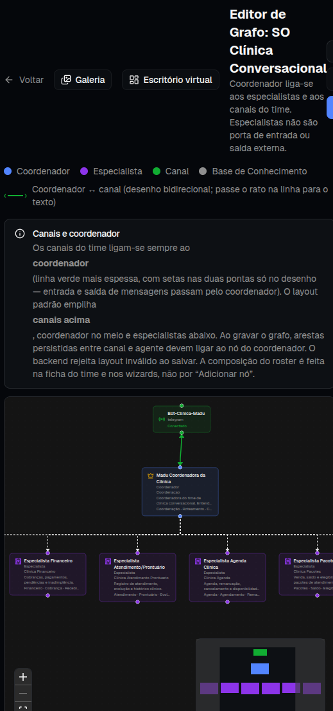
</p>

### Tools e integrações operacionais

As tools dão ação aos agentes. Elas permitem consultar sistemas, acessar dados, chamar APIs, registrar informações, executar tarefas e integrar a IA à infraestrutura real da empresa.

<p align="center">
  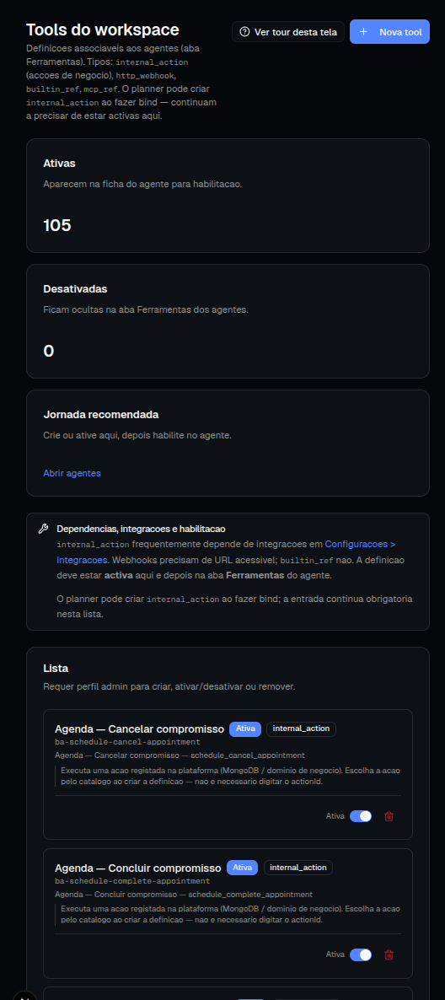
</p>

### Canais onde o negócio já acontece

Clientes e operadores não precisam aprender um sistema novo para cada processo. O TeamAgents centraliza canais de entrada e prepara o workspace para atuar onde a empresa já trabalha.

<p align="center">
  
  
  
  
  
  
  
  
</p>

<p align="center">
  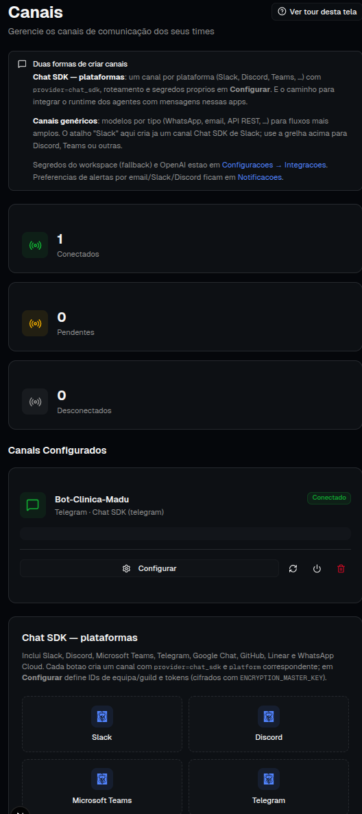
</p>

### Escritório virtual

O escritório virtual desfaz a caixa preta da IA. Ele permite acompanhar o time digital trabalhando, com timeline, status, contexto e sinais visuais de progresso.

<p align="center">
  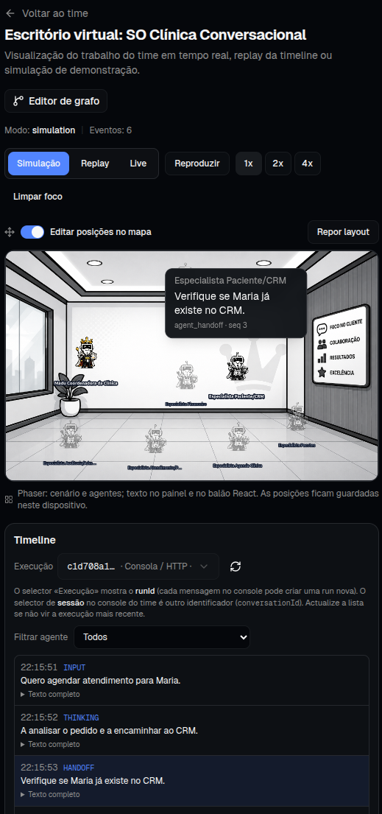
</p>

### Execuções auditáveis

A plataforma registra o histórico de execuções para responder o que foi executado, quando aconteceu, quais agentes participaram, qual caminho lógico foi seguido e qual foi o resultado.

<p align="center">
  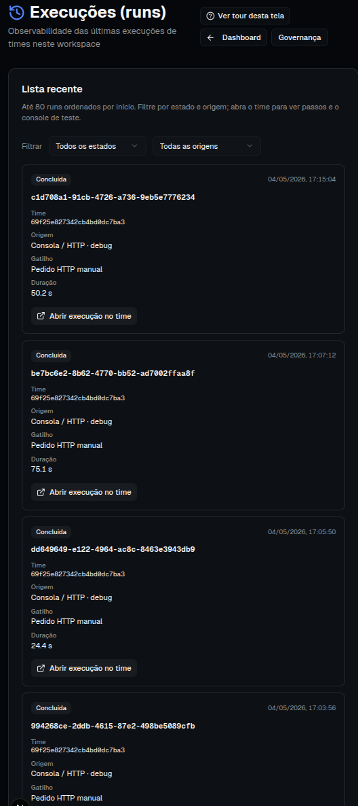
</p>

### Governança para produção

Colocar IA em produção exige responsabilidade. O módulo de governança centraliza regras, limites, controles, trilhas e evidências para ambientes corporativos.

<p align="center">
  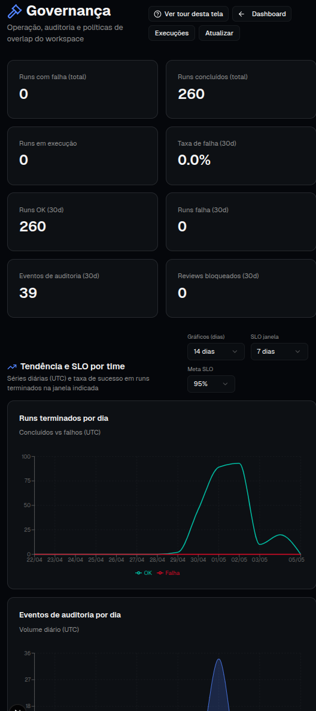
</p>

### Observabilidade constante

A operação precisa ser medida. O módulo de observabilidade ajuda a acompanhar saúde, métricas, tendências, gargalos e comportamento dos times digitais ao longo do tempo.

<p align="center">
  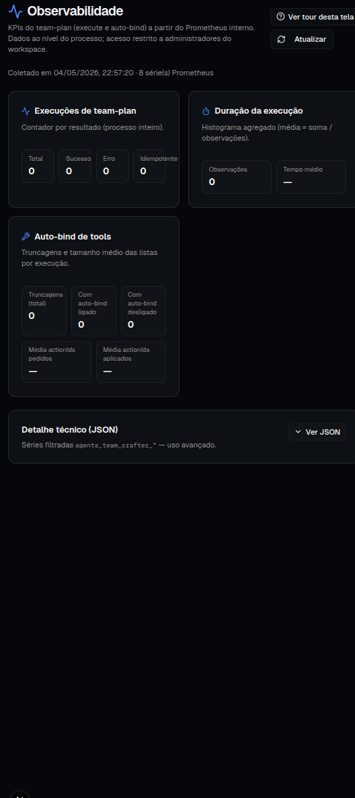
</p>

### Second Brain: memória viva da corporação

O Second Brain mantém documentação, políticas, contexto e conhecimento próximos dos agentes. O objetivo é reduzir improviso e aproximar operação, documentação e tomada de decisão.

<p align="center">
  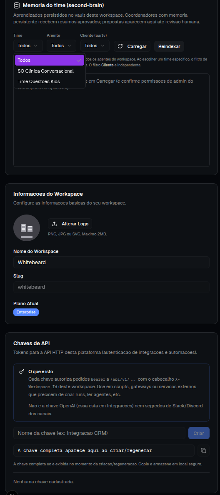
</p>

### Templates para escalar o que funciona

Quando uma operação atinge maturidade, ela pode virar template. Assim, times, grafos, playbooks e modelos de execução podem ser reutilizados em novos contextos, departamentos, clientes ou verticais.

<p align="center">
  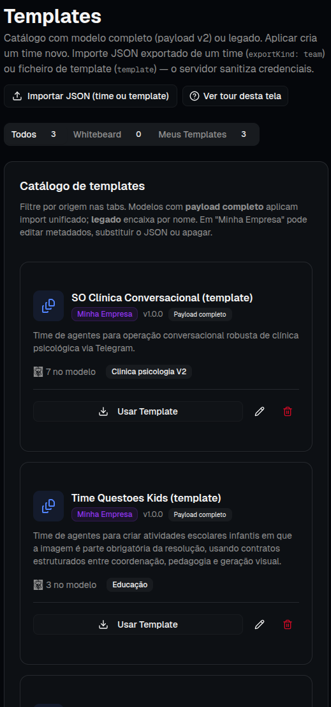
</p>

### Administração do workspace

O workspace inclui áreas para configurações, times, convites e integrações. Isso permite escalar o uso da plataforma com organização, separação de responsabilidades e controle operacional.

<p align="center">
  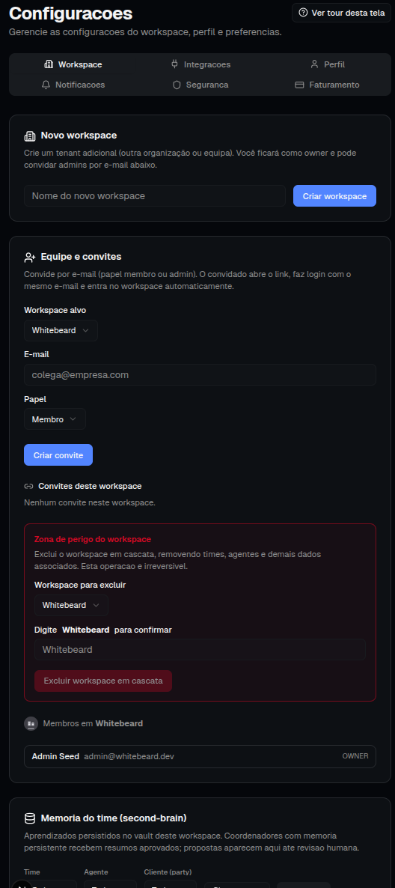
</p>

<p align="center">
  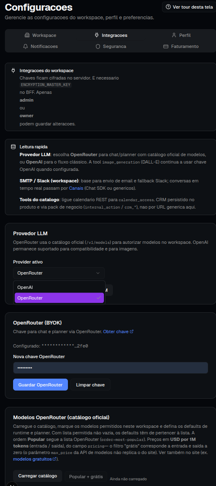
</p>

---

## Casos de uso

| Caso de uso | Exemplo de time digital |
| --- | --- |
| **Suporte técnico** | Triagem, resolução, validação de qualidade e escalonamento. |
| **Backoffice operacional** | Conferência, enriquecimento de dados, análise de exceções e registro em sistemas. |
| **Atendimento comercial** | Qualificação, proposta, follow-up e passagem para humano. |
| **Análise documental** | Extração, validação, classificação, risco e emissão de parecer. |
| **Governança de IA** | Revisão de execuções, auditoria, limites, políticas e evidências. |
| **Operações multi-cliente** | Workspaces separados, templates reutilizáveis e acompanhamento centralizado. |

---

## Diferenciais

### IA criando IA

O módulo Crafter ajuda a sair de uma intenção de negócio para uma estrutura inicial de time digital, reduzindo o tempo entre ideia e operação.

### Operação visível

Grafo, escritório virtual e execuções auditáveis tornam o trabalho dos agentes visível, revisável e gerenciável.

### Governança desde o início

A plataforma trata regras, evidências, limites, histórico e observabilidade como parte do produto, não como uma camada adicionada depois.

### Memória institucional conectada

O Second Brain reduz dependência de conhecimento espalhado e aproxima os agentes das políticas, documentos e aprendizados da empresa.

### Escala por templates

Quando algo funciona, vira modelo. A empresa deixa de depender de configuração artesanal e passa a escalar padrões comprovados.

---

## Arquitetura técnica do projeto

O TeamAgents combina uma aplicação web em Next.js com um backend/BFF em Fastify. O frontend entrega a experiência de operação, enquanto o BFF centraliza autenticação, workspace, orquestração de agentes, integrações, canais, persistência e exposição de APIs.

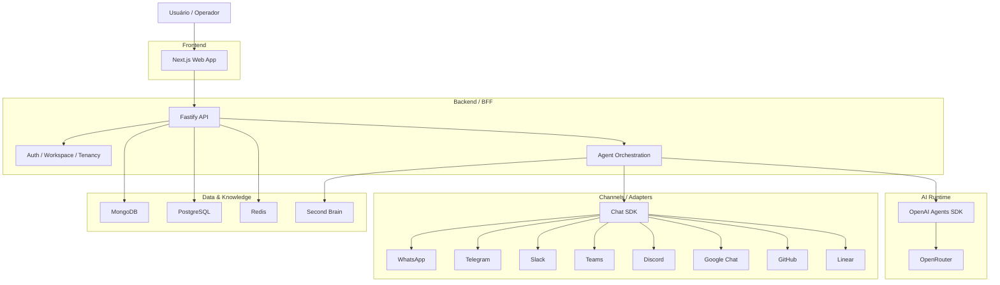

---

## Estrutura do repositório

Este repositório é um monorepo com backend BFF em Fastify e frontend web em Next.js.

```text
.
├── backend/              # API BFF Fastify, rotas, persistência e integrações
├── v0-team-ai-crafter/   # Aplicação web Next.js da plataforma
├── docs/                 # Imagens e materiais de documentação
└── docker-compose.yml    # Serviços de apoio para desenvolvimento local
```

---

## Rodando localmente

> **Instalação guiada (recomendada para primeira vez):** [docs/setup-wizard.md](./docs/setup-wizard.md) — execute `./setup.sh` num clone limpo (Docker Compose + Mongo local, dados só nesta pasta).
>
> Guia manual completo: [docs/rodando-localmente.md](./docs/rodando-localmente.md).
> Ele cobre pré-requisitos, arquivos `.env`, MongoDB/Redis, seed, IA, modelos de imagem e testes locais.

### Backend

```bash
cd backend
npm install
npm run dev
```

### Frontend

```bash
cd v0-team-ai-crafter
npm install
npm run dev
```

Também existe suporte a Docker Compose na raiz do repositório para subir serviços de apoio, backend e frontend conforme as variáveis de ambiente do projeto.

---

## Roadmap conceitual

- Evoluir o Crafter para gerar times cada vez mais aderentes ao objetivo de negócio.
- Fortalecer a orquestração em grafo como camada visual e operacional do time.
- Ampliar conectores de canais e ferramentas.
- Aprimorar histórico de execuções, governança e observabilidade.
- Expandir Second Brain e templates para acelerar adoção multiárea e multicliente.

---

## Versão

Primeira versão publicada no repositório: **v1**.

---

## Licença e uso

Este projeto é **código aberto** e está licenciado sob a **Whitebeard Non-Commercial Open Source License v1.0** (arquivo [`LICENSE`](./LICENSE)).

- Uso permitido para fins **não comerciais** e **pessoais**.
- Qualquer uso, modificação ou redistribuição deve **referenciar o projeto original**, a **Whitebeard** como proprietária intelectual e o autor **almerindo** no GitHub.
- Uso comercial **não é permitido** sem autorização prévia por escrito.
- Em caso de interesse comercial, abra uma Issue neste repositório para iniciar o contato com o projeto/empresa.

---

## Contribuições da comunidade

Contribuições são bem-vindas para fortalecer e evoluir o projeto.

Você pode contribuir:

- abrindo **Issues** para reportar problemas, sugerir melhorias ou discutir ideias;
- enviando **Pull Requests** com correções, documentação e evoluções;
- propondo novos templates, agentes, tools, canais ou melhorias de governança.

---

## Apoie o projeto

Se este projeto te ajuda e você quiser apoiar sua continuidade, considere uma doação:

👉 https://buymeacoffee.com/almerindo

---

<p align="center">
  <strong>Construa o futuro operacional da sua empresa hoje.</strong><br />
  Crie, opere e governe times de inteligência artificial com clareza, rastreabilidade e escala.
</p>
