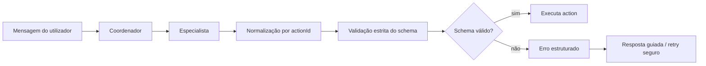

# Ralph Loop 98 — Endurecimento de contrato das tools no runtime, prompts e auto-correção determinística

## Decisão oficial

**O contrato das tools é garantido pelo sistema, não apenas pela LLM/prompt.**

Prompt continua importante para intenção e coleta de dados, mas a execução de `internal_action` e demais tools de negócio deve ser protegida por boundary determinístico.

## Contexto (ligação com Loops anteriores)

- **Loop 87** consolidou fundação de especialistas operacionais, schemas estritos e `MISSING_REQUIRED_FIELDS`.
- **Loop 97** consolidou o caso CRM de alias semântico (`nome completo`) para chave canónica (`displayName`) com diagnóstico via `submittedInput`.

O Loop 98 generaliza essa lição para política transversal multi-pack.

## Problema de produto que este loop fecha

Mesmo com prompt “bem escrito”, a LLM pode:

- usar alias semântico em vez da chave canónica;
- omitir campo obrigatório;
- enviar payload parcialmente estruturado;
- repetir a mesma call inválida em retry cego.

Logo, o sistema precisa impedir execução fora do contrato e orientar correção com base em erro estruturado.

## Norma transversal de contrato de tools

Para qualquer action/tool de negócio:

1. **Schema canónico soberano** por `actionId` (a normalização não substitui o schema).
2. **Normalização controlada por `actionId`** (auditável, testável, sem heurística genérica solta).
3. **Validação estrita no runtime** antes da execução.
4. **Retry seguro, limitado e orientado por diagnóstico** (sem repetição cega).
5. **Observabilidade/auditoria obrigatória** do input bruto, normalizado e rejeitado.

## Pipeline canónico de boundary

## Contrato mínimo de observabilidade/erro

Quando houver falha de contrato (ex.: `MISSING_REQUIRED_FIELDS`, `EXECUTION_ERROR`, `UNKNOWN_ACTION`), registar quando seguro:

- `actionId`
- `toolDefinitionId`
- `correlationId`
- `rawInput`
- `normalizedInput`
- `submittedInput`
- `missingFields`
- `validationResult`
- `errorCode`

## Política oficial de retry

- **`MISSING_REQUIRED_FIELDS`**: não repetir automaticamente payload idêntico; um retry é permitido apenas com transformação objetiva (ex.: normalização controlada aplicada).
- **`EXECUTION_ERROR`**: retry apenas para ação idempotente e erro claramente transitório.
- **`UNKNOWN_ACTION`**: nunca retry cego.

## Anti-padrões proibidos

1. Relaxar schema crítico só para “dar certo”.
2. Retry automático infinito.
3. Normalização mágica genérica sem `actionId`.
4. Mensagem de suporte sem `submittedInput`.
5. Prompt prometendo garantia absoluta sem enforcement no runtime.

## Roadmap em slices (98.1 → 98.9)

### 98.1 — Norma oficial de produto/engenharia
- Registrar regra oficial no plano mestre e ledger.
- Referência cruzada explícita com Loops 87 e 97.

### 98.2 — Pipeline canónico do boundary
- Formalizar sequência: `rawInput` → normalização por `actionId` → validação → execução → auditoria.

### 98.3 — Observabilidade obrigatória
- Padronizar trilha de diagnóstico para erros de contrato.

### 98.4 — Retry seguro e limitado
- Bloquear retry cego; habilitar somente retry orientado por diagnóstico.

### 98.5 — Contrato explícito de prompts
- Prompt passa a colaborar com runtime endurecido (sem “garantia mágica”).

### 98.6 — Biblioteca de normalização por action
- Aliases permitidos + transforms simples + testes por action.

### 98.7 — Matriz de segurança por action
- Classe A (segura), B (cautela), C (sem normalização automática).

### 98.8 — Debug conversacional e UX de incidente
- Narrativa completa de falha na UI/debug.

### 98.9 — Regressão por pack
- Testes mínimos por vertical (CRM, Finance, Scheduling, etc.).

## Ordem recomendada

1. **98.1** (norma oficial)
2. **98.2** (pipeline canónico)
3. **98.3** (observabilidade)
4. **98.4** (retry seguro)
5. **98.5** (prompts alinhados)
6. **98.6** (biblioteca de normalização)
7. **98.7** (matriz de segurança)
8. **98.8** (debug/UX)
9. **98.9** (regressão por pack)

## Critério de aceite do Loop 98

O loop fecha bem quando:

- a norma estiver canónica em `docs/RALPHLOOP`;
- existir referência explícita à limitação de prompt-only;
- roadmap estiver fatiado em slices pequenos e verificáveis;
- a direção para normalização controlada, validação estrita, retry seguro e observabilidade ficar inequívoca.
