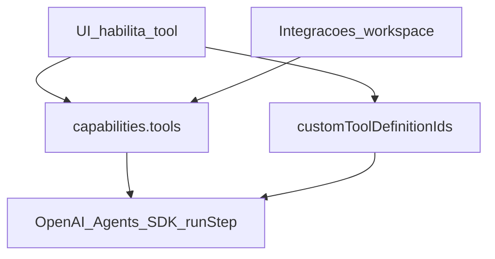
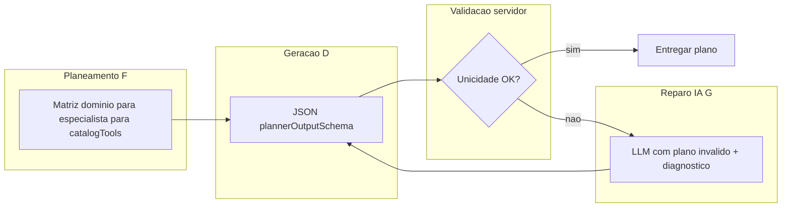

# Plano de evolução do `whitebeardit/agents-team-crafter`

> **Estado atual da implementação:** a fonte oficial de retomada do Ralph Loop continua sendo o ledger `agents-team-crafter-plano-evolucao_IMPLEMENTADO.md`.  
> Este documento segue como **plano mestre e visão de produto**.  
> A partir desta revisão, o roadmap passa a incluir explicitamente a nova frente **Business Tools Platform / Packs Multi-tenant**.
> Regra operacional do Ralph Loop: ao final de cada etapa/loop oficialmente concluído, fazer **commit de tudo** e **push** antes de registrar o encerramento no ledger.

## Objetivo

Evoluir o projeto para atender, de forma consistente, os objetivos do produto:

- **multi-tenant**
- **criação muito fácil e fluida de agentes e times**
- **wizard assistido por IA**
- **um coordenador sempre centralizando a comunicação com os canais**
- **especialistas sem sobreposição de função dentro do mesmo tenant/workspace**
- **controle do que está sendo executado**
- **visualização em tempo real**
- **UX simples, guiada e coerente com o runtime real**
- **UI/UX responsiva para desktop, tablet e celular**
- **onboarding contextual por tela, com tour reexecutável sob demanda**
- **capabilities reais de negócio reutilizáveis por múltiplos agentes e times**

---

# 1. Decisão executiva

## Decisão: adotar a base atual e evoluir incrementalmente

**Não reescrever o projeto.**

A base atual já está boa em pontos centrais:

1. multi-tenant por workspace
2. runtime com coordenador como agente principal
3. especialistas como tools do coordenador
4. Chat SDK integrado
5. OpenAI Agents SDK integrado
6. SSE / live updates
7. team planner assistido por IA
8. editor de grafo já simplificado para o modelo coordinator-first
9. BFF Fastify + MongoDB modular

## O que isso significa na prática

A estratégia correta é:

- preservar o que já está certo
- continuar endurecendo governança e execução
- transformar tools em **capabilities reais de negócio**
- permitir reutilização dessas capabilities em múltiplos times/agentes
- ensinar o AI Builder a montar times já com **packs e tools reais**
- manter UX simples, responsiva e explicativa

---

# 2. O que deve ser mantido

## 2.1 Multi-tenancy por `workspaceId`
Manter.

## 2.2 Runtime coordinator-first
Manter e fortalecer.

### Regra definitiva
- canais entram no coordenador
- resposta externa sai pelo coordenador
- especialistas executam subtarefas
- especialistas não são porta de entrada/saída

## 2.3 Chat SDK
Manter.

## 2.4 Live mode / SSE
Manter e evoluir.

## 2.5 Team planner
Manter e expandir.

## 2.6 Ferramentas OpenAI Agents SDK: utilizáveis vs apenas habilitadas

O runtime expõe function tools ao modelo via OpenAI Agents SDK (`runStep` do especialista). Na UI, **habilitar** uma ferramenta **não** garante, por si só, execução com efeito real no mundo: é preciso alinhar três eixos (matriz técnica em [`docs/UI-RUNTIME-AGENT.md`](UI-RUNTIME-AGENT.md)):

1. **Catálogo no agente** — `capabilities.tools` (IDs canónicos; parte dos IDs só ganha executor real quando existem integrações).
2. **Tools do workspace** — `capabilities.customToolDefinitionIds` → `WorkspaceToolDefinition` (`http_webhook`, `internal_action`, `mcp_ref`, `builtin_ref`): cada tipo tem pré-condições próprias (URL, `actionId`, MCP HTTP, etc.).
3. **Integrações do workspace** — segredos e URLs em Configurações que alimentam executores do catálogo (por exemplo Postgres read-only, CRM, calendário, chave OpenAI para imagens).

Fluxo **coordenador → especialista → `internal_action` → MongoDB** e catálogo `GET /business-actions/catalog`: ver subsecção em [`UI-RUNTIME-AGENT.md`](UI-RUNTIME-AGENT.md) (Coordenador vs especialista / Domínio de negócio).

**Roadmap de UX (Tools do workspace):** o [Loop 59](#loop-59--catálogo-de-ações-de-negócio--ux-guiada-internal_action) cobriu criação guiada **uma `internal_action` de cada vez**; o [Loop 61](#loop-61--criação-em-lote-de-tools-ação-interna-negócio-ux) prevê **seleção múltipla e criação em lote** para reduzir atrito quando se pretendem várias ações de negócio no mesmo workspace.

**Roadmap de UX (AI Builder / team plan):** o [Loop 62](#loop-62--transparência-do-fallback-do-team-planner-ai-builder) expõe na UI `plannerMeta.fallbackReason` e `parseErrorSummary` quando o plano é gerado em modo template, para o utilizador identificar a causa sem inspecionar a rede.

**Regra de produto:** marcar uma tool na UI só produz efeito útil quando as **pré-condições** estão satisfeitas (integração configurada, webhook acessível e autenticado, MCP com endpoint HTTP, ou `internal_action` com `actionId` registado no runtime de negócio). Caso contrário, o utilizador pode ver apenas **stub** ou **placeholder** honesto no output da tool.

**Ralph Loop — critério de aceite ao fechar um loop que toque em ferramentas:** no encerramento do ciclo (e no texto do ledger), declarar explicitamente:

- quais IDs ou tipos de tool ficam **executáveis de verdade** naquele slice;
- o que permanece **stub** ou **placeholder** (e porquê);
- se o `backend` ganhou testes que cobrem o ramo feliz ou o comportamento de indisponibilidade explícita.

Esta subsecção é o **contrato de roadmap** para não confundir “checkbox na ficha do agente” com “capacidade de produção”. O **plano de entrega** correspondente na ETAPA 9 continua na [secção 14](#14-etapa-9--paridade-de-produção-configurações-e-operação) (paridade de UX com backend, explicações operacionais sobre catálogo e validação de tools).

Referência de arquitetura do runtime e handoff: [`docs/ADR-0001-agents-runtime-handoff-deterministico.md`](ADR-0001-agents-runtime-handoff-deterministico.md).

### Seleção de ferramentas por domínio do agente e defaults na criação de times

**Norma de produto:**

1. **Builtins visíveis = já ativas para aquele agente** — Na criação de um time, quando a UI mostrar as ferramentas **builtin** (catálogo Agents SDK / `capabilities.tools`) na ficha de cada **especialista**, as entradas apresentadas devem corresponder **somente** às tools que **esse** agente precisa para o seu papel; e essas entradas devem surgir **já selecionadas e ativadas** no agente, em vez de listas genéricas desmarcadas ou um pacote idêntico copiado para todos os especialistas sem critério de domínio.

2. **Seleção por domínio, não por “template único”** — A escolha de ferramentas é **por domínio de responsabilidade do agente**. Dois especialistas com **papéis ou domínios distintos** não devem, por defeito, partilhar o **mesmo** conjunto de tools só porque estão no mesmo time: cada um recebe o **subconjunto mínimo** coerente com o seu domínio (o que reduz ambiguidade para o modelo e evita expor capacidades irrelevantes).

3. **Um especialista por domínio de assunto** — Dentro do mesmo time, **apenas um** especialista **define a resposta** e a **propriedade operacional** sobre um **domínio de assunto** (ex.: CRM, contas a receber, agendamento clínico, GitHub Ops). O coordenador roteia; os especialistas não competem pelo mesmo tema. Isto alinha-se à governança de não-sobreposição já prevista no produto e evita handoffs ambíguos no runtime coordinator-first.

4. **Identificar builtins necessárias ao desenhar cada especialista** — Antes de fixar papéis e outputs do plano (incluindo geração por IA), deve ficar explícito **se** e **quais** entradas do catálogo builtin (`capabilities.tools` / `catalogTools` no JSON do planner) cada especialista precisa para cumprir o seu domínio. O modelo gerador **não** deve atribuir tools “por hábito” nem copiar listas entre agentes: para cada especialista, a decisão é **intencional** (lista justificável pelo papel).

5. **Sem duplicação de builtins de negócio entre especialistas** — Duas regras em conjunto:
   - **Definição operacional:** tratam-se como **builtins de negócio** as ferramentas do catálogo cuja função primária é servir um **domínio de negócio** (ex.: CRM, finanças do workspace, cuidados, operações sobre dados de negócio), em contraste com utilitários genéricos de apoio ao raciocínio ou I/O **quando** estes forem claramente transversais e sem semântica de dono único — a lista canónica evolui com o catálogo; ver [`operational-catalog-tools.ts`](../backend/src/modules/agents/domain/operational-catalog-tools.ts) e a matriz em [`UI-RUNTIME-AGENT.md`](UI-RUNTIME-AGENT.md).
   - **Regra de unicidade:** no mesmo time, **dois especialistas não podem partilhar o mesmo ID** de builtin **de negócio**. Se dois papéis parecerem exigir a mesma tool de negócio, o desenho está errado: fundir responsabilidades num único especialista ou repartir **domínios** de forma que cada tool de negócio fique sob **um** dono (o coordenador continua a ser o único interface externo).
   - **Âmbito da regra:** a unicidade aplica-se ao par **`workspaceId` × team plan (mesmo time em construção)**. **Não** há conflito entre dois times no mesmo workspace, nem entre workspaces distintos: dois especialistas em **times diferentes** (ou tenants diferentes) podem listar o mesmo ID de builtin de negócio sem violar esta norma.

Esta norma complementa [§2.6](#26-ferramentas-openai-agents-sdk-utilizáveis-vs-apenas-habilitadas) (pré-condições de execução) e reforça o objetivo de **especialistas sem sobreposição de função** no [Objetivo](#objetivo). A materialização parcial no código e prompts está no [Loop 64](#loop-64--builtins-por-domínio-criação-de-time-e-ai-builder); o reforço de **prompts, validação e enforcement** está nos [Loops 77–78](#loop-77-planner-prompts-builtin-domain); o **outer loop de auto-reparo pela IA** no `POST` do planner está **entregue** no [Loop 80](#loop-80-planner-auto-repair-ia). A **simplificação da superfície do AI Builder** (preview em camadas, menos checkboxes simultâneos) está **entregue** no [Loop 81](#loop-81-ai-builder-ux-preview-simples).

### Criação assistida de time — estado actual no produto (síntese)

Fluxo actual ([`team-creation-hub.tsx`](../v0-team-ai-crafter/components/teams/team-creation-hub.tsx)): separador **Assistido por IA** → componente **`TeamAiBuilder`**. O utilizador descreve problema/contexto; o backend gera um `team plan` (com [Loop 80](#loop-80-planner-auto-repair-ia) a tratar colisões de `catalogTools` entre especialistas na geração). No cliente ([Loop 81](#loop-81-ai-builder-ux-preview-simples)), o revisar plano mostra por agente **objective** em destaque, **chips** com `catalogTools` activas e edição completa num **modal**; descrição longa, skills e pré-visualização do grafo podem ficar **recolhidos**; secções de bind/packs quando aplicável mantêm-se visíveis quando o plano sugere capabilities.

**Regra já reflectida no código (unicidade):** apenas os IDs em **`SPECIALIST_EXCLUSIVE_CATALOG_TOOL_IDS`** (6 valores, alinhados ao backend) **não podem** estar activos em **dois especialistas** do mesmo plano; **`web_search`** e **`code_execution`** **podem** repetir-se entre especialistas (são tratados como utilitários no prompt do [Loop 77](#loop-77-planner-prompts-builtin-domain)). O AI Builder já bloqueia Salvar/Executar quando há colisão de exclusivos ([Loop 78](#loop-78-enforcement-builtin-ambiguity)).

### Norma alvo — preview simples, efectivo e camadas (Ralph → Loop 81)

Objetivo de produto: **poucos cliques**, **alta legibilidade** do que vai ser criado, **ferramentas já coerentes** com o papel de cada agente, e **ajuste fino** sem poluir o primeiro ecrã.

| Camada | O quê | Critério |
| --- | --- | --- |
| **Primeira vista** | Nome do time, lista de agentes (papel + **objective** em destaque), canal principal se relevante, CTA claros (guardar / executar / regenerar). | O utilizador responde “quem faz o quê” em **&lt; 30 s** sem abrir secções avançadas. |
| **Ferramentas builtin** | Mostrar **só as já seleccionadas** para aquele agente como *chips* ou lista curta; botão **“Editar ferramentas”** abre painel com validação de colisão **só para IDs exclusivos** entre especialistas. | Não listar os 8 IDs em grelha aberta por defeito para cada agente. |
| **Avançado** | Packs, `requiredTools`, bind preview detalhado, grafo fino, texto longo de overlap — atrás de **accordion**, **drawer** ou passo secundário. | Quem só quer “criar e ir” não vê tabelas densas nem duplicação de controlos. |

Esta norma foi materializada no [Loop 81](#loop-81-ai-builder-ux-preview-simples) com gate frontend no Ralph.

#### Prompts do team planner / AI Builder — contrato mínimo para o modelo

Instruções de sistema e exemplos devem deixar explícito que o modelo:

1. **Lista `catalogTools` (ou equivalente) por agente** quando gerar o JSON do plano, **por especialista**, alinhado ao subconjunto mínimo do seu domínio — não omitir a dimensão “ferramentas” quando o papel implica uso de catálogo.
2. **Nomeia o domínio** de cada especialista numa linha curta (título, `role` ou campo livre coerente com o schema) de forma que não haja dois especialistas com o mesmo âmbito de assunto.
3. **Proíbe a repetição de IDs de builtin de negócio** entre especialistas: se o utilizador pedir dois “analistas CRM”, o modelo deve **reestruturar** (um especialista CRM, outro papel noutro domínio) ou recusar duplicação na própria estrutura do plano.
4. **Distingue** “precisa de integração / pack / `requiredPacks`” de “precisa só de builtin de catálogo”, para o utilizador e o backend aplicarem [`requiredTools` / auto-bind](agents-team-crafter-plano-evolucao_IMPLEMENTADO.md) com clareza.

#### Metodologia Ralph Loop — micro-etapas para evoluir a criação de times por IA

Cada slice que mexer em `team-plan-planner-prompt.ts`, schema do planner ou AI Builder deve considerar o **mesmo** ciclo interno (documentar no ledger o que foi automatizado vs manual):

| Micro-etapa | O quê | Critério de saída do micro-loop |
| --- | --- | --- |
| **A — Partição de domínios** | Extrair do pedido do utilizador **quantos** domínios de assunto existem e **um** especialista candidato por domínio. | Matriz “domínio → nome do papel”; **sem** dois papéis no mesmo domínio. |
| **B — Inventário de builtins** | Por especialista, decidir **se** precisa de builtins; listar IDs **apenas** do catálogo permitido. | Lista por agente; marcação mental (ou campo futuro) de quais são **de negócio**. |
| **C — Verificação de unicidade** | Conferir que nenhum ID de builtin de negócio aparece em **mais de um** especialista **no mesmo plano de time** (mesmo `workspaceId`). | Conjunto de IDs de negócio **disjuntos** entre especialistas desse time; interseção vazia. |
| **D — Geração estruturada** | Emitir JSON válido pelo `plannerOutputSchema` (incl. `catalogTools` normalizado). | `safeParse` verde ou fallback honesto com `plannerMeta` preenchido ([Loop 62](#loop-62--transparência-do-fallback-do-team-planner-ai-builder)). |
| **E — Gate de engenharia** | `./scripts/ralph-loop-gate.sh` (+ frontend se tocar em `v0-team-ai-crafter`). | Build e testes verdes; commit + push antes de fechar o loop no ledger. |
| **F — Matriz de atribuição (pré-JSON)** | **Antes** da emissão do JSON final, o modelo (ou um passo explícito de chain-of-thought interno) fixa **uma linha por especialista**: domínio → `catalogTools` mínimas → quem “possui” cada builtin de negócio. | Cada ID em `PLANNER_SPECIALIST_EXCLUSIVE_CATALOG_TOOL_IDS` (ver [Loop 77](#loop-77-planner-prompts-builtin-domain)) aparece **no máximo numa** linha de especialista. |
| **G — Outer loop de auto-reparo IA** | Após **D**, aplicar o mesmo validador que o servidor ([Loop 78](#loop-78-enforcement-builtin-ambiguity)). Se falhar, **não** devolver `VALIDATION_ERROR` ao utilizador no **fluxo gerado por IA**: segunda chamada (ou ferramenta) com o JSON inválido + diagnóstico (IDs e nomes em colisão) para **reemitir** o plano corrigido. | Plano reemitido passa em `assertSpecialistsExclusiveCatalogTools`; **tentativas máximas** definidas; após o limite, fallback honesto (`plannerMeta`) ou mensagem controlada — ver [Loop 80](#loop-80-planner-auto-repair-ia). |
| **H — Leitura rápida do plano (UX)** | Após gerar, a UI mostra **primeiro** equipa + agentes + **objectives**; não obrigar a percorrer todas as tools para perceber o desenho. | Utilizador identifica papéis sem expandir “avançado”. |
| **I — Tools resumidas + edição focalizada** | Por agente: exibir **apenas** `catalogTools` já activas como resumo; acção **“Alterar ferramentas”** abre UI onde se listam os IDs (ou subconjunto) com regra de colisão **só** para `SPECIALIST_EXCLUSIVE_*` vs outros especialistas. | Redução de checkboxes visíveis no default em relação ao padrão actual (grelha completa por agente). |
| **J — Progressive disclosure** | Bind pesado, packs, grafo opcional, notas de governança → secções **fechadas** ou ecrã dedicado. | Um utilizador novo conclui “gerar → rever objetivos → executar” em **≤ 3** interações principais além do texto livre inicial. |
| **K — Gate UX** | `RALPH_LOOP_INCLUDE_FRONTEND=1 ./scripts/ralph-loop-gate.sh`; smoke manual do fluxo assistido. | `next build` verde; sem regressão nos bloqueios [Loop 78](#loop-78-enforcement-builtin-ambiguity) no cliente. |

**Inner loop de correção (Ralph no repositório):** se **C**, **D**, **F** ou **G** falharem de forma **estrutural** (prompt/schema/servidor), não “remendar” só na UI: ajustar **prompt**, **schema**, **passo de reparo** ou **normalização** (`planner-agent-catalog-tools`, etc.) no **mesmo** Ralph Loop de engenharia, até o critério ficar estável.

**Slices só frontend (H–K):** iterar no **mesmo** ciclo Ralph até cumprir critérios de leitura rápida e progressive disclosure **sem** desligar validações de unicidade; testes de componente ou E2E quando o slice os adicionar.

**Outer loop de produto (runtime da geração):** **G** é o ciclo **gerar → validar → reparar com IA → validar** até sucesso ou limite; espelha a disciplina Ralph (não avançar com gate vermelho) sem expor erro bruto ao utilizador quando o produto prometer correção automática.

**Anti-padrão:** prometer no ledger “duplicatas resolvidas” sem teste que cubra **dois** especialistas com o mesmo ID de negócio (deve falhar, ser normalizado com regra documentada, ou passar pelo **G** com prova de reemissão).

##### Diagrama — outer loop de auto-reparo (alvo Loop 80)

Ver secção dedicada [Loop 80](#loop-80-planner-auto-repair-ia) (secção 14).

## 2.7 Admin global da plataforma (RBAC cross-tenant)

**Quem é:** apenas o **admin global da plataforma** — utilizador com `isPlatformAdmin: true` no modelo de utilizador e/ou email listado em `PLATFORM_ADMIN_EMAILS` (ver [`user.model.ts`](../backend/src/modules/users/infra/user.model.ts), [`env.ts`](../backend/src/config/env.ts), enforcement em [`hooks.ts`](../backend/src/app/plugins/hooks.ts)). Não confundir com **owner** ou **admin de workspace** (âmbito de um único `workspaceId`).

**Norma de produto (capacidades exclusivas do admin global):**

1. **Visualização cross-tenant** — poder listar **todos** os utilizadores registados na instalação e **todos** os workspaces criados na plataforma (visão operacional da instalação).
2. **Remoção em cascata por utilizador** — poder eliminar um utilizador e, em cascata, os workspaces onde é membro (ou de que é dono), convites, membros, e demais dados persistidos no MongoDB associados a essa identidade e a esses tenants, segundo política de integridade definida na implementação.

Estas operações são **sensíveis** e não devem existir para membros normais nem para admins apenas dentro de um workspace.

**Nota de alinhamento com o código:** até existirem rotas e serviços dedicados com testes, tratar listagem global de utilizadores e delete em cascata por utilizador como **requisito de evolução** documentado; o factory reset da zona de perigo (`/platform/danger-zone/factory-reset`) é wipe **de toda** a instalação, não substitui remoção selectiva por utilizador.

## 2.8 UX responsiva e onboarding contextual por tela

**Norma de produto:**

1. **Responsividade é requisito funcional, não acabamento visual** — as superfícies principais do produto devem continuar utilizáveis em **desktop, tablet e celular** sem depender de zoom do navegador, scroll horizontal contínuo ou precisão de mouse. A ação principal de cada tela deve permanecer alcançável e compreensível em larguras reduzidas.

2. **Tour não deve virar fricção recorrente** — a melhor prática **não** é disparar um tour genérico e longo em todo login. O padrão preferido para este produto é **onboarding contextual progressivo por tela**: o utilizador autenticado vê uma apresentação curta **na primeira vez em que entra naquela tela** (ou quando pedir explicitamente), com passos ancorados aos elementos reais daquela view.

3. **Tour por tela, com reentrada voluntária** — cada tela relevante deve oferecer CTA explícito para **“Ver tour desta tela”** ou equivalente. O utilizador pode fechar, rever depois e reexecutar quando quiser, sem perder a autonomia de uso.

4. **Persistência por utilizador + workspace + tela + versão** — o estado do onboarding deve ser guardado por combinação de `userId`, `workspaceId`, `screenKey` e `tourVersion`, permitindo:
   - mostrar o tour apenas para quem ainda **não** viu aquela tela;
   - reapresentar quando houver mudança material de UX/fluxo;
   - respeitar contexto multi-tenant e perfil do utilizador.

5. **Passos curtos e contextuais** — cada tour deve privilegiar **3–5 passos úteis**, com linguagem objectiva, orientada a tarefa e não a marketing. O foco é responder: **o que esta tela faz**, **qual é a ação principal**, **o que é obrigatório configurar** e **qual o próximo passo seguro**.

6. **Variação por viewport e papel** — o mesmo conteúdo pode exigir variações entre `desktop`, `tablet` e `mobile` (por exemplo `sidebar` vs `drawer`, tabela vs cards) e também por papel/RBAC. O tour não deve apontar para elementos que não existem naquele layout ou para ações indisponíveis ao utilizador autenticado.

7. **Slices Ralph Loop para onboarding** — não prometer “tour em todas as telas” num único ciclo. A abordagem correta é:
   - primeiro entregar a infraestrutura base de responsividade e onboarding;
   - depois aplicar em **lotes pequenos de telas críticas**;
   - documentar no ledger quais telas ficaram cobertas em cada loop.

**Decisão explícita de melhor prática para este produto:** adotar **onboarding contextual progressivo por tela**, com **auto-disparo apenas no primeiro acesso à tela** (ou quando `tourVersion` mudar) e **reexecução manual sob demanda**; evitar tour global intrusivo e repetitivo.

---

# 3. Situação atual após os loops já entregues

As etapas originais do produto foram essencialmente fechadas no ciclo anterior:

- contrato runtime/UX/grafo
- governança de domínio
- wizard de criação de agentes
- unificação da criação de times
- execução persistida
- grafo hub-and-spoke
- agentes/times de plataforma iniciais
- auditoria, flags, tendências, SLO e webhooks

Isso significa que o projeto agora entra em uma **nova macrofase**:

# ETAPA 8 — Business Tools Platform / Packs Multi-tenant

---

# 4. Nova direção arquitetural

## 4.1 Problema a resolver
Hoje o produto já cria times e agentes com boa governança, mas ainda não entrega, de forma nativa, **tools reais de negócio** como:

- CRM
- contas a pagar
- contas a receber
- lembretes
- anamneses
- evolução clínica
- catálogo de serviços
- vendas
- controle de pacotes
- atendimento por pacote
- GitHub Ops

## 4.2 Princípio central
O agente **não grava diretamente no MongoDB**.

O agente executa **ações de negócio**.
O backend:
- valida input
- aplica regras
- resolve `workspaceId`
- grava no Mongo
- audita a operação

### Exemplo certo
- `crm_create_party`
- `care_create_subject`
- `clinical_add_evolution_note`
- `sales_create_service_order`
- `finance_create_receivable`
- `github_comment_pr`

### Exemplo errado
- `mongo_write`
- `db_insert_anything`
- query arbitrária de banco

---

# 5. ETAPA 8 — Plataforma de Business Tools Multi-tenant

## Objetivo
Transformar o sistema de tools em uma plataforma de capabilities reais e reutilizáveis por workspace.

## Resultado esperado
Ao final da ETAPA 8, o produto conseguirá:

- instalar packs de negócio por workspace
- reutilizar tools em vários agentes e times
- manter isolamento multi-tenant
- habilitar escrita segura em Mongo via ações de domínio
- deixar o AI Builder sugerir packs e tools automaticamente
- permitir times realmente úteis de negócio

---

## 5.1 Subetapa 8.1 — Foundation de Business Tools

### Objetivo
Criar a base técnica para tools internas reais.

### Mudanças
- adicionar `internal_action` como novo tipo de tool definition
- criar `business-tool-runtime`
- criar `business-tool-registry`
- usar `jsonSchema` real nas tools, em vez de payload genérico
- manter `http_webhook` para integrações externas/custom

### Entregáveis
- suporte backend a `internal_action`
- registry de executores internos
- contrato de tool estruturada
- auditoria básica de tool de negócio

---

## 5.2 Subetapa 8.2 — CRM Pack

### Objetivo
Entregar cadastro e consulta de partes comerciais.

### Escopo
- clientes
- empresas
- fornecedores
- parceiros
- fontes pagadoras
- responsáveis/tutores

### Entidade central
`party`

### Tools
- `crm_create_party`
- `crm_update_party`
- `crm_find_party`
- `crm_get_party_summary`
- `crm_list_parties_by_role`

### API HTTP (consumo pela UI)
- `GET /parties` — lista recente ou pesquisa por nome (`q`, `limit`)
- `POST /parties` — criar contato (`displayName`, opcionais: `roles`, `email`, `phone`, `notes`)
- `GET /parties/:id` — detalhe do contato

---

## 5.3 Subetapa 8.3 — Care Pack

### Objetivo
Representar corretamente quem recebe o cuidado.

### Entidade central
`care_subject`

### Casos
- paciente humano
- paciente psicológico
- pet

### Tools
- `care_create_subject`
- `care_update_subject`
- `care_find_subject`
- `care_get_subject_summary`

---

## 5.4 Subetapa 8.4 — Clinical Records Pack

### Objetivo
Registrar anamneses, evolução e histórico clínico.

### Entidades
- `anamneses`
- `evolution_notes`
- `encounters`

### Templates iniciais
- médico
- psicologia
- veterinária
- custom

### Tools
- `clinical_create_anamnesis`
- `clinical_add_evolution_note`
- `clinical_list_subject_history`
- `clinical_get_latest_evolution`
- `clinical_open_encounter`
- `clinical_close_encounter`

---

## 5.5 Subetapa 8.5 — Services & Sales Pack

### Objetivo
Cadastrar serviços e registrar vendas/contratações.

### Entidades
- `service_catalog`
- `service_orders`

### Tools
- `service_catalog_create_item`
- `service_catalog_list_items`
- `sales_create_service_order`
- `sales_add_service_item`
- `sales_mark_order_paid`
- `sales_get_customer_purchase_history`
- `sales_top_services`
- `sales_total_paid_by_service`

---

## 5.6 Subetapa 8.6 — Packages & Encounters Pack

### Objetivo
Controlar pacotes vendidos e atendimento por pacote.

### Entidades
- `package_sales`
- integração com `encounters`

### Tools
- `package_sell_to_party`
- `package_get_balance`
- `attendance_register_session`
- `attendance_list_by_party`
- `attendance_list_by_package_sale`
- `attendance_get_party_care_summary`

---

## 5.7 Subetapa 8.7 — Finance Pack

### Objetivo
Entregar contas a pagar e receber reais com agregações de negócio.

### Entidades
- `receivables`
- `payables`

### Tools
- `finance_create_receivable`
- `finance_create_payable`
- `finance_mark_receivable_paid`
- `finance_mark_payable_paid`
- `finance_list_overdue_receivables`
- `finance_list_overdue_payables`
- `finance_total_receivable_by_payer`
- `finance_total_payable_by_destination`
- `finance_customer_financial_summary`

---

## 5.8 Subetapa 8.8 — Reminder Pack

### Objetivo
Cadastrar lembretes por data e hora.

### Entidade
- `reminders`

### Tools
- `schedule_create_reminder`
- `schedule_list_reminders_by_date`
- `schedule_mark_reminder_done`
- `schedule_cancel_reminder`

---

## 5.9 Subetapa 8.9 — GitHub Ops Pack

### Objetivo
Entregar capabilities reais para PR review e interação com GitHub.

### Tools
- `github_read_pr`
- `github_read_diff`
- `github_comment_pr`
- `github_list_changed_files`
- `github_get_issue`

---

## 5.10 Subetapa 8.10 — Integração com AI Builder

### Objetivo
Fazer o AI Builder sugerir packs e tools reais automaticamente.

### Resultado esperado
Ao criar um time por objetivo/problema, o planner deve conseguir sugerir:

- packs necessários (identificadores canónicos alinhados ao backend: `PLANNER_PACK_IDS` / `PLANNER_PACK_TO_ACTION_IDS`)
- tools por agente
- indicação de escrita/leitura
- instalação automática dos packs
- bind automático de tool definitions aos agentes

---

## 5.11 Subetapa 8.11 — Scheduling / Appointments Pack

### Objetivo
Cobrir a agenda operacional entre venda, pacote, lembrete e atendimento executado.

### Entidades
- `appointments`
- `availability_slots`

### Resultado esperado
- permitir agendar serviços e sessões futuras para `party` e/ou `care_subject`
- permitir reagendamento, cancelamento, confirmação e no-show
- integrar o compromisso com `service_orders`, `package_sales`, `encounters` e `reminders`
- expor uma API HTTP autenticada mínima de agenda para consumo futuro da UI
- página **Agenda** no app (`/schedule`) consumindo a Scheduling API

### Tools candidatas
- `schedule_create_appointment`
- `schedule_reschedule_appointment`
- `schedule_cancel_appointment`
- `schedule_confirm_appointment`
- `schedule_mark_no_show`
- `schedule_list_agenda_by_date`
- `schedule_get_availability`

---

# 6. Modelo de dados alvo para a ETAPA 8

## 6.1 `parties`
Entidade econômica/comercial unificada:
- cliente
- empresa
- fornecedor
- parceiro
- payer
- guardian

## 6.2 `care_subjects`
Quem recebe o cuidado:
- humano
- animal

## 6.3 `anamneses`
Anamnese inicial estruturada.

## 6.4 `evolution_notes`
Evolução clínica.

## 6.5 `service_catalog`
Catálogo de serviços.

## 6.6 `service_orders`
Pedidos / contratações.

## 6.7 `package_sales`
Instância de pacote vendido.

## 6.8 `encounters`
Atendimento executado.

## 6.9 `receivables`
Contas a receber.

## 6.10 `payables`
Contas a pagar.

## 6.11 `reminders`
Lembretes e follow-ups.

## 6.12 `business_tool_audit`
Auditoria de ferramentas de negócio.

## 6.13 `appointments`
Compromissos/agendamentos futuros e seu ciclo operacional.

---

# 7. Estratégia de entrega incremental

## Ordem prioritária
A ordem correta para a nova macrofase é:

1. **Foundation de Business Tools**
2. **CRM Pack**
3. **Care Pack**
4. **Services & Sales Pack**
5. **Packages & Encounters Pack**
6. **Clinical Records Pack**
7. **Finance Pack**
8. **Reminder Pack**
9. **GitHub Ops Pack**
10. **Integração com AI Builder**
11. **Scheduling / Appointments Pack**

## Observação
Se o foco inicial for saúde, é aceitável antecipar:
- Clinical Records Pack

Mas, como fundação de negócio, `CRM + Care + Services & Sales` continuam sendo a base mais sólida.

---

# 8. Módulos do projeto mais impactados na ETAPA 8

## Backend
- `tool-definitions`
- `runtime`
- `agents`
- `team-planning`
- novos módulos:
  - `business-tools`
  - `crm`
  - `care-subjects`
  - `clinical-records`
  - `services-sales`
  - `finance`
  - `reminders`
  - `github-ops`
  - `scheduling`
  - `observability` (métricas Prometheus filtradas para admin)

## Frontend
- `tool-definitions`
- `agents/[id]`
- `teams/ai-create`
- review do plano
- `observability` (página de métricas resumidas)
- novos componentes de install pack / badges / capability review

---

# 9. Nova priorização do backlog

## P0 — Foco imediato (precisão operacional do team planner e AI Builder)

Slices oficiais numerados **após o Loop 81** (ETAPA 9 continua; ver [§14](#14-etapa-9--paridade-de-produção-configurações-e-operação)):

- **[Loop 82](#loop-82-contrato-do-planner-por-agente-e-ownership-por-workflow)** — **entregue** — contrato do planner por agente (`workflowKey`, `requiredBusinessActionIds`, `requiredPackIds`) e ownership de workflow no mesmo team plan (ledger: [Loop 82 fechado](agents-team-crafter-plano-evolucao_IMPLEMENTADO.md#loop-82-fechado))
- **[Loop 83](#loop-83-bind-preview-e-execute-per-agent-fim-do-bind-global)** — **entregue** — bind preview/execute orientados por agente (ledger: [Loop 83 fechado](agents-team-crafter-plano-evolucao_IMPLEMENTADO.md#loop-83-fechado))
- **[Loop 84](#loop-84-built-ins-mínimas-por-papel--enforcement-por-workflow)** — **entregue** — inferência mínima de built-ins; sem rotação por índice; hints por packs (ledger: [Loop 84 fechado](agents-team-crafter-plano-evolucao_IMPLEMENTADO.md#loop-84-fechado))
- **[Loop 85](#loop-85-ux-do-ai-builder-preview-estável-e-execute-fluido)** — UX do AI Builder: preview estável, executar só bloqueado por *blocker* real

*Base factual no código actual:* quando o plano tem listas por agente (`requiredBusinessActionIds` / `requiredPackIds`), `computePlannerBindActionUniverse` em [`planner-pack-presets.ts`](../backend/src/modules/team-planning/application/planner-pack-presets.ts) + `buildBindPreview` em [`team-plan.service.ts`](../backend/src/modules/team-planning/application/team-plan.service.ts) calculam candidatos **por agente**; sem essas listas, mantém-se o modo **global** legado. Schema [`team-plan-planner-output.schema.ts`](../backend/src/modules/team-planning/application/team-plan-planner-output.schema.ts): **Loop 82** entregue.

## P1 — Entregar primeiro
- Foundation de Business Tools
- CRM Pack
- Care Pack

## P2 — Na sequência
- Services & Sales
- Packages & Encounters
- Clinical Records

## P3 — Depois
- Finance
- Reminders
- GitHub Ops
- AI Builder com packs e tools reais
- Scheduling / Appointments Pack

---

# 10. Nova proposta de releases

## Release 6 — Foundation de Business Tools
### Escopo
- `internal_action`
- registry
- runtime interno
- auditoria de business tools

### Resultado
O produto passa a suportar tools internas reais de negócio.

---

## Release 7 — CRM + Care
### Escopo
- parties
- care subjects
- tools de cadastro e consulta

### Resultado
A base multi-tenant de relacionamento e atendimento fica correta.

---

## Release 8 — Services, Sales e Pacotes
### Escopo
- catálogo
- vendas
- pacotes
- atendimentos por pacote

### Resultado
O sistema sabe quem comprou o quê, o que foi vendido e o que foi executado.

---

## Release 9 — Clinical + Finance + Reminders
### Escopo
- anamneses
- evolução
- contas a pagar/receber
- lembretes

### Resultado
O produto ganha profundidade real de negócio.

---

## Release 10 — GitHub Ops + AI Builder inteligente
### Escopo
- pack GitHub
- AI Builder sugerindo packs/tools automaticamente

### Resultado
O AI Builder passa a montar times úteis de verdade, já com capabilities reais.

---

## Release 11 — Scheduling / agenda operacional
### Escopo
- appointments
- disponibilidade
- reagendamento/cancelamento/confirmação
- integração com encounters e reminders

### Resultado
O produto passa a fechar o ciclo operacional entre venda, agenda, comparecimento e atendimento realizado.

---

# 11. Recomendação final

## Recomendação objetiva
**Aproveitar a base actual e refiná-la onde o produto já opera — precisão de bind, ownership explícito e UX.**

## O que realmente precisa mudar agora
A arquitectura base (governança, grafo, runs, flags, business tools, planner com reparo **Loops 77–80**, AI Builder **Loop 81**, contrato por agente **Loop 82**) **já está sólida**. O problema actual **não** é reescrever pilares; é **precisão operacional**:

- **bind de business tools** — com listas por agente no plano, preview/execute usam candidatos **por agente** (**Loop 83** entregue); modo global mantido quando ninguém preenche listas por agente (legado)
- **planner** persiste **por agente** `workflowKey`, `requiredBusinessActionIds` e `requiredPackIds` (**Loop 82**); bind alinhado (**Loop 83**)
- **inferência default de built-ins** em [`planner-agent-catalog-tools.ts`](../backend/src/modules/team-planning/application/planner-agent-catalog-tools.ts) — **Loop 84 entregue:** mínimo (`web_search`), keywords e hints controlados por packs por agente ou globais; **sem** rotação por índice
- **UX do AI Builder** com atrito: edições cosméticas limpam `bindPreview` / aprovação; **Executar** exige preview aprovado quando há capabilities sugeridas — pode parecer “travado” sem *blocker* de governança real

Em paralelo, continuam válidos como macro-evolução de negócio:

- **Business Tools Platform** e **packs multi-tenant**
- **capabilities reais de negócio** e **AI Builder** com bind **correcto** por especialista

---

# 12. Próxima ação recomendada

## Próximo loop recomendado
**Slice oficial seguinte: [Loop 85 — UX do AI Builder: preview estável e execute fluido](#loop-85-ux-do-ai-builder-preview-estável-e-execute-fluido)** (ledger: [checklist Loop 85](agents-team-crafter-plano-evolucao_IMPLEMENTADO.md#checklist-do-loop-85-proximo)).

Trabalho já entregue que contextualiza o próximo slice: **Loops 77–84** fecharam prompts, enforcement, reparo IA, atalhos de definition inactiva, UX em camadas no [`TeamAiBuilder`](../v0-team-ai-crafter/components/teams/team-ai-builder.tsx), **contrato JSON por agente** (**Loop 82**), **bind preview/execute por agente** (**Loop 83**) e **inferência mínima de built-ins** (**Loop 84**). A **ativação inline** de definitions inactivas permanece documentada nos **[Loops 51](agents-team-crafter-plano-evolucao_IMPLEMENTADO.md#loop-51-fechado)** e **[79](agents-team-crafter-plano-evolucao_IMPLEMENTADO.md#loop-79-fechado)**.

### Próximas melhorias não numeradas (produto)
- ver [14.8 — Riscos e decisões em aberto](#148-riscos-e-decisões-em-aberto) (billing, 2FA, self-service de workspace)
- após **Loops 82–85**, novos refinamentos entram no ledger como slices coerentes (Ralph), não como terceira fonte de roadmap

---

# 13. Resumo final de decisão

## Adotar
- multi-tenant atual
- runtime coordinator-first
- Chat SDK atual
- SSE/live atual
- team planner atual
- governança e auditoria já existentes

## Alterar
- sistema de tools para suportar `internal_action`
- packs oficiais da plataforma
- AI Builder para sugerir e bindar tools reais

## Não fazer agora
- reescrita total
- acesso bruto do agente ao banco
- tool genérica de write
- terceira fonte oficial de roadmap

---

# 14. ETAPA 9 — Paridade de produção, configurações e operação

## 14.1 Objetivo
Fazer com que as superfícies administrativas e operacionais mais visíveis do produto passem a refletir apenas capacidades reais de produção.

## 14.2 Problema a resolver
Hoje o produto já tem uma base forte para runtime, business tools e AI Builder, mas ainda existe um conjunto de telas e ações com desalinhamento entre UX e comportamento real do backend, especialmente em:

- `/settings`
- app shell autenticado (`sidebar`, header, navegação e CTAs principais)
- menu superior do utilizador
- faturamento / upgrade
- segurança de conta
- templates
- tools do workspace
- canais
- agenda
- AI Builder / criação de times
- governança administrativa

### Diagnóstico consolidado
As anotações levantadas continuam válidas em grande parte, com o seguinte recorte:

### Nova classe de problemas (pós Loops 77–81)
O **AI Builder** e o **planner** já cobrem uma fase importante (prompts, unicidade de builtins entre especialistas com reparo **Loop 80**, UX em camadas **Loop 81**). O *gap* actual é **precisão de bind e de modelo**:

- preview e execute derivam um conjunto de `actionIds` a partir de `requiredTools` + `requiredPacks` **do plano** e repetem candidatos para **vários** agentes — gera preview denso e sensação de erro quando tools aparecem em papéis que não as precisam
- **Regra de produto:** dentro do **mesmo** team plan, **um** especialista **dono** de cada workflow/domínio; duplicidade só fora desse plano (outro time, outro workflow, outro workspace)
- o schema JSON do planner **já expõe** **`workflowKey`**, **`requiredBusinessActionIds`** e **`requiredPackIds` por agente** (**Loop 82** entregue); o **bind** preview/execute consome estas listas quando presentes (**Loop 83** entregue); continuam **Loops 84–85** — [P0](#p0--foco-imediato-precisão-operacional-do-team-planner-e-ai-builder)
- **Built-ins:** [Loop 84](#loop-84-built-ins-mínimas-por-papel--enforcement-por-workflow) **entregue** — inferência por omissão em `planner-agent-catalog-tools.ts` sem rotação por índice; hints por packs
- **UX:** no cliente, edições ao plano limpam preview/aprovação e o botão **Executar** exige aprovação de bind quando há packs/tools sugeridos — distinguir *blocker* real de mera revisão pendente é objectivo do [Loop 85](#loop-85-ux-do-ai-builder-preview-estável-e-execute-fluido)

### Já funcionam hoje
- `API keys` do workspace
- integrações do workspace em `/settings` (OpenAI, SMTP, Slack e segredos relacionados a tools)
- política de auto-bind do planner em `/settings`
- nome do workspace
- logo do workspace
- nome do perfil

### Funcionam apenas parcialmente ou ainda não refletem produção
- avatar de perfil
- bio e preferências do perfil
- idioma
- tema
- notificações
- alterar senha
- autenticação de dois fatores
- sessões ativas
- faturamento
- upgrade de plano
- enforcement de quotas do plano Free / Pro / Enterprise
- `Meu Perfil` no menu superior
- apagar compromisso em `/schedule`
- purge de logs em `/governance`
- reset administrativo de fábrica
- responsividade em tablet e celular nas telas mais densas
- tours/guias contextuais para primeiro uso de cada tela

### Ainda precisam de melhor explicação operacional
- para que servem `API keys`
- como usar integrações na prática
- como usar tools de catálogo em produção
- como descobrir, ativar e validar tools reais
- como diferenciar canais genéricos de plataformas Chat SDK
- como aplicar templates realmente curados e prontos para uso
- como a plataforma funciona ao entrar numa tela pela primeira vez

## 14.3 Princípios da ETAPA 9
- nenhuma configuração exibida ao utilizador deve parecer funcional sem backend real ou feedback honesto de indisponibilidade
- limites de plano devem ser aplicados no backend, e não apenas descritos na UI
- ações destrutivas e administrativas exigem RBAC explícito, confirmação forte e guardrails de ambiente
- recursos ainda não entregues devem ser ocultados, despriorizados visualmente ou sinalizados como indisponíveis
- integrações e tools precisam explicar claramente para que servem, como usar e um exemplo operacional mínimo
- superfícies de configuração precisam ser coerentes com o runtime real do produto
- telas críticas devem funcionar sem atrito relevante em desktop, tablet e celular
- onboarding deve ser contextual, curto, reexecutável e persistido por utilizador/tela, em vez de um tour global obrigatório

## 14.4 Resultado esperado
Ao final da ETAPA 9, o produto deverá:

- ter `/settings` coerente com as capacidades reais do backend
- ter perfil, preferências e autenticação com comportamento mínimo de produção
- aplicar quotas reais de plano no backend
- oferecer uma jornada clara de upgrade ou declarar explicitamente quando ela ainda não existir
- reduzir UI enganosa em templates, tools, canais e menus de conta
- ter navegação e telas operacionais principais responsivas em tablet e celular
- apresentar o funcionamento da plataforma com tours contextuais por tela no primeiro acesso e sob demanda
- dar aos administradores operações seguras para limpeza operacional e gestão avançada

## 14.5 Loops previstos da ETAPA 9

## Loop 52 — Settings de perfil e preferências com backend real

### Objetivo
Fechar o gap entre o que `/settings` mostra e o que o produto realmente persiste para o utilizador.

### Foco
- foto/avatar de perfil real
- idioma persistido em `preferences`
- tema persistido em `preferences` e respeitado no app shell
- bio e preferências explícitas ou remoção da UI quando ainda não houver backend
- navegação correta de `Meu Perfil` no menu superior

### Critério de saída
- tudo o que aparece em perfil/preferências salva de verdade ou deixa de ser exibido como funcional

---

## Loop 53 — Notificações, canais e explicações operacionais

### Objetivo
Transformar `/settings` e `/channels` em superfícies compreensíveis e utilizáveis em produção.

### Foco
- persistência real de preferências de notificação
- canal adicional de notificação via Discord, se alinhado ao modelo de canais existente
- explicação prática de OpenAI, `API keys`, integrações e tools de catálogo
- redução da ambiguidade entre `Chat SDK — plataformas` e `Canais genéricos`

### Critério de saída
- o utilizador entende para que serve cada configuração e consegue testá-la com poucos cliques

---

## Loop 54 — Segurança e autenticação de conta

### Objetivo
Entregar o mínimo de segurança de conta esperado para produção.

### Foco
- alterar senha
- gestão mínima de sessões
- decisão honesta sobre 2FA: implementar MVP ou ocultar CTA até existir backend real
- alinhar a danger zone de conta com ações reais

### Critério de saída
- não existir mais botão crítico de segurança sem endpoint correspondente

---

## Loop 55 — Faturamento, upgrade e enforcement de quotas

### Objetivo
Fazer o plano Free / Pro / Enterprise refletir comportamento real do backend.

### Foco
- enforcement central de quotas para `teams`, `agents` e, se aplicável, `channels`
- exibição do consumo atual usando `limits.used*`
- bloqueio de criação acima da quota com mensagem clara
- jornada real de `Fazer upgrade` ou sinalização explícita de indisponibilidade
- desenho de integração futura com provider de billing, sem bloquear o enforcement

### Critério de saída
- o texto `Free até 2 times e 5 agentes` deixa de ser marketing solto e passa a ser regra aplicada

---

## Loop 56 — Templates e tools com curadoria real de produção

### Objetivo
Fazer `Templates` e `Tools` entregarem valor concreto para uso produtivo.

### Foco
- revisar o catálogo seedado e corrigir templates enganosos
- criar templates curados por vertical real, como clínica psicológica
- melhorar explicação e descoberta de tools reais, builtins e exemplos
- mostrar dependências e configurações antes de aplicar template ou tool

### Critério de saída
- templates publicados passam a ser exemplos confiáveis e demonstráveis

---

## Loop 57 — Governança limpa e agenda operacional

### Objetivo
Fechar pendências operacionais que impactam uso diário e administração.

### Foco
- apagar compromisso em `/schedule` ou formalizar claramente soft-delete / cancelamento definitivo
- purge de logs de governança por intervalo de data ou total, com RBAC admin e confirmação forte

### Critério de saída
- operadores e admins conseguem limpar agenda e auditoria sem recorrer a banco ou scripts manuais

---

## Loop 58 — Danger Zone administrativa e reset de fábrica

### Objetivo
Disponibilizar apenas para admin de plataforma uma operação segura de reset da instalação, se esse requisito continuar válido.

### Foco
- definir a semântica exata de `reset total`
- restringir a `platform admin`
- exigir múltiplas confirmações e guardrails de ambiente
- preferir feature flag ou env para impedir uso acidental em ambientes errados

### Critério de saída
- existir um fluxo de reset controlado, auditado e impossível de acionar casualmente

---

## Loop 59 — Catálogo de ações de negócio + UX guiada (`internal_action`)

### Objetivo
Fechar a lacuna entre documentação de runtime (coordenador → especialista → `internal_action` → MongoDB) e configuração na UI: metadados PT-BR por `actionId`, endpoint read-only de catálogo, criação de `WorkspaceToolDefinition` do tipo `internal_action` via select (sem digitar `actionId` à cegas), e rótulos amigáveis na ficha do agente.

### Foco
- presets canónicos e `BusinessToolRegistry.listCatalog`; `GET /api/v1/business-actions/catalog` (auth por tenant)
- página Tools: fluxo «Ação interna (negócio)» com combobox; evitar duplicar a mesma ação no workspace
- `ensureInternalActionDefinitions` (auto-bind / team plan): `name` alinhado aos presets quando existirem
- [`docs/UI-RUNTIME-AGENT.md`](UI-RUNTIME-AGENT.md) (subsecção domínio de negócio) e referência cruzada em [§2.6](#26-ferramentas-openai-agents-sdk-utilizáveis-vs-apenas-habilitadas) deste plano

### Critério de saída
- catálogo devolve apenas `actionId` com handler registado; gate Ralph com `RALPH_LOOP_INCLUDE_FRONTEND=1` (alterações em `v0-team-ai-crafter`)

---

## Loop 60 — Remover CRM HTTP do catálogo (paridade com CRM interno)

### Objetivo
Ter **uma única história de CRM** no produto: o domínio persistido no MongoDB via pack `crm` e ações `internal_action` (`crm_*`), sem competir no runtime com uma segunda via “CRM” baseada em HTTP genérico no catálogo Agents SDK.

### Foco
- retirar o ID `crm_access` do catálogo (`capabilities.tools`) e o ramo correspondente em `buildCapabilityCatalogTools` (executor HTTP + stub)
- remover `executeCrmAccess` e referências de teste associadas
- retirar ou deprecar `toolCrm` em schema de integrações, serviço de integrações e UI de Settings (bloco “Tools do catálogo — CRM”)
- atualizar [`UI-RUNTIME-AGENT.md`](UI-RUNTIME-AGENT.md) e [`operational-catalog-tools.ts`](../backend/src/modules/agents/domain/operational-catalog-tools.ts)
- decidir tratamento para agentes que já persistem `crm_access` em `capabilities.tools` (ignorar no runtime, filtrar na gravação ou migração pontual)
- ajustar testes (`operational-catalog-tools.test.ts`, etc.)

### Critério de saída
- não existe function tool `catalog_crm_access` nem configuração de integração de primeira classe para CRM HTTP no catálogo
- CRM externo, se voltar a ser necessário, documenta-se como caminho explícito (ex.: `http_webhook`, MCP), sem ambiguidade com o pack interno

---

## Loop 61 — Criação em lote de tools «Ação interna (negócio)» (UX)

### Objetivo
Melhorar o fluxo na página **Tools do workspace** quando se pretende registar **várias** `WorkspaceToolDefinition` do tipo `internal_action`: hoje o utilizador tem de abrir **Nova tool** e repetir o diálogo **uma ação de cada vez**, o que é lento e frustante quando o catálogo tem dezenas de entradas.

### Foco
- **Seleção múltipla** no catálogo (`GET /api/v1/business-actions/catalog`): multiselect, lista com checkboxes ou equivalente acessível; mostrar claramente quais `actionId` **já** têm definição no workspace (desativar ou ocultar conforme decisão de produto).
- **Uma confirmação** para criar N definições de uma vez, com resumo (títulos / `actionId` / slugs gerados) antes de aplicar.
- **Backend:** decidir entre `POST` em lote (ex.: corpo com array de `{ actionId }` e criação transacional ou em partes) versus N `POST /tool-definitions` com feedback agregado na UI (toast único, lista de erros por item). Manter regras atuais: slug derivado de `actionId`, `jsonSchema` por ação, sem duplicar a mesma ação no workspace.
- **Estados de UX:** loading global ou por item; mensagem clara em sucesso parcial (algumas criadas, outras falharam por duplicata ou validação).

### Critério de saída
- O utilizador consegue adicionar **várias** tools «Ação interna (negócio)» sem repetir o modal linha a linha; documentação e ledger atualizados quando o slice for fechado.

**Estado (ledger):** entregue — `POST /api/v1/tool-definitions/bulk-internal-actions`, UI com checkboxes na página Tools (`v0-team-ai-crafter`), teste [`tool-definitions-bulk.integration.test.ts`](../backend/src/__tests__/tool-definitions-bulk.integration.test.ts).

### Relação com o Loop 59
O [Loop 59](#loop-59--catálogo-de-ações-de-negócio--ux-guiada-internal_action) entregou o catálogo read-only e o combobox **single-select**. O Loop 61 **substitui** essa UI por **lista com selecção múltipla** e endpoint em lote para o mesmo tipo de tool.

---

## Loop 62 — Transparência do fallback do team planner (AI Builder)

### Objetivo
Quando `POST /team-plans` devolve `plannerMeta.usedFallback: true`, o utilizador deve ver **porquê** (sem abrir DevTools): códigos `no_openai_key`, `openai_request_failed`, `json_extract_failed`, `schema_validation_failed` e, quando existir, o detalhe técnico `parseErrorSummary` já produzido pelo backend.

### Foco
- Copy PT-BR por `fallbackReason` + bloco opcional «Detalhe técnico» no alerta da revisão do plano (`team-ai-builder.tsx`).
- Toast de aviso alinhado (título + descrição curta).
- Sem alteração obrigatória de contrato BFF: metadados já vêm em `plannerMeta`.

### Critério de saída
- O utilizador identifica a causa do fallback a partir da própria UI; documentação e ledger atualizados.

**Estado (ledger):** entregue — [`planner-fallback-messages.ts`](../v0-team-ai-crafter/lib/planner-fallback-messages.ts) + alterações em [`team-ai-builder.tsx`](../v0-team-ai-crafter/components/teams/team-ai-builder.tsx).

---

## Loop 63 — Paridade planner × canais (Chat SDK + nativos)

### Objetivo
O schema Zod do output do Whitebeard AI Planner e as rotas que aceitam `channels` / `primaryChannel` em agentes e times devem permitir **os mesmos literais** que o modelo `Channel` no MongoDB e as plataformas expostas pelo Chat SDK (incluindo `telegram`). Caso contrário, um plano válido gerado pelo modelo com `primaryChannel: "telegram"` falha em `schema_validation_failed` e o produto cai no fallback genérico.

### Foco
- Constante e `z.enum` partilhados: [`product-channel-type.ts`](../backend/src/modules/channels/domain/product-channel-type.ts)
- `plannerOutputSchema` extraído para [`team-plan-planner-output.schema.ts`](../backend/src/modules/team-planning/application/team-plan-planner-output.schema.ts)
- Rotas: canais em [`agent.routes.ts`](../backend/src/modules/agents/interfaces/agent.routes.ts), [`team.routes.ts`](../backend/src/modules/teams/interfaces/team.routes.ts), [`channel.routes.ts`](../backend/src/modules/channels/interfaces/channel.routes.ts), [`agent-config.schemas.ts`](../backend/src/modules/agents/application/agent-config.schemas.ts)
- Prompt do planner: lista dinâmica de canais + regra de alinhar canal mencionado no contexto (ex.: Telegram → `"telegram"`)
- Tipos frontend: [`v0-team-ai-crafter/lib/types/index.ts`](../v0-team-ai-crafter/lib/types/index.ts) (`TeamPlanAgentDraft`, `TeamPlanDraft`)
- Teste: [`team-plan-planner-output.schema.test.ts`](../backend/src/modules/team-planning/application/team-plan-planner-output.schema.test.ts)

### Critério de saída
- `plannerOutputSchema.safeParse` aceita `primaryChannel: "telegram"` e canais do coordenador coerentes
- Gate: `RALPH_LOOP_INCLUDE_FRONTEND=1 ./scripts/ralph-loop-gate.sh`

**Estado (ledger):** entregue — ver [`agents-team-crafter-plano-evolucao_IMPLEMENTADO.md`](agents-team-crafter-plano-evolucao_IMPLEMENTADO.md) Loop 63.

---

## Loop 64 — Builtins por domínio (criação de time e AI Builder)

### Objetivo
Cumprir a norma de produto de [seleção de ferramentas por domínio do agente](#26-ferramentas-openai-agents-sdk-utilizáveis-vs-apenas-habilitadas): ao criar times, cada especialista deve receber **apenas** as builtins coerentes com o seu papel, já ativas por defeito quando fizer sentido.

### Foco
- wizard de time / AI Builder / preview de agentes: default = **subconjunto mínimo** coerente com papel e domínio; não replicar o mesmo pacote para todos os especialistas
- planner / team plan: quando existirem `requiredTools` ou metadados de domínio, materializar em `capabilities.tools` e binds relacionados com previsibilidade
- backend: preservar a intenção de **um especialista por domínio**, em linha com overlap guard e governança já existentes
- documentação de encerramento: declarar claramente o que ficou como default automático e o que continua edição manual

### Critério de saída
- ao criar ou executar um time de exemplo com papéis distintos, a ficha de cada especialista mostra builtins **ativas** e **diferenciadas** por domínio
- gate Ralph com frontend incluído quando o slice tocar `v0-team-ai-crafter`

**Estado (ledger):** entregue — ver [`agents-team-crafter-plano-evolucao_IMPLEMENTADO.md`](agents-team-crafter-plano-evolucao_IMPLEMENTADO.md) Loop 64.

**Extensão (produto/prompts):** reforço explícito de instruções ao modelo, anti-duplicação de builtins de negócio e enforcement pós-geração — planead nos [Loops 77–78](#loop-77-planner-prompts-builtin-domain).

---

## Loop 65 — Foundation responsiva multi-device

### Objetivo
Criar a base para que a UI autenticada funcione de forma consistente em **tablet** e **celular**, sem depender de correções ad hoc tela a tela.

### Foco
- definir e normalizar breakpoints canónicos (`desktop`, `tablet`, `mobile`) e regras de densidade visual para o app shell
- revisar `sidebar`, header, breadcrumbs, tabs, filtros e CTAs principais para comportamento responsivo previsível
- substituir modais excessivamente largos por `drawer`, fullscreen dialog ou variantes equivalentes quando a viewport for reduzida
- criar padrões para tabelas/listagens densas: colapso para cards, colunas prioritárias, detalhes expansíveis, ações acessíveis por toque
- garantir ergonomia touch-first: alvos mínimos, espaçamento, safe areas, teclado virtual, rolagem e foco

### Critério de saída
- a navegação autenticada e os componentes-base não apresentam overflow horizontal contínuo nas larguras de referência `1024`, `768` e `390`
- a ação principal de cada superfície-base permanece visível ou alcançável sem “caça ao botão”
- gate Ralph com frontend incluído; documentação registra os padrões responsivos adotados

**Estado (ledger):** entregue — ver [`agents-team-crafter-plano-evolucao_IMPLEMENTADO.md`](agents-team-crafter-plano-evolucao_IMPLEMENTADO.md) Loop 65 (shell: drawer `< lg`, sidebar `lg+`, header adaptável, `overflow-x` no `body`/`main`).

---

## Loop 66 — Responsividade das telas críticas

### Objetivo
Aplicar a foundation responsiva nas telas de maior valor operacional, reduzindo atrito real de uso em tablet e celular.

### Foco
- priorizar rotas críticas: `/settings`, `/channels`, `/tool-definitions`, AI Builder / criação de times, `/schedule` e fichas de agentes/times mais usadas no dia a dia
- converter layouts densos em fluxos progressivos quando necessário: filtros recolhíveis, ações primárias “sticky”, cards empilhados, secções dobráveis e navegação em etapas
- adaptar feedbacks da UI para telas pequenas: toasts, alertas, drawers, confirmação e erros inline sem cobrir elementos essenciais
- rever tabelas e grids que hoje assumem desktop, evitando cortar informação essencial ou esconder estados importantes do runtime
- documentar por tela o que ficou **responsivo entregue**, **aceitável com limitação** ou **pendente**

### Critério de saída
- um utilizador autenticado consegue executar os fluxos principais das telas priorizadas em tablet/celular sem depender de viewport desktop
- o ledger do loop lista explicitamente as rotas cobertas e as limitações remanescentes
- gate Ralph com frontend incluído; E2E ou smoke manual dirigido nas rotas alteradas quando viável

**Estado (ledger):** entregue — ver [`agents-team-crafter-plano-evolucao_IMPLEMENTADO.md`](agents-team-crafter-plano-evolucao_IMPLEMENTADO.md) secção **Loop 66 (fechado)** (tabela por rota: entregue / aceitável com limitação / pendente).

---

## Loop 67 — Onboarding contextual e tour reexecutável por tela

### Objetivo
Explicar como a plataforma funciona de forma **fácil, fluida e contextual**, apresentando cada tela ao utilizador autenticado quando ele ainda não a viu ou quando pedir ajuda explicitamente.

### Decisão de UX
Adotar **onboarding contextual progressivo por tela** como melhor prática para o produto, em vez de um tour único, longo e obrigatório. Cada view relevante pode auto-disparar um tour curto **no primeiro acesso** e também permitir **reabrir** esse tour sob demanda.

### Foco
- criar infraestrutura de tour/coaching com persistência por `userId` + `workspaceId` + `screenKey` + `tourVersion`
- definir CTA consistente de ajuda: “Ver tour desta tela”, “Rever onboarding” ou equivalente em local previsível
- suportar passos curtos, ancorados à UI real, com variações por viewport e RBAC; se o elemento não existir naquele contexto, o passo deve adaptar-se ou ser omitido
- começar por um lote pequeno de telas críticas (`dashboard`/home quando existir, AI Builder, Tools, Settings, Channels, Schedule), em vez de prometer cobertura total num único slice
- incluir estados de “ignorar”, “lembrar depois” ou encerramento simples, sem bloquear o trabalho do utilizador

### Critério de saída
- o utilizador vê ajuda contextual ao entrar pela primeira vez nas telas cobertas e pode reabrir o tour manualmente depois
- a persistência impede repetição intrusiva e permite reapresentar o tour quando `tourVersion` mudar
- o ledger lista as telas cobertas, o contrato de persistência adotado e as regras de reentrada

**Estado (ledger):** entregue — ver [`agents-team-crafter-plano-evolucao_IMPLEMENTADO.md`](agents-team-crafter-plano-evolucao_IMPLEMENTADO.md) secção **Loop 67 (fechado)** (dashboard, AI Builder / hub de criação de times, tools, settings, canais, agenda).

---

## Loop 68 — Expansão dos tours contextuais (listagens)

### Objetivo
Continuar o rollout progressivo do Loop 67 nas rotas de **lista** mais usadas, sem alterar o contrato de persistência.

### Foco
- novos `screenKey` em `contextual-tours-catalog.ts` com `version: 1` por ecrã
- integração de `ContextualTourHost` + `ContextualTourManualTrigger` em `/agents`, `/teams`, `/runs`, `/templates`

### Critério de saída
- utilizador vê tour automático (ou manual) nestas quatro rotas com as mesmas regras de reentrada do Loop 67
- ledger atualizado com tabela de `screenKey` ↔ rota

**Estado (ledger):** entregue — ver [`agents-team-crafter-plano-evolucao_IMPLEMENTADO.md`](agents-team-crafter-plano-evolucao_IMPLEMENTADO.md) secção **Loop 68 (fechado)**.

---

## Loop 69 — Tours contextuais (governança e observabilidade)

### Objetivo
Fechar a lacuna de onboarding nas rotas que apoiam **governança** e **observabilidade** do workspace, reutilizando o contrato dos Loops 67–68.

### Foco (MVP)
- **`/governance`** — explicar resumo de execuções, overlap e ações administrativas visíveis na UI.
- **`/observability`** — explicar métricas/listagens expostas e ligação ao runtime (sem prometer integrações ainda não implementadas).

### Extensão opcional
- Tours nas fichas **`/agents/[id]`** e **`/teams/[id]`** — ver **Loop 70** (candidato no ledger).

### Critério de saída
- Mesmas regras de persistência e reentrada do Loop 67; gate com frontend; ledger com **Loop 69 (fechado)**.

**Estado (ledger):** entregue — ver [`agents-team-crafter-plano-evolucao_IMPLEMENTADO.md`](agents-team-crafter-plano-evolucao_IMPLEMENTADO.md) secção **Loop 69 (fechado)** (`governance_workspace`, `observability_metrics`).

---

## Loop 70 — Tours contextuais (fichas agente e time)

### Objetivo
Completar o rollout de onboarding **por ecrã** nas fichas de **agente** e **time**, onde o utilizador passa mais tempo a configurar runtime, ferramentas e canais.

### Foco (MVP)
- **`/agents/[id]`** — passos curtos sobre abas (visão geral, missão, ferramentas, etc.), modo avançado e salvamento; respeitar agente só leitura (catálogo).
- **`/teams/[id]`** — passos sobre visão geral, agentes, canais e execução / consola conforme a UI atual.

### Fora do MVP do Loop 70
- Tour com **highlight/spotlight** em elementos específicos do DOM (slice ou ADR separado).
- Alterações de RBAC além de copy condicional nos passos.

### Critério de saída
- Mesmas regras de persistência e reentrada do Loop 67; gate com frontend; ledger com **Loop 70 (fechado)**.

**Estado (ledger):** entregue — ver [`agents-team-crafter-plano-evolucao_IMPLEMENTADO.md`](agents-team-crafter-plano-evolucao_IMPLEMENTADO.md) secção **Loop 70 (fechado)** (`agent_detail`, `team_detail`).

---

## Loop 71 — Tabelas densas: scroll horizontal consistente (mobile/tablet)

### Objetivo
Fechar o gap de **14.8** sobre tabelas densas em viewports estreitas: o utilizador deve poder **deslocar horizontalmente** a grelha com scroll previsível (incl. momentum em iOS), sem partir o layout da página.

### Foco (MVP)
- reutilizar o componente existente **`ResponsiveTableScroll`** introduzido no Loop 66
- aplicar às tabelas ainda sem wrapper: **`/runs`**, blocos de tabela em **`/governance`** (SLO, linha do tempo, auditoria), lista de **convites** em Settings (`workspace-team-section`)

### Fora do MVP do Loop 71
- substituir tabelas por **cards** em `sm`/`md` (slice futuro se necessário)
- spotlight DOM nos tours

### Critério de saída
- nenhuma destas tabelas força overflow da página inteira em mobile típico; scroll horizontal fica **no contentor** da tabela
- gate com frontend; ledger com **Loop 71 (fechado)**

**Estado (ledger):** entregue — ver [`agents-team-crafter-plano-evolucao_IMPLEMENTADO.md`](agents-team-crafter-plano-evolucao_IMPLEMENTADO.md) secção **Loop 71 (fechado)**.

---

## Loop 72 — Tours contextuais: spotlight / ancoragem DOM

### Objetivo
Evoluir o onboarding **por ecrã** (Loops 67–71) para permitir **passos opcionalmente ancorados** a elementos reais da UI — máscara/spotlight, realce do alvo e copy adjacente — **sem** substituir o modo atual baseado em `Dialog` onde o ancoragem não for segura ou o elemento for condicional.

### Foco (MVP de engenharia)
- **Contrato de passo:** estender o modelo de tour (ex.: campo opcional `anchor?: { kind: "dataAttr" | "selector"; value: string }` ou `targetId` estável) com **semântica clara** de fallback quando o elemento não existe (omitir passo, ou mostrar só copy no diálogo).
- **Componente de spotlight:** overlay (portal) com “buraco” ou realce no elemento alvo; **não bloquear** interação crítica por defeito — preferir “Seguinte” explícito ou modo não-modal conforme ADR.
- **Integração:** `ContextualTourHost` (ou sucessor) capaz de alternar entre **modo diálogo central** (actual) e **modo ancorado** por passo; **subir `tourVersion`** quando o conteúdo ou o comportamento de um `screenKey` mudar.
- **Piloto:** 1–2 `screenKey` já estáveis (ex.: `dashboard` + uma listagem) antes de reescrever todos os catálogos.

### Fora do MVP do Loop 72
- animações pesadas ou transições longas entre passos
- spotlight **obrigatório** em todas as telas (o catálogo pode misturar passos só texto e passos ancorados)
- substituir a persistência `contextualTours.byWorkspace` (permanece o contrato dos Loops 67+)

### Artefactos recomendados
- **ADR curta** (1–2 páginas): decisão modal vs semi-modal, acessibilidade (teclado, `aria`, foco), política de `data-*` nos alvos.

### Critério de saída
- pelo menos **dois** `screenKey` com **pelo menos um** passo ancorado cada, com fallback verificável quando o alvo falha
- **sem regressão** nos tours puramente dialogados existentes
- gate com **`RALPH_LOOP_INCLUDE_FRONTEND=1`**; ledger com **Loop 72 (fechado)**

**Estado (ledger):** **entregue** — detalhe canónico em [`agents-team-crafter-plano-evolucao_IMPLEMENTADO.md`](agents-team-crafter-plano-evolucao_IMPLEMENTADO.md) secção **Loop 72 (fechado)**.

---

## Loop 73 — Listagens muito densas: vista em cards em mobile

### Objetivo
Complementar o **Loop 71** (`ResponsiveTableScroll`): em **viewports estreitas**, oferecer **vista em cards** (stack vertical) para listagens com muitas colunas ou IDs longos, priorizando **leitura e ações primárias** sem depender só de scroll horizontal contínuo.

### Foco (MVP)
- **Matriz por rota:** documentar, por ecrã afetado, **quais colunas viram linhas/labels** no card e qual é o **CTA primário** (ex.: abrir run, abrir time, copiar id).
- **Implementação:** breakpoint típico `md` abaixo = cards, `md` acima = tabela existente (ou o inverso onde fizer sentido), reutilizando os mesmos dados e handlers das linhas da tabela.
- **Candidatos naturais de piloto** (a confirmar no slice): `/runs`, auditoria expandida em `/governance`, listas com muitos metadados em `/tool-definitions` ou `/templates` — **não** é obrigatório cobrir todas no mesmo PR; o loop fecha com **pelo menos uma** rota piloto bem definida no ledger.

### Fora do MVP do Loop 73
- substituir tabelas em **desktop** ou redesenho visual completo
- infinite scroll ou virtualização (podem ser slices futuros)

### Critério de saída
- pelo menos **uma** listagem piloto com **paridade funcional** (mesmas ações disponíveis na vista cartão vs tabela no mesmo breakpoint policy)
- documentação no ledger com **tabela rota ↔ colunas priorizadas**
- gate com **`RALPH_LOOP_INCLUDE_FRONTEND=1`**; ledger com **Loop 73 (fechado)**

**Estado (ledger):** **entregue** — detalhe canónico em [`agents-team-crafter-plano-evolucao_IMPLEMENTADO.md`](agents-team-crafter-plano-evolucao_IMPLEMENTADO.md) secção **Loop 73 (fechado)** (piloto `/runs`).

### Norma de replicação (Loops 74+)

Cada slice que expande **cards em listagens densas** deve:

1. **Um loop numerado por rota** (ou por conjunto mínimo coerente), com **gate** `RALPH_LOOP_INCLUDE_FRONTEND=1 ./scripts/ralph-loop-gate.sh` e **commit + push** antes de marcar **(fechado)** no ledger.
2. **Paridade:** mesmos dados e **mesmas ações** que a tabela em `md+`; política de breakpoint alinhada ao Loop 73 (**`<md`** cartões, **`md+`** tabela), salvo decisão explícita no ledger.
3. **Documentação:** tabela **coluna (tabela) ↔ campo no cartão ↔ CTA primário** na secção **Loop N (fechado)** do [`agents-team-crafter-plano-evolucao_IMPLEMENTADO.md`](agents-team-crafter-plano-evolucao_IMPLEMENTADO.md).
4. **Referência de código:** padrão piloto em [`runs-list-mobile-cards.tsx`](../v0-team-ai-crafter/components/runs/runs-list-mobile-cards.tsx) + [`runs/page.tsx`](../v0-team-ai-crafter/app/(app)/runs/page.tsx).

---

## Loop 74 — Listagens densas: cards em `/governance` (entregue no ledger)

### Objetivo

Aplicar vista em **cartões** em viewports estreitas às **tabelas densas** da rota **`/governance`** (resumo operacional, SLO por time, linha do tempo, auditoria paginada, etc.), **sem** alterar o comportamento em desktop nem quebrar permissões ou paginação.

### Foco (MVP)

- Reutilizar o contrato do [Loop 73](#loop-73-listagens-cards) e a **norma de replicação** acima.
- Priorizar a superfície com maior atrito em mobile (tipicamente **auditoria** e/ou **SLO**, conforme análise no slice).

### Fora do MVP

- Redesenho visual completo da página ou substituição de tabelas em desktop.

### Critério de saída

- Matriz **coluna ↔ cartão ↔ CTA** no ledger; paridade funcional; gate com **`RALPH_LOOP_INCLUDE_FRONTEND=1`**; ledger com **Loop 74 (fechado)**.

**Estado (ledger):** **entregue** — detalhe canónico em [`agents-team-crafter-plano-evolucao_IMPLEMENTADO.md`](agents-team-crafter-plano-evolucao_IMPLEMENTADO.md) secção **Loop 74 (fechado)**.

---

## Loop 75 — Listagens densas: cards em `/tool-definitions` (entregue no ledger)

### Objetivo

Vista em cartões para a listagem de **definições de tools** do workspace em **`/tool-definitions`**, com paridade de estado, tipos, identificadores e ações (editar, ativar/desativar, etc.).

### Foco (MVP)

- Tabela principal da página; breakpoint alinhado ao Loop 73.
- Componente dedicado recomendado (espelhar estrutura do piloto `/runs`).

### Critério de saída

- Matriz no ledger; paridade com a tabela; gate; **Loop 75 (fechado)**.

**Estado (ledger):** **entregue** — detalhe canónico em [`agents-team-crafter-plano-evolucao_IMPLEMENTADO.md`](agents-team-crafter-plano-evolucao_IMPLEMENTADO.md) secção **Loop 75 (fechado)**.

---

## Loop 76 — Listagens densas: cards em `/templates` (entregue no ledger)

### Objetivo

Vista em cartões para o **catálogo de templates** em **`/templates`**, preservando filtros, metadados visíveis na tabela e CTAs (abrir, aplicar, etc.).

### Foco (MVP)

- Lista/catalogação principal; prioridade de colunas documentada no encerramento do loop.

### Critério de saída

- Matriz no ledger; paridade com filtros e ações; gate; **Loop 76 (fechado)**.

**Estado (ledger):** **entregue** — detalhe canónico em [`agents-team-crafter-plano-evolucao_IMPLEMENTADO.md`](agents-team-crafter-plano-evolucao_IMPLEMENTADO.md) secção **Loop 76 (fechado)**.

---

## Loop 77 — Prompts do planner: domínio, builtin e anti-duplicação (entregue no ledger)

### Objetivo

Endurecer **texto de sistema**, **mensagens de utilizador** e **few-shot** do team planner para que a geração de planos reflita a norma de [seleção de ferramentas por domínio](#seleção-de-ferramentas-por-domínio-do-agente-e-defaults-na-criação-de-times): **um especialista = um domínio de assunto**, **inventário explícito de builtins** por especialista e **proibição de duas especialistas carregarem o mesmo ID de builtin de negócio** no mesmo time.

### Foco (MVP)

- [`team-plan-planner-prompt.ts`](../backend/src/modules/team-planning/application/team-plan-planner-prompt.ts): secções obrigatórias do prompt alinhadas à tabela de **micro-etapas** (A–D) em [Metodologia Ralph Loop — micro-etapas](#metodologia-ralph-criacao-times-ia).
- Exemplos JSON (positivo e negativo corrigido) onde dois especialistas **não** partilham IDs de negócio; contra-exemplo comentado quando o utilizador pede papéis sobrepostos.
- Alinhamento com `plannerOutputSchema` / `catalogTools` e com inferência em [`planner-agent-catalog-tools.ts`](../backend/src/modules/team-planning/application/planner-agent-catalog-tools.ts) — sem contradizer a normalização já existente ([Loop 64](#loop-64--builtins-por-domínio-criação-de-time-e-ai-builder)).
- Testes: regressão em [`team-plan-planner-output.schema.test.ts`](../backend/src/modules/team-planning/application/team-plan-planner-output.schema.test.ts) e/ou testes de prompt (fixtures) que assegurem que instruções críticas permanecem presentes após refactors.

### Fora do MVP deste loop

- Enforcement automático pós-geração — entregue no [Loop 78](#loop-78-enforcement-builtin-ambiguity); alterações grandes no AI Builder além de copy/ajuda inline ficaram para esse slice.

### Critério de saída

- Ledger descreve **trechos** do prompt alterados e **comportamento esperado** do modelo face a duplicação de domínio / IDs de negócio.
- Gate: `RALPH_LOOP_INCLUDE_FRONTEND=1 ./scripts/ralph-loop-gate.sh` se o slice tocar `v0-team-ai-crafter` (copy); caso contrário gate backend.

**Estado (ledger):** **entregue** — detalhe canónico em [`agents-team-crafter-plano-evolucao_IMPLEMENTADO.md`](agents-team-crafter-plano-evolucao_IMPLEMENTADO.md) secção **Loop 77 (fechado)**.

---

## Loop 78 — Enforcement e UX: plano sem ambiguidade de builtins de negócio

### Objetivo

Garantir que um plano **não** persista ou **não** avance para execução com **dois especialistas** a partilharem o mesmo **builtin de negócio**, e que o utilizador veja **feedback acionável** (mensagem + sugestão de correção) quando o modelo ou a edição manual violarem a regra.

### Foco (MVP)

- Backend: validação na criação/atualização/execução do team plan (`team-plan.service` + domínio) que detecte colisão de IDs **de domínio** em `catalogTools` entre especialistas; **política: rejeitar** (`400` / `VALIDATION_ERROR`), sem normalização silenciosa — detalhe no ledger.
- Catálogo de IDs “de domínio” para unicidade: lista canónica partilhada com o prompt do [Loop 77](#loop-77-planner-prompts-builtin-domain) — [`planner-specialist-catalog-uniqueness.ts`](../backend/src/modules/team-planning/domain/planner-specialist-catalog-uniqueness.ts).
- Frontend (AI Builder): alertas e bloqueio de ações de persistência/execução coerente com o backend — [`team-ai-builder.tsx`](../v0-team-ai-crafter/components/teams/team-ai-builder.tsx), constante em [`catalog-tool-ids.ts`](../v0-team-ai-crafter/lib/catalog-tool-ids.ts).
- Testes unitários e integração cobrindo **colisão** (`POST /api/v1/team-plans`) e **caminho feliz** sem colisão.

### Fora do MVP

- Reformulação completa do wizard de times; métricas Prometheus específicas (podem ser slice futuro).

### Critério de saída

- Caso de teste reproduzível: dois especialistas com o mesmo ID de domínio → **erro 400** com mensagem acionável.
- Gate: `RALPH_LOOP_INCLUDE_FRONTEND=1 ./scripts/ralph-loop-gate.sh`.

**Estado (ledger):** **entregue** — [`Loop 78 (fechado)`](agents-team-crafter-plano-evolucao_IMPLEMENTADO.md#loop-78-fechado).

---

## Loop 79 — AI Builder: atalhos por agente quando a definition está inativa

### Objetivo

Reduzir atrito quando o utilizador ajusta **overrides por agente** no preview de bind e encontra **definitions existentes mas inativas**: permitir **reativar na própria linha da ação** (além dos cartões globais e do lote já entregues no [Loop 51](agents-team-crafter-plano-evolucao_IMPLEMENTADO.md#loop-51-fechado)) e **bloquear o checkbox** até a reativação refletir no preview.

### Foco (MVP)

- Frontend: [`team-ai-builder.tsx`](../v0-team-ai-crafter/components/teams/team-ai-builder.tsx) — para cada `actionId` em `actionIdsBlockedByDisabledDefinitions`, botão **Ativar definition** (chama o mesmo endpoint que o Loop 51) e checkbox desativado até a definition ficar ativa.
- Sem alteração de contrato OpenAPI neste slice; reutiliza `POST /team-plans/:id/bind-enable-definitions`.

### Critério de saída

- O utilizador não precisa descartar o contexto do agente para reativar uma definition que bloqueia uma única ação.

**Estado (ledger):** **entregue** — [`Loop 79 (fechado)`](agents-team-crafter-plano-evolucao_IMPLEMENTADO.md#loop-79-fechado).

---

## Loop 80 — Planner: planeamento explícito + outer loop de auto-reparo pela IA *(entregue no ledger)*

### Objetivo

Complementar [Loop 77](#loop-77-planner-prompts-builtin-domain) e [Loop 78](#loop-78-enforcement-builtin-ambiguity): quando a geração assistida produzir **colisão** de builtins de negócio entre especialistas (ex.: `internal_actions` em “Finanças” e “Cadastro”), o sistema **corrige pelo pipeline de IA** (micro-etapas **F** e **G** em [Metodologia Ralph Loop](#metodologia-ralph-criacao-times-ia)) em vez de devolver imediatamente `VALIDATION_ERROR` ao utilizador.

### Foco (MVP)

- **Passo F (prompt ou estágio explícito):** obrigar **matriz pré-JSON** — dono único por ID exclusivo — alinhada ao catálogo partilhado com o servidor (`PLANNER_SPECIALIST_EXCLUSIVE_CATALOG_TOOL_IDS` / [`planner-specialist-catalog-uniqueness.ts`](../backend/src/modules/team-planning/domain/planner-specialist-catalog-uniqueness.ts)).
- **Passo G (serviço):** após parse/normalização, chamar `assertSpecialistsExclusiveCatalogTools`; em falha, invocar **reparo** (mensagem de sistema + plano inválido + lista de conflitos) com **limite de tentativas** e telemetria (`plannerMeta.repairAttempts` ou equivalente).
- **Persistência / API manual:** manter [Loop 78](#loop-78-enforcement-builtin-ambiguity) — edição humana ou integrações que contornam o planner continuam sujeitas a **400** com mensagem acionável; o diferencial do Loop 80 é o **fluxo team planner / AI Builder gerado por modelo**.
- **Testes:** integração com mock OpenAI — colisão na 1.ª emissão, plano válido na 2.ª; teste de esgotamento de tentativas → fallback alinhado ao [Loop 62](#loop-62--transparência-do-fallback-do-team-planner-ai-builder).

### Critério de saída

- Caso reproduzível (pedido tipo clínica/psicologia com vários domínios): **nenhum** `VALIDATION_ERROR` de unicidade no caminho feliz do assistente após reparo.
- Gate: `./scripts/ralph-loop-gate.sh` e `RALPH_LOOP_INCLUDE_FRONTEND=1 ./scripts/ralph-loop-gate.sh` se tocar no AI Builder.

**Estado (ledger):** **entregue** — detalhe canónico em [`agents-team-crafter-plano-evolucao_IMPLEMENTADO.md`](agents-team-crafter-plano-evolucao_IMPLEMENTADO.md) secção **Loop 80 (fechado)**.

---

## Loop 81 — AI Builder: preview simples, ferramentas focadas e camadas *(entregue)*

### Objetivo

Reduzir **poluição visual** e **carga cognitiva** no assistente **Criar time** ([`TeamAiBuilder`](../v0-team-ai-crafter/components/teams/team-ai-builder.tsx)) mantendo a **eficácia**: o utilizador vê **de imediato** quais agentes serão criados e **para quê** (objectivos / papéis), com **ferramentas builtin já alinhadas** ao plano; ajustes finos (catálogo completo, bind, packs) ficam em **camadas avançadas**.

### Diagnóstico (estado actual)

- O preview repete **todos** os **8** `CATALOG_TOOL_IDS` por agente em checkboxes — multiplica o ruído (ex.: 6 agentes → 48 controlos só nesta secção).
- A norma [§2.6 — seleção por domínio](#sec-selecao-ferramentas-dominio) pede subconjunto **mínimo** por papel e **já seleccionado**; a UI ainda **expõe o catálogo inteiro** por defeito.
- **Unicidade:** apenas **6** IDs são **exclusivos entre especialistas** (`SPECIALIST_EXCLUSIVE_CATALOG_TOOL_IDS`); **`web_search`** e **`code_execution`** podem coexistir em vários especialistas — a UX de edição deve **destacar** a regra dos exclusivos (alerta ao marcar) sem tratar todos os IDs igual.

### Foco (MVP do slice)

1. **Cartão agente — modo resumo:** título, papel, **objective** (e opcionalmente uma linha de responsabilidades); chips só com **`catalogTools` já activas**; CTA **“Editar ferramentas do catálogo”**.
2. **Painel / modal de edição:** lista completa ou agrupada (ex.: “Exclusivas por domínio” vs “Utilitários”) com **validação de colisão em tempo real** para exclusivos (reutilizar lógica alinhada a [`catalog-tool-ids.ts`](../v0-team-ai-crafter/lib/catalog-tool-ids.ts) + mensagens do [Loop 78](#loop-78-enforcement-builtin-ambiguity)).
3. **Avançado:** accordion para bind preview detalhado, packs, grafo ampliado, metadados longos — **fechado por defeito** após primeira visita ou com preferência guardada.
4. **Micro-etapas Ralph [H–K](#metodologia-ralph-criacao-times-ia)** documentadas no encerramento do loop no ledger.

### Critério de saída

- Revisão assistida **sem** precisar scroll infinito de checkboxes no estado inicial.
- Caminho **gerar → confirmar objetivos → executar** possível com **poucos cliques** para utilizador experiente; utilizador curioso abre avançado.
- Gate: `RALPH_LOOP_INCLUDE_FRONTEND=1 ./scripts/ralph-loop-gate.sh`.

**Estado:** **entregue** — ledger: [Loop 81 (fechado)](agents-team-crafter-plano-evolucao_IMPLEMENTADO.md#loop-81-fechado).

---

## Loop 82 — Contrato do planner por agente e ownership por workflow *(entregue)*

### Objetivo do slice
O **contrato JSON** do planner declara, **por agente**, quais **business tools** e **packs** pertencem a **esse** papel, e qual o **workflow/domínio** (`workflowKey`) que o especialista possui no time.

### Implementação (código)
- [`team-plan-planner-output.schema.ts`](../backend/src/modules/team-planning/application/team-plan-planner-output.schema.ts): por agente — `workflowKey`, `requiredBusinessActionIds`, `requiredPackIds` (normalização + passo `ensurePlannerAgentWorkflowKeys`).
- [`planner-workflow-ownership.ts`](../backend/src/modules/team-planning/domain/planner-workflow-ownership.ts): unicidade de `workflowKey` entre especialistas (desambiguação automática).
- [`team-plan-planner-prompt.ts`](../backend/src/modules/team-planning/application/team-plan-planner-prompt.ts): instruções e exemplo JSON; reparo Loop 80 inclui os novos campos no payload.
- [`team-plan.service.ts`](../backend/src/modules/team-planning/application/team-plan.service.ts): `buildFallback`, `agentGraphData`, `formatPlanPayloadForRepair`; **bind preview/execute global** inalterado — [Loop 83](#loop-83-bind-preview-e-execute-per-agent-fim-do-bind-global).
- [`team-plan.model.ts`](../backend/src/modules/team-planning/infra/team-plan.model.ts); [`v0-team-ai-crafter/lib/types/index.ts`](../v0-team-ai-crafter/lib/types/index.ts); [`team-ai-builder.tsx`](../v0-team-ai-crafter/components/teams/team-ai-builder.tsx) — cartão “Plano por agente”.

### Relação com §2.6 e loops seguintes
- [Loop 84](#loop-84-built-ins-mínimas-por-papel--enforcement-por-workflow): inferência mínima de built-ins (sem rotação por índice); hints por packs — **entregue**.
- **Bind operacional por agente:** [Loop 83](#loop-83-bind-preview-e-execute-per-agent-fim-do-bind-global).

**Estado:** **entregue** — ledger: [Loop 82 (fechado)](agents-team-crafter-plano-evolucao_IMPLEMENTADO.md#loop-82-fechado).

---

## Loop 83 — Bind preview e execute per-agent (fim do bind global) *(entregue)*

### Objetivo do slice
Deixar de distribuir **business actionIds** e *bindings* como se **todo** o conjunto `requiredTools`/`requiredPacks` fosse candidato **por defeito** a **cada** agente elegível no plano.

### Implementação
- [`planner-pack-presets.ts`](../backend/src/modules/team-planning/application/planner-pack-presets.ts): `hasPerAgentBindHints`, `collectAgentBindActionCandidates`, `computePlannerBindActionUniverse`, `mergePlannerPackIdsForBind`.
- [`team-plan.service.ts`](../backend/src/modules/team-planning/application/team-plan.service.ts): `buildBindPreview` e overrides usam o universo por agente quando há listas por agente; caso contrário, modo **global** (legado).
- Preview API: `bindResolutionMode`: `global` | `per_agent`.
- [`team-ai-builder.tsx`](../v0-team-ai-crafter/components/teams/team-ai-builder.tsx) + tipos: badge e texto quando `per_agent`.

### Comportamento
- Com **pelo menos** um agente com `requiredBusinessActionIds` ou `requiredPackIds` → candidatos por agente; coordenador sem listas → candidatos vazios.
- Sem listas por agente em ninguém → mesmo conjunto global para todos (compatível com planos anteriores ao Loop 82).

**Estado:** **entregue** — ledger: [Loop 83 (fechado)](agents-team-crafter-plano-evolucao_IMPLEMENTADO.md#loop-83-fechado).

---

## Loop 84 — Built-ins mínimas por papel + enforcement por workflow *(entregue)*

### Objetivo do slice
Reduzir **built-ins** inferidas por omissão quando o planner deixa `catalogTools` vazio — sem injeção por rotação de índice; alinhar hints a **packs** (`requiredPackIds` por agente ou `requiredPacks` globais).

### Implementação
- [`planner-agent-catalog-tools.ts`](../backend/src/modules/team-planning/application/planner-agent-catalog-tools.ts): removida rotação por índice; `inferCatalogPackContextLower`; `inferCatalogToolsForPlanAgent` com keywords + `applyPackHintsToPicked` (ex.: `scheduling`/`reminders` → `calendar_access`; packs de negócio → `internal_actions`).
- [`team-plan-planner-prompt.ts`](../backend/src/modules/team-planning/application/team-plan-planner-prompt.ts): parágrafo **Loop 84** (inferência mínima no servidor).
- [`planner-specialist-catalog-uniqueness.ts`](../backend/src/modules/team-planning/domain/planner-specialist-catalog-uniqueness.ts): inalterado neste slice (continua a exclusividade **Loops 77–80**).

### Critério de saída
- Menos ruído nas fichas quando o modelo omite `catalogTools`; testes e gate Ralph; ledger actualizado.

**Estado:** **entregue** — ledger: [Loop 84 (fechado)](agents-team-crafter-plano-evolucao_IMPLEMENTADO.md#loop-84-fechado).

---

## Loop 85 — UX do AI Builder: preview estável e execute fluido *(planeado)*

### Objetivo do slice
Tornar o assistente **muito fácil**: poucos cliques, **preview** que não “expira” por edições **cosméticas**, e botão **Executar plano** bloqueado só por **blockers** reais (governança, colisão, dependência de bind), não por ruído de revisão.

### Contexto factual (código actual)
[`team-ai-builder.tsx`](../v0-team-ai-crafter/components/teams/team-ai-builder.tsx): vários `onChange` chamam `setBindPreview(null)` e `setBindPreviewApproved(false)`; `executePlan` exige `bindPreviewApproved` quando `requiresBindReview` — correcto para segurança, mas pode **exagerar** o atrito se mudanças não afectarem bind.

### O que o slice deve entregar
- Distinguir na UI: **blocker** de governança / colisão / dependência real vs **preview desactualizado** vs **edição cosmética** sem impacto no bind.
- Review mais legível: tools **por agente**, **porquê** naquele agente, **plano vs override**.
- Ligação com o estado actual: mantém-se o cartão de preview e políticas de auto-bind; melhora-se **quando** exigir nova revisão e **o quê** precisa de re-aprovação.

### Ficheiros-alvo (sugeridos)
- [`team-ai-builder.tsx`](../v0-team-ai-crafter/components/teams/team-ai-builder.tsx)
- [`v0-team-ai-crafter/lib/types/index.ts`](../v0-team-ai-crafter/lib/types/index.ts)
- Endpoints/handlers de preview apenas se o contrato de “hash”/versão do bind o exigir

### Critério de saída
- Fluxo documentado + testes manuais mínimos ou e2e opcional; gate Ralph com frontend; ledger actualizado.

**Estado:** **planeado**.

---

## 14.6 Ordem recomendada
1. Loop 52
2. Loop 54
3. Loop 55
4. Loop 53
5. Loop 56
6. Loop 57
7. Loop 58

### Slices após a sequência 52–58
8. **Loop 59** — catálogo de ações de negócio + UX guiada `internal_action` (ver [secção Loop 59](#loop-59--catálogo-de-ações-de-negócio--ux-guiada-internal_action)); entregue no ledger.
9. **Loop 60** — remover CRM HTTP do catálogo (ver [secção Loop 60](#loop-60--remover-crm-http-do-catálogo-paridade-com-crm-interno)); entregue no ledger.
10. **Loop 61** — criação em lote de tools «Ação interna (negócio)» na página Tools (ver [secção Loop 61](#loop-61--criação-em-lote-de-tools-ação-interna-negócio-ux)); entregue no ledger.
11. **Loop 62** — transparência do fallback do team planner no AI Builder (ver [secção Loop 62](#loop-62--transparência-do-fallback-do-team-planner-ai-builder)); entregue no ledger.
12. **Loop 63** — paridade planner × canais Chat SDK + nativos (ver [secção Loop 63](#loop-63--paridade-planner--canais-chat-sdk--nativos)); entregue no ledger.
13. **Loop 64** — builtins por domínio na criação de times e AI Builder (entregue no ledger).
14. **Loop 65** — foundation responsiva multi-device (entregue no ledger).
15. **Loop 66** — responsividade das telas críticas (entregue no ledger).
16. **Loop 67** — onboarding contextual e tour reexecutável por tela (entregue no ledger).
17. **Loop 68** — expansão dos tours às listagens `/agents`, `/teams`, `/runs`, `/templates` (entregue no ledger).
18. **Loop 69** — tours em `/governance` e `/observability` (entregue no ledger; ver [Loop 69](#loop-69--tours-contextuais-governança-e-observabilidade)).
19. **Loop 70** — tours nas fichas `/agents/[id]` e `/teams/[id]` (entregue no ledger; ver [Loop 70](#loop-70--tours-contextuais-fichas-agente-e-time)).
20. **Loop 71** — `ResponsiveTableScroll` em `/runs`, `/governance` e convites em Settings (entregue no ledger; ver [Loop 71](#loop-71-tabelas-scroll)).
21. **Loop 72** — tours com **spotlight / ancoragem DOM** opcional por passo (entregue no ledger; ver [Loop 72](#loop-72-spotlight-tours)).
22. **Loop 73** — listagens densas com **vista em cards** em mobile/tablet (entregue no ledger, piloto `/runs`; ver [Loop 73](#loop-73-listagens-cards)).
23. **Loop 74** — cards em **`/governance`** (entregue; ver [Loop 74](#loop-74-cards-governance)).
24. **Loop 75** — tabela `md+` + cards `<md` em **`/tool-definitions`** (entregue; ver [Loop 75](#loop-75-cards-tool-definitions)).
25. **Loop 76** — tabela `md+` + cartões `<md` em **`/templates`** (entregue; ver [Loop 76](#loop-76-cards-templates)).
26. **Loop 77** — prompts do planner: domínio, builtins e anti-duplicação (entregue; ver [Loop 77](#loop-77-planner-prompts-builtin-domain)).
27. **Loop 78** — enforcement e UX contra ambiguidade de builtins de negócio (entregue; ver [Loop 78](#loop-78-enforcement-builtin-ambiguity)).
28. **Loop 79** — AI Builder: atalhos por agente/ação com definition inativa no bind preview (entregue; ver [Loop 79](#loop-79-ai-builder-bind-inactive-per-action)).
29. **Loop 80** — planner: matriz pré-JSON + outer loop de auto-reparo pela IA (entregue; ver [Loop 80](#loop-80-planner-auto-repair-ia)).
30. **Loop 81** — AI Builder: preview simples, chips de tools, edição focalizada, progressive disclosure *(entregue; ver [Loop 81](#loop-81-ai-builder-ux-preview-simples))*.
31. **Loop 82** — contrato do planner por agente (`workflowKey`, `requiredBusinessActionIds`, `requiredPackIds`) e ownership de workflow *(entregue; ver [Loop 82](#loop-82-contrato-do-planner-por-agente-e-ownership-por-workflow))*.
32. **Loop 83** — bind preview e execute per-agent, fim do *candidate set* global demasiado largo *(entregue; ver [Loop 83](#loop-83-bind-preview-e-execute-per-agent-fim-do-bind-global))*.
33. **Loop 84** — built-ins mínimas por inferência; remoção da rotação por índice em `planner-agent-catalog-tools` *(entregue; ver [Loop 84](#loop-84-built-ins-mínimas-por-papel--enforcement-por-workflow))*.
34. **Loop 85** — UX AI Builder: preview estável, execute fluido, blockers reais vs cosméticos *(planeado; ver [Loop 85](#loop-85-ux-do-ai-builder-preview-estável-e-execute-fluido))*.

### Justificativa
- primeiro corrigir o truthfulness de `/settings`
- depois fechar segurança mínima e quotas reais
- em seguida tornar notificações, integrações, templates e tools mais utilizáveis
- por fim tratar ações destrutivas e administrativas
- **Loop 59:** documentação runtime + paridade UX/backend para criar e rotular `internal_action` sem `actionId` manual
- **Loop 60:** reduzir ambiguidade produto/runtime entre CRM catálogo HTTP e CRM interno (pack)
- **Loop 61:** reduzir atrito ao registar muitas `internal_action` no mesmo workspace (seleção múltipla + confirmação única)
- **Loop 62:** operação e suporte quando o planner usa template (`fallbackReason` visível na UI)
- **Loop 63:** enum de canais do planner alinhado a `Channel` / Chat SDK (evita fallback por `telegram` inválido)
- **Loop 64:** reduzir ambiguidade e excesso de builtins por especialista, reforçando o modelo “um domínio por agente”
- **Loop 65:** estabelecer a fundação responsiva antes de corrigir dezenas de telas de forma fragmentada
- **Loop 66:** atacar as superfícies com maior atrito operacional em tablet e celular
- **Loop 67:** explicar a plataforma com onboarding contextual progressivo, sem impor tour global repetitivo
- **Loop 68:** alargar o mesmo padrão às listagens operacionais sem mudar persistência
- **Loop 69:** cobrir governança e observabilidade antes de fichas de detalhe ou spotlight DOM (entregue: `/governance`, `/observability`)
- **Loop 70:** fechar onboarding nas fichas de agente e de time (MVP sem spotlight DOM; entregue: `agent_detail`, `team_detail`)
- **Loop 71:** scroll horizontal consistente para tabelas densas em mobile/tablet (`/runs`, governança, convites)
- **Loop 72:** elevar tours de “copy em diálogo” para **realce no alvo** quando o DOM for estável, mantendo fallback e `tourVersion`
- **Loop 73:** quando o scroll horizontal não chega para leitura eficiente, **cards** com prioridade de colunas explícita por rota
- **Loops 74–76:** expandir o **mesmo padrão** de cards (um Ralph Loop por rota: governança, tools do workspace, templates), mantendo paridade e documentação no ledger
- **Loop 77:** endurecer instruções e exemplos do **team planner** para builtins por domínio e **sem** duplicação de IDs de negócio entre especialistas ([secção dedicada](#loop-77-planner-prompts-builtin-domain))
- **Loop 78:** **validação e UX** quando o plano violar unicidade de builtins de negócio entre especialistas — entregue; alinhado à [metodologia de micro-etapas](#metodologia-ralph-criacao-times-ia)
- **Loop 79:** completar o fluxo do [Loop 51](agents-team-crafter-plano-evolucao_IMPLEMENTADO.md#loop-51-fechado) com **resolução por linha** no impacto por agente (definition inativa + override granular)
- **Loop 80:** **auto-reparo pela IA** no `POST` de criação de plano quando o modelo violar unicidade (micro-etapas **F** e **G**); **PUT** manual continua com **400** do [Loop 78](#loop-78-enforcement-builtin-ambiguity) — entregue ([secção dedicada](#loop-80-planner-auto-repair-ia))
- **Loop 81:** **UX do AI Builder** — preview legível, tools resumidas, avançado recolhido; micro-etapas **H–K** — *entregue* ([Loop 81](#loop-81-ai-builder-ux-preview-simples))
- **Loop 85:** **próxima onda** — UX fluida no AI Builder *(planeado; ver [Loop 85](#loop-85-ux-do-ai-builder-preview-estável-e-execute-fluido)); **Loops 82–84** entregues*

## 14.7 Recomendação final da ETAPA 9
Esta etapa não substitui a ETAPA 8.

Ela funciona como a macrofase seguinte para:

- endurecer a superfície de produção
- reduzir discrepâncias entre UI e backend
- preparar o produto para uso real com menos atrito operacional

**Fase actual (pós Loops 77–84):** o bind é **por agente** quando o plano traz listas por agente; a inferência de built-ins com `catalogTools` vazio é **mínima** (**Loop 84 entregue**). O **próximo slice oficial** é o [Loop 85](#loop-85-ux-do-ai-builder-preview-estável-e-execute-fluido) (preview estável e execute fluido).

## 14.8 Riscos e decisões em aberto
- o provider de billing ainda não está decidido
- 2FA pode exigir slice próprio, caso o MVP mínimo de conta precise sair antes
- reset de fábrica deve ser tratado como capacidade de plataforma, não de workspace comum
- a criação de workspace ainda restrita a `platform admin` pode exigir revisão futura de onboarding self-service
- tours contextuais exigem versionamento por tela e disciplina para não apontar para elementos condicionais ou layouts divergentes — **spotlight DOM** amplifica este risco; mitigação proposta no **Loop 72** (fallback obrigatório, piloto pequeno, ADR)
- responsividade de tabelas densas pode exigir decisões explícitas sobre prioridade de colunas e versões mobile/tablet por rota — **Loop 71** cobre scroll; **Loop 73** cobre vista em **cards** onde fizer sentido; **Loops 74–76** planeados para **replicar** cards em `/governance`, `/tool-definitions` e `/templates` (ver secções dedicadas)
- criação de times por IA: **Loops 77–78** (prompts + enforcement em API) e **Loop 80** (reparo automático no `POST` do planner quando há colisão de builtins entre especialistas); **Loop 81** (superfície do assistente mais simples — **entregue**; [§ estado actual](#sec-ux-ai-builder-estado-atual)); **Loop 82** — contrato por agente (`workflowKey`, listas de negócio) **entregue**; **Loop 83** — bind per-agent quando há listas por agente **entregue**; **Loop 84** — inferência mínima de built-ins **entregue**; **Loop 85** — *planeado* para UX fluida no AI Builder ([§ P0](#p0--foco-imediato-precisão-operacional-do-team-planner-e-ai-builder)); ver [§2.6 — seleção por domínio](#sec-selecao-ferramentas-dominio), [micro-etapas Ralph](#metodologia-ralph-criacao-times-ia), [Loop 80](#loop-80-planner-auto-repair-ia) e [Loop 81](#loop-81-ai-builder-ux-preview-simples)
