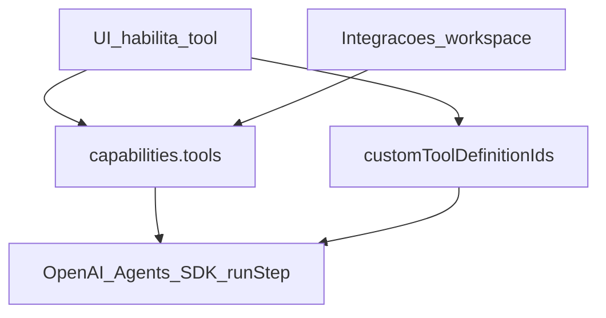

# Plano de evolução do `whitebeardit/agents-team-crafter`

> **Estado atual da implementação:** a fonte oficial de retomada do Ralph Loop continua sendo o ledger `agents-team-crafter-plano-evolucao_IMPLEMENTADO.md`.  
> Este documento segue como **plano mestre e visão de produto**.  
> A partir desta revisão, o roadmap passa a incluir explicitamente a nova frente **Business Tools Platform / Packs Multi-tenant**.
> Regra operacional do Ralph Loop: ao final de cada etapa/loop oficialmente concluído, fazer **commit de tudo** e **push** antes de registrar o encerramento no ledger.

## Objetivo

Evoluir o projeto para atender, de forma consistente, os objetivos do produto:

- **multi-tenant**
- **criação muito fácil e fluida de agentes e times**
- **wizard assistido por IA**
- **um coordenador sempre centralizando a comunicação com os canais**
- **especialistas sem sobreposição de função dentro do mesmo tenant/workspace**
- **controle do que está sendo executado**
- **visualização em tempo real**
- **UX simples, guiada e coerente com o runtime real**
- **UI/UX responsiva para desktop, tablet e celular**
- **onboarding contextual por tela, com tour reexecutável sob demanda**
- **capabilities reais de negócio reutilizáveis por múltiplos agentes e times**

---

# 1. Decisão executiva

## Decisão: adotar a base atual e evoluir incrementalmente

**Não reescrever o projeto.**

A base atual já está boa em pontos centrais:

1. multi-tenant por workspace
2. runtime com coordenador como agente principal
3. especialistas como tools do coordenador
4. Chat SDK integrado
5. OpenAI Agents SDK integrado
6. SSE / live updates
7. team planner assistido por IA
8. editor de grafo já simplificado para o modelo coordinator-first
9. BFF Fastify + MongoDB modular

## O que isso significa na prática

A estratégia correta é:

- preservar o que já está certo
- continuar endurecendo governança e execução
- transformar tools em **capabilities reais de negócio**
- permitir reutilização dessas capabilities em múltiplos times/agentes
- ensinar o AI Builder a montar times já com **packs e tools reais**
- manter UX simples, responsiva e explicativa

---

# 2. O que deve ser mantido

## 2.1 Multi-tenancy por `workspaceId`
Manter.

## 2.2 Runtime coordinator-first
Manter e fortalecer.

### Regra definitiva
- canais entram no coordenador
- resposta externa sai pelo coordenador
- especialistas executam subtarefas
- especialistas não são porta de entrada/saída

## 2.3 Chat SDK
Manter.

## 2.4 Live mode / SSE
Manter e evoluir.

## 2.5 Team planner
Manter e expandir.

## 2.6 Ferramentas OpenAI Agents SDK: utilizáveis vs apenas habilitadas

O runtime expõe function tools ao modelo via OpenAI Agents SDK (`runStep` do especialista). Na UI, **habilitar** uma ferramenta **não** garante, por si só, execução com efeito real no mundo: é preciso alinhar três eixos (matriz técnica em [`docs/UI-RUNTIME-AGENT.md`](UI-RUNTIME-AGENT.md)):

1. **Catálogo no agente** — `capabilities.tools` (IDs canónicos; parte dos IDs só ganha executor real quando existem integrações).
2. **Tools do workspace** — `capabilities.customToolDefinitionIds` → `WorkspaceToolDefinition` (`http_webhook`, `internal_action`, `mcp_ref`, `builtin_ref`): cada tipo tem pré-condições próprias (URL, `actionId`, MCP HTTP, etc.).
3. **Integrações do workspace** — segredos e URLs em Configurações que alimentam executores do catálogo (por exemplo Postgres read-only, CRM, calendário, chave OpenAI para imagens).

Fluxo **coordenador → especialista → `internal_action` → MongoDB** e catálogo `GET /business-actions/catalog`: ver subsecção em [`UI-RUNTIME-AGENT.md`](UI-RUNTIME-AGENT.md) (Coordenador vs especialista / Domínio de negócio).

**Roadmap de UX (Tools do workspace):** o [Loop 59](#loop-59--catálogo-de-ações-de-negócio--ux-guiada-internal_action) cobriu criação guiada **uma `internal_action` de cada vez**; o [Loop 61](#loop-61--criação-em-lote-de-tools-ação-interna-negócio-ux) prevê **seleção múltipla e criação em lote** para reduzir atrito quando se pretendem várias ações de negócio no mesmo workspace.

**Roadmap de UX (AI Builder / team plan):** o [Loop 62](#loop-62--transparência-do-fallback-do-team-planner-ai-builder) expõe na UI `plannerMeta.fallbackReason` e `parseErrorSummary` quando o plano é gerado em modo template, para o utilizador identificar a causa sem inspecionar a rede.

**Regra de produto:** marcar uma tool na UI só produz efeito útil quando as **pré-condições** estão satisfeitas (integração configurada, webhook acessível e autenticado, MCP com endpoint HTTP, ou `internal_action` com `actionId` registado no runtime de negócio). Caso contrário, o utilizador pode ver apenas **stub** ou **placeholder** honesto no output da tool.

**Ralph Loop — critério de aceite ao fechar um loop que toque em ferramentas:** no encerramento do ciclo (e no texto do ledger), declarar explicitamente:

- quais IDs ou tipos de tool ficam **executáveis de verdade** naquele slice;
- o que permanece **stub** ou **placeholder** (e porquê);
- se o `backend` ganhou testes que cobrem o ramo feliz ou o comportamento de indisponibilidade explícita.

Esta subsecção é o **contrato de roadmap** para não confundir “checkbox na ficha do agente” com “capacidade de produção”. O **plano de entrega** correspondente na ETAPA 9 continua na [secção 14](#14-etapa-9--paridade-de-produção-configurações-e-operação) (paridade de UX com backend, explicações operacionais sobre catálogo e validação de tools).

Referência de arquitetura do runtime e handoff: [`docs/ADR-0001-agents-runtime-handoff-deterministico.md`](ADR-0001-agents-runtime-handoff-deterministico.md).

### Seleção de ferramentas por domínio do agente e defaults na criação de times

**Norma de produto:**

1. **Builtins visíveis = já ativas para aquele agente** — Na criação de um time, quando a UI mostrar as ferramentas **builtin** (catálogo Agents SDK / `capabilities.tools`) na ficha de cada **especialista**, as entradas apresentadas devem corresponder **somente** às tools que **esse** agente precisa para o seu papel; e essas entradas devem surgir **já selecionadas e ativadas** no agente, em vez de listas genéricas desmarcadas ou um pacote idêntico copiado para todos os especialistas sem critério de domínio.

2. **Seleção por domínio, não por “template único”** — A escolha de ferramentas é **por domínio de responsabilidade do agente**. Dois especialistas com **papéis ou domínios distintos** não devem, por defeito, partilhar o **mesmo** conjunto de tools só porque estão no mesmo time: cada um recebe o **subconjunto mínimo** coerente com o seu domínio (o que reduz ambiguidade para o modelo e evita expor capacidades irrelevantes).

3. **Um especialista por domínio** — Garantir que **apenas um** especialista **utilize e responda** por aquele domínio dentro do time (alinhado à governança de não-sobreposição já prevista no produto). Evita-se que dois agentes especialistas “disputem” o mesmo tipo de ação ou carreguem ferramentas duplicadas sem necessidade.

Esta norma complementa [§2.6](#26-ferramentas-openai-agents-sdk-utilizáveis-vs-apenas-habilitadas) (pré-condições de execução) e reforça o objetivo de **especialistas sem sobreposição de função** no [Objetivo](#objetivo).

## 2.7 Admin global da plataforma (RBAC cross-tenant)

**Quem é:** apenas o **admin global da plataforma** — utilizador com `isPlatformAdmin: true` no modelo de utilizador e/ou email listado em `PLATFORM_ADMIN_EMAILS` (ver [`user.model.ts`](../backend/src/modules/users/infra/user.model.ts), [`env.ts`](../backend/src/config/env.ts), enforcement em [`hooks.ts`](../backend/src/app/plugins/hooks.ts)). Não confundir com **owner** ou **admin de workspace** (âmbito de um único `workspaceId`).

**Norma de produto (capacidades exclusivas do admin global):**

1. **Visualização cross-tenant** — poder listar **todos** os utilizadores registados na instalação e **todos** os workspaces criados na plataforma (visão operacional da instalação).
2. **Remoção em cascata por utilizador** — poder eliminar um utilizador e, em cascata, os workspaces onde é membro (ou de que é dono), convites, membros, e demais dados persistidos no MongoDB associados a essa identidade e a esses tenants, segundo política de integridade definida na implementação.

Estas operações são **sensíveis** e não devem existir para membros normais nem para admins apenas dentro de um workspace.

**Nota de alinhamento com o código:** até existirem rotas e serviços dedicados com testes, tratar listagem global de utilizadores e delete em cascata por utilizador como **requisito de evolução** documentado; o factory reset da zona de perigo (`/platform/danger-zone/factory-reset`) é wipe **de toda** a instalação, não substitui remoção selectiva por utilizador.

## 2.8 UX responsiva e onboarding contextual por tela

**Norma de produto:**

1. **Responsividade é requisito funcional, não acabamento visual** — as superfícies principais do produto devem continuar utilizáveis em **desktop, tablet e celular** sem depender de zoom do navegador, scroll horizontal contínuo ou precisão de mouse. A ação principal de cada tela deve permanecer alcançável e compreensível em larguras reduzidas.

2. **Tour não deve virar fricção recorrente** — a melhor prática **não** é disparar um tour genérico e longo em todo login. O padrão preferido para este produto é **onboarding contextual progressivo por tela**: o utilizador autenticado vê uma apresentação curta **na primeira vez em que entra naquela tela** (ou quando pedir explicitamente), com passos ancorados aos elementos reais daquela view.

3. **Tour por tela, com reentrada voluntária** — cada tela relevante deve oferecer CTA explícito para **“Ver tour desta tela”** ou equivalente. O utilizador pode fechar, rever depois e reexecutar quando quiser, sem perder a autonomia de uso.

4. **Persistência por utilizador + workspace + tela + versão** — o estado do onboarding deve ser guardado por combinação de `userId`, `workspaceId`, `screenKey` e `tourVersion`, permitindo:
   - mostrar o tour apenas para quem ainda **não** viu aquela tela;
   - reapresentar quando houver mudança material de UX/fluxo;
   - respeitar contexto multi-tenant e perfil do utilizador.

5. **Passos curtos e contextuais** — cada tour deve privilegiar **3–5 passos úteis**, com linguagem objectiva, orientada a tarefa e não a marketing. O foco é responder: **o que esta tela faz**, **qual é a ação principal**, **o que é obrigatório configurar** e **qual o próximo passo seguro**.

6. **Variação por viewport e papel** — o mesmo conteúdo pode exigir variações entre `desktop`, `tablet` e `mobile` (por exemplo `sidebar` vs `drawer`, tabela vs cards) e também por papel/RBAC. O tour não deve apontar para elementos que não existem naquele layout ou para ações indisponíveis ao utilizador autenticado.

7. **Slices Ralph Loop para onboarding** — não prometer “tour em todas as telas” num único ciclo. A abordagem correta é:
   - primeiro entregar a infraestrutura base de responsividade e onboarding;
   - depois aplicar em **lotes pequenos de telas críticas**;
   - documentar no ledger quais telas ficaram cobertas em cada loop.

**Decisão explícita de melhor prática para este produto:** adotar **onboarding contextual progressivo por tela**, com **auto-disparo apenas no primeiro acesso à tela** (ou quando `tourVersion` mudar) e **reexecução manual sob demanda**; evitar tour global intrusivo e repetitivo.

---

# 3. Situação atual após os loops já entregues

As etapas originais do produto foram essencialmente fechadas no ciclo anterior:

- contrato runtime/UX/grafo
- governança de domínio
- wizard de criação de agentes
- unificação da criação de times
- execução persistida
- grafo hub-and-spoke
- agentes/times de plataforma iniciais
- auditoria, flags, tendências, SLO e webhooks

Isso significa que o projeto agora entra em uma **nova macrofase**:

# ETAPA 8 — Business Tools Platform / Packs Multi-tenant

---

# 4. Nova direção arquitetural

## 4.1 Problema a resolver
Hoje o produto já cria times e agentes com boa governança, mas ainda não entrega, de forma nativa, **tools reais de negócio** como:

- CRM
- contas a pagar
- contas a receber
- lembretes
- anamneses
- evolução clínica
- catálogo de serviços
- vendas
- controle de pacotes
- atendimento por pacote
- GitHub Ops

## 4.2 Princípio central
O agente **não grava diretamente no MongoDB**.

O agente executa **ações de negócio**.
O backend:
- valida input
- aplica regras
- resolve `workspaceId`
- grava no Mongo
- audita a operação

### Exemplo certo
- `crm_create_party`
- `care_create_subject`
- `clinical_add_evolution_note`
- `sales_create_service_order`
- `finance_create_receivable`
- `github_comment_pr`

### Exemplo errado
- `mongo_write`
- `db_insert_anything`
- query arbitrária de banco

---

# 5. ETAPA 8 — Plataforma de Business Tools Multi-tenant

## Objetivo
Transformar o sistema de tools em uma plataforma de capabilities reais e reutilizáveis por workspace.

## Resultado esperado
Ao final da ETAPA 8, o produto conseguirá:

- instalar packs de negócio por workspace
- reutilizar tools em vários agentes e times
- manter isolamento multi-tenant
- habilitar escrita segura em Mongo via ações de domínio
- deixar o AI Builder sugerir packs e tools automaticamente
- permitir times realmente úteis de negócio

---

## 5.1 Subetapa 8.1 — Foundation de Business Tools

### Objetivo
Criar a base técnica para tools internas reais.

### Mudanças
- adicionar `internal_action` como novo tipo de tool definition
- criar `business-tool-runtime`
- criar `business-tool-registry`
- usar `jsonSchema` real nas tools, em vez de payload genérico
- manter `http_webhook` para integrações externas/custom

### Entregáveis
- suporte backend a `internal_action`
- registry de executores internos
- contrato de tool estruturada
- auditoria básica de tool de negócio

---

## 5.2 Subetapa 8.2 — CRM Pack

### Objetivo
Entregar cadastro e consulta de partes comerciais.

### Escopo
- clientes
- empresas
- fornecedores
- parceiros
- fontes pagadoras
- responsáveis/tutores

### Entidade central
`party`

### Tools
- `crm_create_party`
- `crm_update_party`
- `crm_find_party`
- `crm_get_party_summary`
- `crm_list_parties_by_role`

### API HTTP (consumo pela UI)
- `GET /parties` — lista recente ou pesquisa por nome (`q`, `limit`)
- `POST /parties` — criar contato (`displayName`, opcionais: `roles`, `email`, `phone`, `notes`)
- `GET /parties/:id` — detalhe do contato

---

## 5.3 Subetapa 8.3 — Care Pack

### Objetivo
Representar corretamente quem recebe o cuidado.

### Entidade central
`care_subject`

### Casos
- paciente humano
- paciente psicológico
- pet

### Tools
- `care_create_subject`
- `care_update_subject`
- `care_find_subject`
- `care_get_subject_summary`

---

## 5.4 Subetapa 8.4 — Clinical Records Pack

### Objetivo
Registrar anamneses, evolução e histórico clínico.

### Entidades
- `anamneses`
- `evolution_notes`
- `encounters`

### Templates iniciais
- médico
- psicologia
- veterinária
- custom

### Tools
- `clinical_create_anamnesis`
- `clinical_add_evolution_note`
- `clinical_list_subject_history`
- `clinical_get_latest_evolution`
- `clinical_open_encounter`
- `clinical_close_encounter`

---

## 5.5 Subetapa 8.5 — Services & Sales Pack

### Objetivo
Cadastrar serviços e registrar vendas/contratações.

### Entidades
- `service_catalog`
- `service_orders`

### Tools
- `service_catalog_create_item`
- `service_catalog_list_items`
- `sales_create_service_order`
- `sales_add_service_item`
- `sales_mark_order_paid`
- `sales_get_customer_purchase_history`
- `sales_top_services`
- `sales_total_paid_by_service`

---

## 5.6 Subetapa 8.6 — Packages & Encounters Pack

### Objetivo
Controlar pacotes vendidos e atendimento por pacote.

### Entidades
- `package_sales`
- integração com `encounters`

### Tools
- `package_sell_to_party`
- `package_get_balance`
- `attendance_register_session`
- `attendance_list_by_party`
- `attendance_list_by_package_sale`
- `attendance_get_party_care_summary`

---

## 5.7 Subetapa 8.7 — Finance Pack

### Objetivo
Entregar contas a pagar e receber reais com agregações de negócio.

### Entidades
- `receivables`
- `payables`

### Tools
- `finance_create_receivable`
- `finance_create_payable`
- `finance_mark_receivable_paid`
- `finance_mark_payable_paid`
- `finance_list_overdue_receivables`
- `finance_list_overdue_payables`
- `finance_total_receivable_by_payer`
- `finance_total_payable_by_destination`
- `finance_customer_financial_summary`

---

## 5.8 Subetapa 8.8 — Reminder Pack

### Objetivo
Cadastrar lembretes por data e hora.

### Entidade
- `reminders`

### Tools
- `schedule_create_reminder`
- `schedule_list_reminders_by_date`
- `schedule_mark_reminder_done`
- `schedule_cancel_reminder`

---

## 5.9 Subetapa 8.9 — GitHub Ops Pack

### Objetivo
Entregar capabilities reais para PR review e interação com GitHub.

### Tools
- `github_read_pr`
- `github_read_diff`
- `github_comment_pr`
- `github_list_changed_files`
- `github_get_issue`

---

## 5.10 Subetapa 8.10 — Integração com AI Builder

### Objetivo
Fazer o AI Builder sugerir packs e tools reais automaticamente.

### Resultado esperado
Ao criar um time por objetivo/problema, o planner deve conseguir sugerir:

- packs necessários (identificadores canónicos alinhados ao backend: `PLANNER_PACK_IDS` / `PLANNER_PACK_TO_ACTION_IDS`)
- tools por agente
- indicação de escrita/leitura
- instalação automática dos packs
- bind automático de tool definitions aos agentes

---

## 5.11 Subetapa 8.11 — Scheduling / Appointments Pack

### Objetivo
Cobrir a agenda operacional entre venda, pacote, lembrete e atendimento executado.

### Entidades
- `appointments`
- `availability_slots`

### Resultado esperado
- permitir agendar serviços e sessões futuras para `party` e/ou `care_subject`
- permitir reagendamento, cancelamento, confirmação e no-show
- integrar o compromisso com `service_orders`, `package_sales`, `encounters` e `reminders`
- expor uma API HTTP autenticada mínima de agenda para consumo futuro da UI
- página **Agenda** no app (`/schedule`) consumindo a Scheduling API

### Tools candidatas
- `schedule_create_appointment`
- `schedule_reschedule_appointment`
- `schedule_cancel_appointment`
- `schedule_confirm_appointment`
- `schedule_mark_no_show`
- `schedule_list_agenda_by_date`
- `schedule_get_availability`

---

# 6. Modelo de dados alvo para a ETAPA 8

## 6.1 `parties`
Entidade econômica/comercial unificada:
- cliente
- empresa
- fornecedor
- parceiro
- payer
- guardian

## 6.2 `care_subjects`
Quem recebe o cuidado:
- humano
- animal

## 6.3 `anamneses`
Anamnese inicial estruturada.

## 6.4 `evolution_notes`
Evolução clínica.

## 6.5 `service_catalog`
Catálogo de serviços.

## 6.6 `service_orders`
Pedidos / contratações.

## 6.7 `package_sales`
Instância de pacote vendido.

## 6.8 `encounters`
Atendimento executado.

## 6.9 `receivables`
Contas a receber.

## 6.10 `payables`
Contas a pagar.

## 6.11 `reminders`
Lembretes e follow-ups.

## 6.12 `business_tool_audit`
Auditoria de ferramentas de negócio.

## 6.13 `appointments`
Compromissos/agendamentos futuros e seu ciclo operacional.

---

# 7. Estratégia de entrega incremental

## Ordem prioritária
A ordem correta para a nova macrofase é:

1. **Foundation de Business Tools**
2. **CRM Pack**
3. **Care Pack**
4. **Services & Sales Pack**
5. **Packages & Encounters Pack**
6. **Clinical Records Pack**
7. **Finance Pack**
8. **Reminder Pack**
9. **GitHub Ops Pack**
10. **Integração com AI Builder**
11. **Scheduling / Appointments Pack**

## Observação
Se o foco inicial for saúde, é aceitável antecipar:
- Clinical Records Pack

Mas, como fundação de negócio, `CRM + Care + Services & Sales` continuam sendo a base mais sólida.

---

# 8. Módulos do projeto mais impactados na ETAPA 8

## Backend
- `tool-definitions`
- `runtime`
- `agents`
- `team-planning`
- novos módulos:
  - `business-tools`
  - `crm`
  - `care-subjects`
  - `clinical-records`
  - `services-sales`
  - `finance`
  - `reminders`
  - `github-ops`
  - `scheduling`
  - `observability` (métricas Prometheus filtradas para admin)

## Frontend
- `tool-definitions`
- `agents/[id]`
- `teams/ai-create`
- review do plano
- `observability` (página de métricas resumidas)
- novos componentes de install pack / badges / capability review

---

# 9. Nova priorização do backlog

## P1 — Entregar primeiro
- Foundation de Business Tools
- CRM Pack
- Care Pack

## P2 — Na sequência
- Services & Sales
- Packages & Encounters
- Clinical Records

## P3 — Depois
- Finance
- Reminders
- GitHub Ops
- AI Builder com packs e tools reais
- Scheduling / Appointments Pack

---

# 10. Nova proposta de releases

## Release 6 — Foundation de Business Tools
### Escopo
- `internal_action`
- registry
- runtime interno
- auditoria de business tools

### Resultado
O produto passa a suportar tools internas reais de negócio.

---

## Release 7 — CRM + Care
### Escopo
- parties
- care subjects
- tools de cadastro e consulta

### Resultado
A base multi-tenant de relacionamento e atendimento fica correta.

---

## Release 8 — Services, Sales e Pacotes
### Escopo
- catálogo
- vendas
- pacotes
- atendimentos por pacote

### Resultado
O sistema sabe quem comprou o quê, o que foi vendido e o que foi executado.

---

## Release 9 — Clinical + Finance + Reminders
### Escopo
- anamneses
- evolução
- contas a pagar/receber
- lembretes

### Resultado
O produto ganha profundidade real de negócio.

---

## Release 10 — GitHub Ops + AI Builder inteligente
### Escopo
- pack GitHub
- AI Builder sugerindo packs/tools automaticamente

### Resultado
O AI Builder passa a montar times úteis de verdade, já com capabilities reais.

---

## Release 11 — Scheduling / agenda operacional
### Escopo
- appointments
- disponibilidade
- reagendamento/cancelamento/confirmação
- integração com encounters e reminders

### Resultado
O produto passa a fechar o ciclo operacional entre venda, agenda, comparecimento e atendimento realizado.

---

# 11. Recomendação final

## Recomendação objetiva
**Aproveitar a base atual e expandi-la.**

## O que realmente precisa mudar agora
A próxima grande evolução não é mais sobre:
- governança de domínio de agentes
- grafo
- runs
- flags

Esses pilares já estão amadurecidos.

A próxima grande evolução é:
- **Business Tools Platform**
- **packs multi-tenant**
- **capabilities reais de negócio**
- **AI Builder com bind automático dessas capabilities**

---

# 12. Próxima ação recomendada

## Próximo loop recomendado
Após a entrega das ações em lote, reset rápido e diff final dos overrides do bind no AI Builder, o próximo loop recomendado é:

### Ativação inline de `tool definitions` inativas no preview
- permitir ativar `internal_action` inativas diretamente a partir do preview do bind, sem sair do AI Builder
- distinguir com clareza o que depende de criação, reuso ou apenas reativação de definition
- refletir no preview e no feedback final quando uma definition foi reativada para destravar o bind
- reduzir a ida e volta entre o AI Builder e a tela de `tool-definitions`

### Justificativa
- o Loop 50 reduziu a microgestão dos overrides, mas ainda sobra atrito quando o preview aponta definitions existentes porém inativas
- reativação inline fecha o último gargalo operacional frequente do bind dentro do próprio AI Builder
- isso torna o preview não só explicativo, mas também resolutivo para o caso mais comum de bloqueio operacional

---

# 13. Resumo final de decisão

## Adotar
- multi-tenant atual
- runtime coordinator-first
- Chat SDK atual
- SSE/live atual
- team planner atual
- governança e auditoria já existentes

## Alterar
- sistema de tools para suportar `internal_action`
- packs oficiais da plataforma
- AI Builder para sugerir e bindar tools reais

## Não fazer agora
- reescrita total
- acesso bruto do agente ao banco
- tool genérica de write
- terceira fonte oficial de roadmap

---

# 14. ETAPA 9 — Paridade de produção, configurações e operação

## 14.1 Objetivo
Fazer com que as superfícies administrativas e operacionais mais visíveis do produto passem a refletir apenas capacidades reais de produção.

## 14.2 Problema a resolver
Hoje o produto já tem uma base forte para runtime, business tools e AI Builder, mas ainda existe um conjunto de telas e ações com desalinhamento entre UX e comportamento real do backend, especialmente em:

- `/settings`
- app shell autenticado (`sidebar`, header, navegação e CTAs principais)
- menu superior do utilizador
- faturamento / upgrade
- segurança de conta
- templates
- tools do workspace
- canais
- agenda
- AI Builder / criação de times
- governança administrativa

### Diagnóstico consolidado
As anotações levantadas continuam válidas em grande parte, com o seguinte recorte:

### Já funcionam hoje
- `API keys` do workspace
- integrações do workspace em `/settings` (OpenAI, SMTP, Slack e segredos relacionados a tools)
- política de auto-bind do planner em `/settings`
- nome do workspace
- logo do workspace
- nome do perfil

### Funcionam apenas parcialmente ou ainda não refletem produção
- avatar de perfil
- bio e preferências do perfil
- idioma
- tema
- notificações
- alterar senha
- autenticação de dois fatores
- sessões ativas
- faturamento
- upgrade de plano
- enforcement de quotas do plano Free / Pro / Enterprise
- `Meu Perfil` no menu superior
- apagar compromisso em `/schedule`
- purge de logs em `/governance`
- reset administrativo de fábrica
- responsividade em tablet e celular nas telas mais densas
- tours/guias contextuais para primeiro uso de cada tela

### Ainda precisam de melhor explicação operacional
- para que servem `API keys`
- como usar integrações na prática
- como usar tools de catálogo em produção
- como descobrir, ativar e validar tools reais
- como diferenciar canais genéricos de plataformas Chat SDK
- como aplicar templates realmente curados e prontos para uso
- como a plataforma funciona ao entrar numa tela pela primeira vez

## 14.3 Princípios da ETAPA 9
- nenhuma configuração exibida ao utilizador deve parecer funcional sem backend real ou feedback honesto de indisponibilidade
- limites de plano devem ser aplicados no backend, e não apenas descritos na UI
- ações destrutivas e administrativas exigem RBAC explícito, confirmação forte e guardrails de ambiente
- recursos ainda não entregues devem ser ocultados, despriorizados visualmente ou sinalizados como indisponíveis
- integrações e tools precisam explicar claramente para que servem, como usar e um exemplo operacional mínimo
- superfícies de configuração precisam ser coerentes com o runtime real do produto
- telas críticas devem funcionar sem atrito relevante em desktop, tablet e celular
- onboarding deve ser contextual, curto, reexecutável e persistido por utilizador/tela, em vez de um tour global obrigatório

## 14.4 Resultado esperado
Ao final da ETAPA 9, o produto deverá:

- ter `/settings` coerente com as capacidades reais do backend
- ter perfil, preferências e autenticação com comportamento mínimo de produção
- aplicar quotas reais de plano no backend
- oferecer uma jornada clara de upgrade ou declarar explicitamente quando ela ainda não existir
- reduzir UI enganosa em templates, tools, canais e menus de conta
- ter navegação e telas operacionais principais responsivas em tablet e celular
- apresentar o funcionamento da plataforma com tours contextuais por tela no primeiro acesso e sob demanda
- dar aos administradores operações seguras para limpeza operacional e gestão avançada

## 14.5 Loops previstos da ETAPA 9

## Loop 52 — Settings de perfil e preferências com backend real

### Objetivo
Fechar o gap entre o que `/settings` mostra e o que o produto realmente persiste para o utilizador.

### Foco
- foto/avatar de perfil real
- idioma persistido em `preferences`
- tema persistido em `preferences` e respeitado no app shell
- bio e preferências explícitas ou remoção da UI quando ainda não houver backend
- navegação correta de `Meu Perfil` no menu superior

### Critério de saída
- tudo o que aparece em perfil/preferências salva de verdade ou deixa de ser exibido como funcional

---

## Loop 53 — Notificações, canais e explicações operacionais

### Objetivo
Transformar `/settings` e `/channels` em superfícies compreensíveis e utilizáveis em produção.

### Foco
- persistência real de preferências de notificação
- canal adicional de notificação via Discord, se alinhado ao modelo de canais existente
- explicação prática de OpenAI, `API keys`, integrações e tools de catálogo
- redução da ambiguidade entre `Chat SDK — plataformas` e `Canais genéricos`

### Critério de saída
- o utilizador entende para que serve cada configuração e consegue testá-la com poucos cliques

---

## Loop 54 — Segurança e autenticação de conta

### Objetivo
Entregar o mínimo de segurança de conta esperado para produção.

### Foco
- alterar senha
- gestão mínima de sessões
- decisão honesta sobre 2FA: implementar MVP ou ocultar CTA até existir backend real
- alinhar a danger zone de conta com ações reais

### Critério de saída
- não existir mais botão crítico de segurança sem endpoint correspondente

---

## Loop 55 — Faturamento, upgrade e enforcement de quotas

### Objetivo
Fazer o plano Free / Pro / Enterprise refletir comportamento real do backend.

### Foco
- enforcement central de quotas para `teams`, `agents` e, se aplicável, `channels`
- exibição do consumo atual usando `limits.used*`
- bloqueio de criação acima da quota com mensagem clara
- jornada real de `Fazer upgrade` ou sinalização explícita de indisponibilidade
- desenho de integração futura com provider de billing, sem bloquear o enforcement

### Critério de saída
- o texto `Free até 2 times e 5 agentes` deixa de ser marketing solto e passa a ser regra aplicada

---

## Loop 56 — Templates e tools com curadoria real de produção

### Objetivo
Fazer `Templates` e `Tools` entregarem valor concreto para uso produtivo.

### Foco
- revisar o catálogo seedado e corrigir templates enganosos
- criar templates curados por vertical real, como clínica psicológica
- melhorar explicação e descoberta de tools reais, builtins e exemplos
- mostrar dependências e configurações antes de aplicar template ou tool

### Critério de saída
- templates publicados passam a ser exemplos confiáveis e demonstráveis

---

## Loop 57 — Governança limpa e agenda operacional

### Objetivo
Fechar pendências operacionais que impactam uso diário e administração.

### Foco
- apagar compromisso em `/schedule` ou formalizar claramente soft-delete / cancelamento definitivo
- purge de logs de governança por intervalo de data ou total, com RBAC admin e confirmação forte

### Critério de saída
- operadores e admins conseguem limpar agenda e auditoria sem recorrer a banco ou scripts manuais

---

## Loop 58 — Danger Zone administrativa e reset de fábrica

### Objetivo
Disponibilizar apenas para admin de plataforma uma operação segura de reset da instalação, se esse requisito continuar válido.

### Foco
- definir a semântica exata de `reset total`
- restringir a `platform admin`
- exigir múltiplas confirmações e guardrails de ambiente
- preferir feature flag ou env para impedir uso acidental em ambientes errados

### Critério de saída
- existir um fluxo de reset controlado, auditado e impossível de acionar casualmente

---

## Loop 59 — Catálogo de ações de negócio + UX guiada (`internal_action`)

### Objetivo
Fechar a lacuna entre documentação de runtime (coordenador → especialista → `internal_action` → MongoDB) e configuração na UI: metadados PT-BR por `actionId`, endpoint read-only de catálogo, criação de `WorkspaceToolDefinition` do tipo `internal_action` via select (sem digitar `actionId` à cegas), e rótulos amigáveis na ficha do agente.

### Foco
- presets canónicos e `BusinessToolRegistry.listCatalog`; `GET /api/v1/business-actions/catalog` (auth por tenant)
- página Tools: fluxo «Ação interna (negócio)» com combobox; evitar duplicar a mesma ação no workspace
- `ensureInternalActionDefinitions` (auto-bind / team plan): `name` alinhado aos presets quando existirem
- [`docs/UI-RUNTIME-AGENT.md`](UI-RUNTIME-AGENT.md) (subsecção domínio de negócio) e referência cruzada em [§2.6](#26-ferramentas-openai-agents-sdk-utilizáveis-vs-apenas-habilitadas) deste plano

### Critério de saída
- catálogo devolve apenas `actionId` com handler registado; gate Ralph com `RALPH_LOOP_INCLUDE_FRONTEND=1` (alterações em `v0-team-ai-crafter`)

---

## Loop 60 — Remover CRM HTTP do catálogo (paridade com CRM interno)

### Objetivo
Ter **uma única história de CRM** no produto: o domínio persistido no MongoDB via pack `crm` e ações `internal_action` (`crm_*`), sem competir no runtime com uma segunda via “CRM” baseada em HTTP genérico no catálogo Agents SDK.

### Foco
- retirar o ID `crm_access` do catálogo (`capabilities.tools`) e o ramo correspondente em `buildCapabilityCatalogTools` (executor HTTP + stub)
- remover `executeCrmAccess` e referências de teste associadas
- retirar ou deprecar `toolCrm` em schema de integrações, serviço de integrações e UI de Settings (bloco “Tools do catálogo — CRM”)
- atualizar [`UI-RUNTIME-AGENT.md`](UI-RUNTIME-AGENT.md) e [`operational-catalog-tools.ts`](../backend/src/modules/agents/domain/operational-catalog-tools.ts)
- decidir tratamento para agentes que já persistem `crm_access` em `capabilities.tools` (ignorar no runtime, filtrar na gravação ou migração pontual)
- ajustar testes (`operational-catalog-tools.test.ts`, etc.)

### Critério de saída
- não existe function tool `catalog_crm_access` nem configuração de integração de primeira classe para CRM HTTP no catálogo
- CRM externo, se voltar a ser necessário, documenta-se como caminho explícito (ex.: `http_webhook`, MCP), sem ambiguidade com o pack interno

---

## Loop 61 — Criação em lote de tools «Ação interna (negócio)» (UX)

### Objetivo
Melhorar o fluxo na página **Tools do workspace** quando se pretende registar **várias** `WorkspaceToolDefinition` do tipo `internal_action`: hoje o utilizador tem de abrir **Nova tool** e repetir o diálogo **uma ação de cada vez**, o que é lento e frustante quando o catálogo tem dezenas de entradas.

### Foco
- **Seleção múltipla** no catálogo (`GET /api/v1/business-actions/catalog`): multiselect, lista com checkboxes ou equivalente acessível; mostrar claramente quais `actionId` **já** têm definição no workspace (desativar ou ocultar conforme decisão de produto).
- **Uma confirmação** para criar N definições de uma vez, com resumo (títulos / `actionId` / slugs gerados) antes de aplicar.
- **Backend:** decidir entre `POST` em lote (ex.: corpo com array de `{ actionId }` e criação transacional ou em partes) versus N `POST /tool-definitions` com feedback agregado na UI (toast único, lista de erros por item). Manter regras atuais: slug derivado de `actionId`, `jsonSchema` por ação, sem duplicar a mesma ação no workspace.
- **Estados de UX:** loading global ou por item; mensagem clara em sucesso parcial (algumas criadas, outras falharam por duplicata ou validação).

### Critério de saída
- O utilizador consegue adicionar **várias** tools «Ação interna (negócio)» sem repetir o modal linha a linha; documentação e ledger atualizados quando o slice for fechado.

**Estado (ledger):** entregue — `POST /api/v1/tool-definitions/bulk-internal-actions`, UI com checkboxes na página Tools (`v0-team-ai-crafter`), teste [`tool-definitions-bulk.integration.test.ts`](../backend/src/__tests__/tool-definitions-bulk.integration.test.ts).

### Relação com o Loop 59
O [Loop 59](#loop-59--catálogo-de-ações-de-negócio--ux-guiada-internal_action) entregou o catálogo read-only e o combobox **single-select**. O Loop 61 **substitui** essa UI por **lista com selecção múltipla** e endpoint em lote para o mesmo tipo de tool.

---

## Loop 62 — Transparência do fallback do team planner (AI Builder)

### Objetivo
Quando `POST /team-plans` devolve `plannerMeta.usedFallback: true`, o utilizador deve ver **porquê** (sem abrir DevTools): códigos `no_openai_key`, `openai_request_failed`, `json_extract_failed`, `schema_validation_failed` e, quando existir, o detalhe técnico `parseErrorSummary` já produzido pelo backend.

### Foco
- Copy PT-BR por `fallbackReason` + bloco opcional «Detalhe técnico» no alerta da revisão do plano (`team-ai-builder.tsx`).
- Toast de aviso alinhado (título + descrição curta).
- Sem alteração obrigatória de contrato BFF: metadados já vêm em `plannerMeta`.

### Critério de saída
- O utilizador identifica a causa do fallback a partir da própria UI; documentação e ledger atualizados.

**Estado (ledger):** entregue — [`planner-fallback-messages.ts`](../v0-team-ai-crafter/lib/planner-fallback-messages.ts) + alterações em [`team-ai-builder.tsx`](../v0-team-ai-crafter/components/teams/team-ai-builder.tsx).

---

## Loop 63 — Paridade planner × canais (Chat SDK + nativos)

### Objetivo
O schema Zod do output do Whitebeard AI Planner e as rotas que aceitam `channels` / `primaryChannel` em agentes e times devem permitir **os mesmos literais** que o modelo `Channel` no MongoDB e as plataformas expostas pelo Chat SDK (incluindo `telegram`). Caso contrário, um plano válido gerado pelo modelo com `primaryChannel: "telegram"` falha em `schema_validation_failed` e o produto cai no fallback genérico.

### Foco
- Constante e `z.enum` partilhados: [`product-channel-type.ts`](../backend/src/modules/channels/domain/product-channel-type.ts)
- `plannerOutputSchema` extraído para [`team-plan-planner-output.schema.ts`](../backend/src/modules/team-planning/application/team-plan-planner-output.schema.ts)
- Rotas: canais em [`agent.routes.ts`](../backend/src/modules/agents/interfaces/agent.routes.ts), [`team.routes.ts`](../backend/src/modules/teams/interfaces/team.routes.ts), [`channel.routes.ts`](../backend/src/modules/channels/interfaces/channel.routes.ts), [`agent-config.schemas.ts`](../backend/src/modules/agents/application/agent-config.schemas.ts)
- Prompt do planner: lista dinâmica de canais + regra de alinhar canal mencionado no contexto (ex.: Telegram → `"telegram"`)
- Tipos frontend: [`v0-team-ai-crafter/lib/types/index.ts`](../v0-team-ai-crafter/lib/types/index.ts) (`TeamPlanAgentDraft`, `TeamPlanDraft`)
- Teste: [`team-plan-planner-output.schema.test.ts`](../backend/src/modules/team-planning/application/team-plan-planner-output.schema.test.ts)

### Critério de saída
- `plannerOutputSchema.safeParse` aceita `primaryChannel: "telegram"` e canais do coordenador coerentes
- Gate: `RALPH_LOOP_INCLUDE_FRONTEND=1 ./scripts/ralph-loop-gate.sh`

**Estado (ledger):** entregue — ver [`agents-team-crafter-plano-evolucao_IMPLEMENTADO.md`](agents-team-crafter-plano-evolucao_IMPLEMENTADO.md) Loop 63.

---

## Loop 64 — Builtins por domínio (criação de time e AI Builder)

### Objetivo
Cumprir a norma de produto de [seleção de ferramentas por domínio do agente](#26-ferramentas-openai-agents-sdk-utilizáveis-vs-apenas-habilitadas): ao criar times, cada especialista deve receber **apenas** as builtins coerentes com o seu papel, já ativas por defeito quando fizer sentido.

### Foco
- wizard de time / AI Builder / preview de agentes: default = **subconjunto mínimo** coerente com papel e domínio; não replicar o mesmo pacote para todos os especialistas
- planner / team plan: quando existirem `requiredTools` ou metadados de domínio, materializar em `capabilities.tools` e binds relacionados com previsibilidade
- backend: preservar a intenção de **um especialista por domínio**, em linha com overlap guard e governança já existentes
- documentação de encerramento: declarar claramente o que ficou como default automático e o que continua edição manual

### Critério de saída
- ao criar ou executar um time de exemplo com papéis distintos, a ficha de cada especialista mostra builtins **ativas** e **diferenciadas** por domínio
- gate Ralph com frontend incluído quando o slice tocar `v0-team-ai-crafter`

**Estado (ledger):** entregue — ver [`agents-team-crafter-plano-evolucao_IMPLEMENTADO.md`](agents-team-crafter-plano-evolucao_IMPLEMENTADO.md) Loop 64.

---

## Loop 65 — Foundation responsiva multi-device

### Objetivo
Criar a base para que a UI autenticada funcione de forma consistente em **tablet** e **celular**, sem depender de correções ad hoc tela a tela.

### Foco
- definir e normalizar breakpoints canónicos (`desktop`, `tablet`, `mobile`) e regras de densidade visual para o app shell
- revisar `sidebar`, header, breadcrumbs, tabs, filtros e CTAs principais para comportamento responsivo previsível
- substituir modais excessivamente largos por `drawer`, fullscreen dialog ou variantes equivalentes quando a viewport for reduzida
- criar padrões para tabelas/listagens densas: colapso para cards, colunas prioritárias, detalhes expansíveis, ações acessíveis por toque
- garantir ergonomia touch-first: alvos mínimos, espaçamento, safe areas, teclado virtual, rolagem e foco

### Critério de saída
- a navegação autenticada e os componentes-base não apresentam overflow horizontal contínuo nas larguras de referência `1024`, `768` e `390`
- a ação principal de cada superfície-base permanece visível ou alcançável sem “caça ao botão”
- gate Ralph com frontend incluído; documentação registra os padrões responsivos adotados

**Estado (ledger):** entregue — ver [`agents-team-crafter-plano-evolucao_IMPLEMENTADO.md`](agents-team-crafter-plano-evolucao_IMPLEMENTADO.md) Loop 65 (shell: drawer `< lg`, sidebar `lg+`, header adaptável, `overflow-x` no `body`/`main`).

---

## Loop 66 — Responsividade das telas críticas

### Objetivo
Aplicar a foundation responsiva nas telas de maior valor operacional, reduzindo atrito real de uso em tablet e celular.

### Foco
- priorizar rotas críticas: `/settings`, `/channels`, `/tool-definitions`, AI Builder / criação de times, `/schedule` e fichas de agentes/times mais usadas no dia a dia
- converter layouts densos em fluxos progressivos quando necessário: filtros recolhíveis, ações primárias “sticky”, cards empilhados, secções dobráveis e navegação em etapas
- adaptar feedbacks da UI para telas pequenas: toasts, alertas, drawers, confirmação e erros inline sem cobrir elementos essenciais
- rever tabelas e grids que hoje assumem desktop, evitando cortar informação essencial ou esconder estados importantes do runtime
- documentar por tela o que ficou **responsivo entregue**, **aceitável com limitação** ou **pendente**

### Critério de saída
- um utilizador autenticado consegue executar os fluxos principais das telas priorizadas em tablet/celular sem depender de viewport desktop
- o ledger do loop lista explicitamente as rotas cobertas e as limitações remanescentes
- gate Ralph com frontend incluído; E2E ou smoke manual dirigido nas rotas alteradas quando viável

**Estado (ledger):** entregue — ver [`agents-team-crafter-plano-evolucao_IMPLEMENTADO.md`](agents-team-crafter-plano-evolucao_IMPLEMENTADO.md) secção **Loop 66 (fechado)** (tabela por rota: entregue / aceitável com limitação / pendente).

---

## Loop 67 — Onboarding contextual e tour reexecutável por tela

### Objetivo
Explicar como a plataforma funciona de forma **fácil, fluida e contextual**, apresentando cada tela ao utilizador autenticado quando ele ainda não a viu ou quando pedir ajuda explicitamente.

### Decisão de UX
Adotar **onboarding contextual progressivo por tela** como melhor prática para o produto, em vez de um tour único, longo e obrigatório. Cada view relevante pode auto-disparar um tour curto **no primeiro acesso** e também permitir **reabrir** esse tour sob demanda.

### Foco
- criar infraestrutura de tour/coaching com persistência por `userId` + `workspaceId` + `screenKey` + `tourVersion`
- definir CTA consistente de ajuda: “Ver tour desta tela”, “Rever onboarding” ou equivalente em local previsível
- suportar passos curtos, ancorados à UI real, com variações por viewport e RBAC; se o elemento não existir naquele contexto, o passo deve adaptar-se ou ser omitido
- começar por um lote pequeno de telas críticas (`dashboard`/home quando existir, AI Builder, Tools, Settings, Channels, Schedule), em vez de prometer cobertura total num único slice
- incluir estados de “ignorar”, “lembrar depois” ou encerramento simples, sem bloquear o trabalho do utilizador

### Critério de saída
- o utilizador vê ajuda contextual ao entrar pela primeira vez nas telas cobertas e pode reabrir o tour manualmente depois
- a persistência impede repetição intrusiva e permite reapresentar o tour quando `tourVersion` mudar
- o ledger lista as telas cobertas, o contrato de persistência adotado e as regras de reentrada

## 14.6 Ordem recomendada
1. Loop 52
2. Loop 54
3. Loop 55
4. Loop 53
5. Loop 56
6. Loop 57
7. Loop 58

### Slices após a sequência 52–58
8. **Loop 59** — catálogo de ações de negócio + UX guiada `internal_action` (ver [secção Loop 59](#loop-59--catálogo-de-ações-de-negócio--ux-guiada-internal_action)); entregue no ledger.
9. **Loop 60** — remover CRM HTTP do catálogo (ver [secção Loop 60](#loop-60--remover-crm-http-do-catálogo-paridade-com-crm-interno)); entregue no ledger.
10. **Loop 61** — criação em lote de tools «Ação interna (negócio)» na página Tools (ver [secção Loop 61](#loop-61--criação-em-lote-de-tools-ação-interna-negócio-ux)); entregue no ledger.
11. **Loop 62** — transparência do fallback do team planner no AI Builder (ver [secção Loop 62](#loop-62--transparência-do-fallback-do-team-planner-ai-builder)); entregue no ledger.
12. **Loop 63** — paridade planner × canais Chat SDK + nativos (ver [secção Loop 63](#loop-63--paridade-planner--canais-chat-sdk--nativos)); entregue no ledger.
13. **Loop 64** — builtins por domínio na criação de times e AI Builder (entregue no ledger).
14. **Loop 65** — foundation responsiva multi-device (entregue no ledger).
15. **Loop 66** — responsividade das telas críticas.
16. **Loop 67** — onboarding contextual e tour reexecutável por tela.

### Justificativa
- primeiro corrigir o truthfulness de `/settings`
- depois fechar segurança mínima e quotas reais
- em seguida tornar notificações, integrações, templates e tools mais utilizáveis
- por fim tratar ações destrutivas e administrativas
- **Loop 59:** documentação runtime + paridade UX/backend para criar e rotular `internal_action` sem `actionId` manual
- **Loop 60:** reduzir ambiguidade produto/runtime entre CRM catálogo HTTP e CRM interno (pack)
- **Loop 61:** reduzir atrito ao registar muitas `internal_action` no mesmo workspace (seleção múltipla + confirmação única)
- **Loop 62:** operação e suporte quando o planner usa template (`fallbackReason` visível na UI)
- **Loop 63:** enum de canais do planner alinhado a `Channel` / Chat SDK (evita fallback por `telegram` inválido)
- **Loop 64:** reduzir ambiguidade e excesso de builtins por especialista, reforçando o modelo “um domínio por agente”
- **Loop 65:** estabelecer a fundação responsiva antes de corrigir dezenas de telas de forma fragmentada
- **Loop 66:** atacar as superfícies com maior atrito operacional em tablet e celular
- **Loop 67:** explicar a plataforma com onboarding contextual progressivo, sem impor tour global repetitivo

## 14.7 Recomendação final da ETAPA 9
Esta etapa não substitui a ETAPA 8.

Ela funciona como a macrofase seguinte para:

- endurecer a superfície de produção
- reduzir discrepâncias entre UI e backend
- preparar o produto para uso real com menos atrito operacional

## 14.8 Riscos e decisões em aberto
- o provider de billing ainda não está decidido
- 2FA pode exigir slice próprio, caso o MVP mínimo de conta precise sair antes
- reset de fábrica deve ser tratado como capacidade de plataforma, não de workspace comum
- a criação de workspace ainda restrita a `platform admin` pode exigir revisão futura de onboarding self-service
- tours contextuais exigem versionamento por tela e disciplina para não apontar para elementos condicionais ou layouts divergentes
- responsividade de tabelas densas pode exigir decisões explícitas sobre prioridade de colunas e versões mobile/tablet por rota
