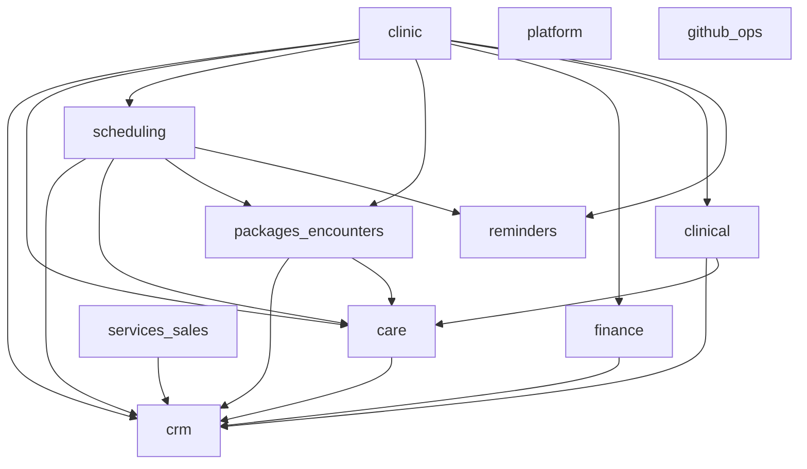

# Dependências entre domínios (business tools / internal actions)

**Propósito:** indicar, ao nível de **domínio** (pack BFF), que outros domínios precisam de dados ou fluxos compatíveis para que **pelo menos uma** ação interna desse domínio funcione corretamente — sem listar `actionId` individualmente.

**Âmbito desta matriz:** dependências **observadas** ao agregar handlers e dados cruzados — é **conservadora** (basta uma action com interseção para marcar dependência). Não substitui o grafo de produto ao **habilitar domínios** no planner/UI (ver secção abaixo).

**Regra de agregação:** se existe **pelo menos uma** action registada nesse domínio que usa identidade **Party**, **`careSubjectId`**, **Encounter** / **PackageSale**, **Reminder**, ou que delega para handlers doutro pack, então o domínio **depende** dos domínios correspondentes.

**Identificadores de domínio:** alinhados ao campo `packId` em [`business-action-presets.ts`](../backend/src/modules/business-tools/application/business-action-presets.ts). O domínio **`clinical`** é o prontuário estruturado (anamnese, evolução, encontro). As actions com prefixo **`clinic_*`** são orquestração conversacional clínica — na matriz aparecem sob a linha agregada **`clinic`**.

**Glossário `clinic` vs `clinic_ops`**

| Termo | Significado |
|-------|-------------|
| **`clinic`** (linha desta matriz) | Agregação de dependências das actions `clinic_*` e orquestração sobre CRM, Care, Scheduling, etc. |
| **`clinic_ops`** | Identificador estável no [`domain-capability-registry.ts`](../backend/src/modules/business-tools/application/domain-capability-registry.ts) e no planner/UI para o pacote “Clínica Gold” (lista explícita de `actionIds` + dependências transitivas via `resolveDomainCapabilitySelection`). Corresponde ao mesmo produto conceptual que a linha **`clinic`** aqui, com granularidade diferente da matriz agregada. |

**Fonte de verdade no código:** registo em [`backend/src/modules/business-tools/application/register-all-business-packs.ts`](../backend/src/modules/business-tools/application/register-all-business-packs.ts), mais [`register-core-business-actions.ts`](../backend/src/modules/business-tools/application/register-core-business-actions.ts) para `platform`.

---

## Matriz domínio → depende de

| Domínio (`packId` ou nome) | Depende de | Nota |
|----------------------------|------------|------|
| `platform` | — | Ex.: `business.ping`; sem dados de negócio. |
| `crm` | — | Raiz de identidade (**Party**). |
| `github_ops` | — | API GitHub + variáveis de ambiente; sem modelo de negócio interno. |
| `reminders` | — | Handlers usam apenas `ReminderRepository`. |
| `care` | `crm` | Sujeitos de cuidado referenciam **Party**; criação pode passar pelo repositório de parties. |
| `finance` | `crm` | Várias actions resolvem party via `resolvePartyIdFromPartyOrPhone`; títulos referenciam parties. |
| `clinical` | `crm`, `care` | Resolução de party em fluxos que abrem encontro clínico; escritas clínicas exigem **`careSubjectId`** (domínio Care). |
| `services_sales` | `crm` | Ordens de serviço referenciam **`partyId`**; catálogo interno não exige party, mas o domínio inclui actions que exigem cliente. |
| `packages_encounters` | `crm`, `care` | Venda/listagem por party via CRM; resumo operacional junta **encounters** e **`careSubjects`**. |
| `scheduling` | `crm`, `care`, `packages_encounters`, `reminders` | Agenda por party (CRM); validação de **care subject**; **completar compromisso** cria **Encounter** (módulo packages-encounters); criação/reagendamento pode criar ou cancelar **lembretes**. |
| `clinic` | `crm`, `care`, `scheduling`, `packages_encounters`, `finance`, `clinical`, `reminders` | Orquestração via `registry.get(...)` sobre packs acima (fluxos conversacionais). |

---

## Dependência obrigatória vs. opcional no payload

A matriz acima é **conservadora**: basta **uma** action com interseção com outro domínio para marcar a dependência.

- Pode usar **só** disponibilidade (`schedule_set_availability`) ou leituras por data **sem** criar party nessa chamada — mas o domínio **`scheduling`** continua listado como dependente de **CRM** porque outras actions resolvem party.
- Em **`packages_encounters`**, `package_catalog_*` opera só no catálogo do workspace; mesmo assim o domínio depende de **CRM** / **Care** por outras actions (ex.: venda ao party, resumo com sujeitos de cuidado).

Para um **subconjunto mínimo** de actions à la carte, avalie o payload e o catálogo exposto ao agente; esta página documenta **limites do domínio como pacote**, não o mínimo por conversa.

---

## Closure de produto ao habilitar domínio

Quando um utilizador escolhe domínios na UI ou o planner materializa `requiredPacks`, a expansão de **`actionIds`** e dependências entre domínios segue **[`domain-capability-registry.ts`](../backend/src/modules/business-tools/application/domain-capability-registry.ts)** (`DOMAIN_CAPABILITY_DEFINITIONS`, `resolveDomainCapabilitySelection`), consumido por [`planner-pack-presets.ts`](../backend/src/modules/team-planning/application/planner-pack-presets.ts) e pelas rotas `GET/POST /business-actions/domains`.

Esta lista pode **divergir ligeiramente** da matriz acima na granularidade (ex.: CRM vs care vs scheduling agrupados de forma diferente), porque a matriz reflecte dependências **inferidas dos handlers** e o registry reflecte o **contrato de produto** para habilitação e planner.

---

## Leitura para produto

- **Verticais no menu** (CRM, Clinical, Care, …) são sobretudo **UI e rotas REST**; não desligam packs no BFF.
- **Habilitar tools no agente / workspace** escolhe que internal actions existem na runtime; os dados (Party, CareSubject, …) têm de existir ou ser criados por actions que também estão habilitadas.
- Times **mínimos** para fluxos cruzados (ex.: clínica conversacional) devem incluir os domínios da linha **`clinic`** na matriz, ou equivalentes manuais via CRM + Care + …

---

## Diagrama (dependências diretas)

---

## Ver também

- [`register-all-business-packs.ts`](../backend/src/modules/business-tools/application/register-all-business-packs.ts) — ordem de registo dos packs.
- [`business-action-presets.ts`](../backend/src/modules/business-tools/application/business-action-presets.ts) — metadados `packId` / catálogo exposto a `GET /business-actions/catalog`.
- [Playbook para contribuidores: tools e domínios](./contributing-business-tools-and-domains.md).
