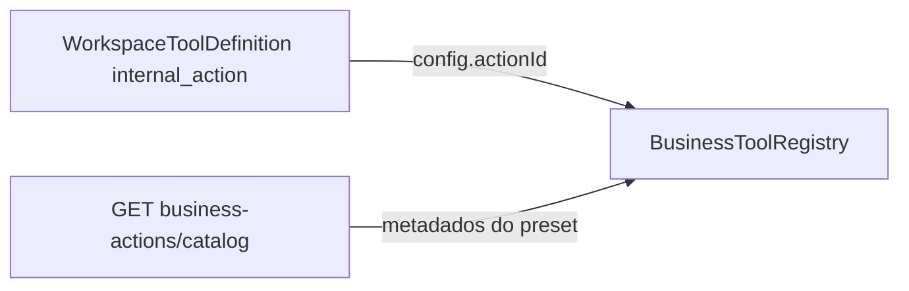

# Contribuir: business tools, domínios e internal_action

Guia para desenvolvedores que adicionam ou alteram ações de negócio (`internal_action`), packs do planner e habilitação por domínio na UI.

## Três camadas no código

| Camada | O que é | Onde |
|--------|---------|------|
| **Handlers** | Execução real: `registry.register(actionId, handler)` | Packs em `backend/src/modules/*/application/register-*-pack.ts`; agregação em [`register-all-business-packs.ts`](../backend/src/modules/business-tools/application/register-all-business-packs.ts) |
| **Catálogo / presets** | Título, descrição, `inputSchema`, `packId`, `dependsOnActionIds`, `dependsOnCatalogTools` | [`business-action-presets.ts`](../backend/src/modules/business-tools/application/business-action-presets.ts) |
| **Domínio habilitável** | Lista de `actionIds` por domínio (id estável), `dependsOnDomainIds`, catalog tools implícitas ao resolver seleção | [`domain-capability-registry.ts`](../backend/src/modules/business-tools/application/domain-capability-registry.ts), derivado em [`planner-pack-presets.ts`](../backend/src/modules/team-planning/application/planner-pack-presets.ts) (`PLANNER_PACK_TO_ACTION_IDS`, `collectPlannerActionIds`) |

Sem handler registado, o catálogo pode listar a action mas o runtime não executa. Sem entrada no **domain capability registry**, o planner e a UI por domínio não expandem essa action ao escolher o pack/domínio correspondente.

## Checklist ao criar ou alterar uma action de negócio

1. **Handler** — Implementar e registar no pack adequado (ou novo `register-*-pack.ts` + import em `register-all-business-packs.ts`).
2. **Preset** — Adicionar ou atualizar entrada em `business-action-presets.ts` com `inputSchema` válido para a API OpenAI: `type: "object"` com `properties` (nunca objeto vazio sem `properties`). Ver [`.cursor/rules/openai-tool-json-schema.mdc`](../.cursor/rules/openai-tool-json-schema.mdc).
3. **Domínio** — Acrescentar o `actionId` ao domínio certo em `DOMAIN_CAPABILITY_DEFINITIONS`, ou criar domínio novo com `dependsOnDomainIds` / `dependsOnCatalogTools` quando fizer sentido (ex.: agendamento pode implicar `calendar_access`).
4. **Consistência** — Os `actionIds` listados para um domínio devem existir no `BusinessToolRegistry` após o bootstrap da app.
5. **Testes** — Padrão existente: testes gold por pack (`*.gold.test.ts`), [`domain-capability-registry.test.ts`](../backend/src/modules/business-tools/application/domain-capability-registry.test.ts) quando mudar dependências entre domínios.
6. **Frontend (rótulos planner)** — Se criar um **novo** identificador de domínio/pack (nova chave em `PLANNER_PACK_IDS`), adicionar entrada em [`v0-team-ai-crafter/lib/planner-pack-labels.ts`](../v0-team-ai-crafter/lib/planner-pack-labels.ts).

## WorkspaceToolDefinition vs execução

- **`WorkspaceToolDefinition`** (`kind: internal_action`, `config.actionId`): expõe a tool ao workspace e ao agente (`customToolDefinitionIds`).
- **Execução:** o runtime resolve `actionId` contra handlers registados no `BusinessToolRegistry`.

## Glossário: `clinic` vs `clinic_ops`

- **`clinical`** — Domínio do prontuário estruturado (anamnese, evolução, encontro): actions `clinical_*` no preset `packId` clinical.
- **`clinic_*` (prefixo de action)** — Orquestração conversacional clínica (vários packs); não confundir com o id de domínio `clinical`.
- **`clinic_ops`** — Identificador do **domínio habilitável** no registry e valor usado em `requiredPacks` / seleção por domínio na UI para o pacote “Clínica Gold” (workflow completo). Na matriz agregada de dependências costuma corresponder à linha conceptual **clinic** (orquestração sobre CRM, care, scheduling, etc.). Ver também [`business-domain-tool-dependencies.md`](./business-domain-tool-dependencies.md).

## Endpoints HTTP úteis (prefixo `/api/v1`)

| Método | Rota | Notas |
|--------|------|--------|
| `GET` | `/business-actions/catalog` | Catálogo de actions registadas + metadados |
| `GET` | `/business-actions/domains` | Lista domínios com actionIds disponíveis vs registadas |
| `POST` | `/business-actions/domains/resolve` | Corpo `{ "domainIds": ["crm", ...] }` — resolve dependências e devolve `actionIds`, `catalogTools`, etc. |
| `PUT` | `/agents/:id/domains` | Corpo `{ "domainIds": [...] }` — aplica domínios ao agente (tools + definitions) |
| `POST` | `/tool-definitions/bulk-internal-action-domains` | Admin — cria definitions em lote por domínios |
| `POST` | `/teams` | Corpo opcional `agentDomainIds`: mapa `agentId` → lista de domain ids |

Autenticação e tenant: ver [`v0-team-ai-crafter/docs/backend-api.md`](../v0-team-ai-crafter/docs/backend-api.md).

## Documentação relacionada

- [Dependências entre domínios (matriz agregada)](./business-domain-tool-dependencies.md)
- [ADR: bind automático no team plan](./adr/ADR-2026-04-team-plan-auto-bind-tools.md)
- [README backend — secção team plans](../backend/README.md)
