# Entidades MongoDB (backend)

Este documento apresenta o inventário das **collections** definidas pelos modelos **Mongoose** em [`backend/src/modules/<domínio>/infra/*.model.ts`](../../backend/src/modules). Não existe opção `collection:` nos schemas: o nome da collection em runtime é o **plural automático** do nome do modelo (regra do Mongoose). Os nomes abaixo foram confirmados com `Model.collection.collectionName` (pluralização Mongoose 8).

**Multi-tenant:** quase todas as entidades de negócio incluem `workspaceId: ObjectId` com índices compostos `{ workspaceId: 1, … }`.

**Referências:** as arestas no diagrama representam **ligações lógicas** via `ObjectId` (ou `runId` string nos runs), não chaves estrangeiras impostas pelo MongoDB.

---

## Diagrama de relações (alto nível)

```mermaid
flowchart TB
  subgraph tenancy [Tenancy_e_identidade]
    Workspace
    User
    WorkspaceMember
    Invite
  end
  subgraph agents_planning [Agentes_e_planeamento]
    Agent
    AgentPlan
    TeamPlan
  end
  subgraph teams_channels [Equipas_canais_grafo]
    Team
    TeamGraph
    Channel
  end
  subgraph mcp_layer [MCP]
    McpConnection
    AgentMcpBinding
  end
  subgraph runs_domain [Execucao_runs]
    Run
    RunEvent
    RunStep
  end
  subgraph crm_care [CRM_cuidados_clinicos]
    Party
    CareSubject
    Anamnesis
    EvolutionNote
  end
  subgraph packages_enc [Pacotes_encontros]
    PackageSale
    Encounter
  end
  subgraph sched_commerce [Agenda_comercio_financeiro]
    Appointment
    AvailabilitySlot
    Reminder
    ServiceCatalogItem
    ServiceOrder
    Receivable
    Payable
  end
  subgraph platform [Ferramentas_conteudo]
    WorkspaceToolDefinition
    KnowledgeSource
    Template
    ApiKey
  end
  subgraph compliance [Auditoria_governanca]
    AuditLog
    GovernanceAuditEvent
    BusinessToolAudit
    AgentOverlapReview
  end

  Workspace --> WorkspaceMember
  User --> WorkspaceMember
  Workspace --> Invite
  Workspace --> Agent
  Workspace --> AgentPlan
  Workspace --> TeamPlan
  Workspace --> Team
  Workspace --> TeamGraph
  Workspace --> Channel
  Workspace --> McpConnection
  Workspace --> Run
  Workspace --> Party
  Workspace --> AvailabilitySlot
  Workspace --> Reminder
  Workspace --> WorkspaceToolDefinition
  Workspace --> KnowledgeSource
  Workspace --> Template
  Workspace --> ApiKey
  Workspace --> AuditLog
  Workspace --> GovernanceAuditEvent
  Workspace --> BusinessToolAudit
  Workspace --> AgentOverlapReview

  Agent --> AgentMcpBinding
  McpConnection --> AgentMcpBinding
  Team --> TeamGraph
  Team --> Run
  Team --> Channel
  Run -->|runId string| RunEvent
  Run -->|runId string| RunStep

  Party --> CareSubject
  CareSubject --> Anamnesis
  CareSubject --> EvolutionNote
  Party --> PackageSale
  Party --> Encounter
  Party --> Appointment
  Party --> ServiceOrder
  Receivable --> Party
  Payable --> Party
  PackageSale --> Encounter
  CareSubject --> Encounter
  ServiceOrder --> Appointment
  PackageSale --> Appointment
  CareSubject --> Appointment
  Appointment --> Reminder
  ServiceOrder --> ServiceCatalogItem

  User --> AuditLog
  User --> GovernanceAuditEvent
```

**Legenda do diagrama:** setas indicam dependência típica de leitura (documento filho referencia o pai ou partilha `workspaceId` com o mesmo tenant). `RunEvent` e `RunStep` amarram-se ao `Run` pelo campo string `runId` (não por `ObjectId`). `Team.coordinatorId` e `Run.coordinatorAgentId` são guardados como `ObjectId` / string conforme o schema, não duplicados no diagrama.

---

## Domínio `agent-governance`

| Collection | Modelo | Ficheiro | Resumo | Índices |
|------------|--------|----------|--------|---------|
| `agentoverlapreviews` | `AgentOverlapReview` | [`backend/src/modules/agent-governance/infra/agent-overlap-review.model.ts`](../../backend/src/modules/agent-governance/infra/agent-overlap-review.model.ts) | `workspaceId`, `draftAgent` (subdocumento de proposta), `matches[]`, `decision` (`allow` \| `review` \| `block` \| `reuse_existing`), `summary`. | `{ workspaceId: 1, createdAt: -1 }` |

---

## Domínio `agent-planning`

| Collection | Modelo | Ficheiro | Resumo | Índices |
|------------|--------|----------|--------|---------|
| `agentplans` | `AgentPlan` | [`backend/src/modules/agent-planning/infra/agent-plan.model.ts`](../../backend/src/modules/agent-planning/infra/agent-plan.model.ts) | `workspaceId`, `status` (draft→failed), `request`/`draftAgent`/`result` mixed, `decision` (`create_new` \| `reuse_existing` \| `split_scope` \| `blocked`), `overlapReview`, `notes[]`. | `{ workspaceId: 1, updatedAt: -1 }` |

---

## Domínio `agents`

| Collection | Modelo | Ficheiro | Resumo | Índices |
|------------|--------|----------|--------|---------|
| `agents` | `Agent` | [`backend/src/modules/agents/infra/agent.model.ts`](../../backend/src/modules/agents/infra/agent.model.ts) | `workspaceId`, `name`, `role` (coordinator/specialist), `origin`, `status`, `domain` (subdocumento), `capabilities`/`knowledge`/etc. mixed, `systemRole`, `deletedAt`. | `workspaceId+status`, `workspaceId+origin`, `workspaceId+role`, `workspaceId+category` |
| `agentmcpbindings` | `AgentMcpBinding` | [`backend/src/modules/agents/infra/agent-mcp-binding.model.ts`](../../backend/src/modules/agents/infra/agent-mcp-binding.model.ts) | `workspaceId`, `agentId`, `mcpConnectionId`, `allowedTools[]`, `requiresApproval`. | único `{ workspaceId, agentId, mcpConnectionId }` |

---

## Domínio `audit`

| Collection | Modelo | Ficheiro | Resumo | Índices |
|------------|--------|----------|--------|---------|
| `auditlogs` | `AuditLog` | [`backend/src/modules/audit/infra/audit-log.model.ts`](../../backend/src/modules/audit/infra/audit-log.model.ts) | `workspaceId`, `userId?`, `method`, `path`, `statusCode`, `durationMs`, `correlationId`. | `{ workspaceId: 1, createdAt: -1 }` |

---

## Domínio `business-tools`

| Collection | Modelo | Ficheiro | Resumo | Índices |
|------------|--------|----------|--------|---------|
| `businesstoolaudits` | `BusinessToolAudit` | [`backend/src/modules/business-tools/infra/business-tool-audit.model.ts`](../../backend/src/modules/business-tools/infra/business-tool-audit.model.ts) | `workspaceId`, `toolDefinitionId`, `actionId`, `ok`, prévias e `correlationId`. | `{ workspaceId: 1, createdAt: -1 }` |

---

## Domínio `care`

| Collection | Modelo | Ficheiro | Resumo | Índices |
|------------|--------|----------|--------|---------|
| `caresubjects` | `CareSubject` | [`backend/src/modules/care/infra/care-subject.model.ts`](../../backend/src/modules/care/infra/care-subject.model.ts) | `workspaceId`, `partyId`, `name`, `subjectKind` (human/animal/psych), `notes`. | `{ workspaceId: 1, name: 1 }` |

---

## Domínio `channels`

| Collection | Modelo | Ficheiro | Resumo | Índices |
|------------|--------|----------|--------|---------|
| `channels` | `Channel` | [`backend/src/modules/channels/infra/channel.model.ts`](../../backend/src/modules/channels/infra/channel.model.ts) | `workspaceId`, `type` (whatsapp, slack, …), `provider`/`platform`, `name`, `status`, `teamId?`, `config` mixed, `secretsEncrypted?`, métricas. | vários compostos por workspace+tipo/status e por IDs em `config` (Slack, Discord, Teams, etc.) |

---

## Domínio `clinical`

| Collection | Modelo | Ficheiro | Resumo | Índices |
|------------|--------|----------|--------|---------|
| `anamneses` | `Anamnesis` | [`backend/src/modules/clinical/infra/anamnesis.model.ts`](../../backend/src/modules/clinical/infra/anamnesis.model.ts) | `workspaceId`, `careSubjectId`, `template`, `content` mixed. | índices declarados nos campos |
| `evolutionnotes` | `EvolutionNote` | [`backend/src/modules/clinical/infra/evolution-note.model.ts`](../../backend/src/modules/clinical/infra/evolution-note.model.ts) | `workspaceId`, `careSubjectId`, `body`. | índices declarados nos campos |

---

## Domínio `crm`

| Collection | Modelo | Ficheiro | Resumo | Índices |
|------------|--------|----------|--------|---------|
| `parties` | `Party` | [`backend/src/modules/crm/infra/party.model.ts`](../../backend/src/modules/crm/infra/party.model.ts) | `workspaceId`, `displayName`, `roles[]`, contacto, `notes`. | `{ workspaceId: 1, displayName: 1 }` |

---

## Domínio `finance`

| Collection | Modelo | Ficheiro | Resumo | Índices |
|------------|--------|----------|--------|---------|
| `receivables` | `Receivable` | [`backend/src/modules/finance/infra/receivable.model.ts`](../../backend/src/modules/finance/infra/receivable.model.ts) | `workspaceId`, `partyId`, `amount`, `currency`, `dueDate`, `paid`, `description`. | índices nos campos marcados |
| `payables` | `Payable` | [`backend/src/modules/finance/infra/payable.model.ts`](../../backend/src/modules/finance/infra/payable.model.ts) | `workspaceId`, `destinationPartyId`, `amount`, `currency`, `dueDate`, `paid`, `description`. | índices nos campos marcados |

---

## Domínio `governance`

| Collection | Modelo | Ficheiro | Resumo | Índices |
|------------|--------|----------|--------|---------|
| `governanceauditevents` | `GovernanceAuditEvent` | [`backend/src/modules/governance/infra/governance-audit-event.model.ts`](../../backend/src/modules/governance/infra/governance-audit-event.model.ts) | `workspaceId`, `userId?`, `correlationId`, `eventType`, `payload` mixed. | `{ workspaceId: 1, createdAt: -1 }` |

---

## Domínio `graphs`

| Collection | Modelo | Ficheiro | Resumo | Índices |
|------------|--------|----------|--------|---------|
| `teamgraphs` | `TeamGraph` | [`backend/src/modules/graphs/infra/team-graph.model.ts`](../../backend/src/modules/graphs/infra/team-graph.model.ts) | `workspaceId`, `teamId` (único), `nodes`/`edges` mixed, `validationState`. | `teamId` unique |

---

## Domínio `knowledge`

| Collection | Modelo | Ficheiro | Resumo | Índices |
|------------|--------|----------|--------|---------|
| `knowledgesources` | `KnowledgeSource` | [`backend/src/modules/knowledge/infra/knowledge-source.model.ts`](../../backend/src/modules/knowledge/infra/knowledge-source.model.ts) | `workspaceId`, `name`, `type` (document/database/api/website), `status`, `lastSyncAt`, `itemCount`, `config`. | `{ workspaceId: 1, type: 1 }` |

---

## Domínio `mcps`

| Collection | Modelo | Ficheiro | Resumo | Índices |
|------------|--------|----------|--------|---------|
| `mcpconnections` | `McpConnection` | [`backend/src/modules/mcps/infra/mcp-connection.model.ts`](../../backend/src/modules/mcps/infra/mcp-connection.model.ts) | `workspaceId`, `name`, `status`, `tools[]` (name/description), `icon`, `config` mixed. | `{ workspaceId: 1, name: 1 }` |

---

## Domínio `packages-encounters`

| Collection | Modelo | Ficheiro | Resumo | Índices |
|------------|--------|----------|--------|---------|
| `encounters` | `Encounter` | [`backend/src/modules/packages-encounters/infra/encounter.model.ts`](../../backend/src/modules/packages-encounters/infra/encounter.model.ts) | `workspaceId`, `partyId`, `packageSaleId?`, `careSubjectId?`, `encounterKind`, `clinicalStatus`, `durationMinutes`, `notes`. | índices nos campos |
| `packagesales` | `PackageSale` | [`backend/src/modules/packages-encounters/infra/package-sale.model.ts`](../../backend/src/modules/packages-encounters/infra/package-sale.model.ts) | `workspaceId`, `partyId`, `packageName`, `unitsTotal`, `unitsUsed`. | — |

---

## Domínio `reminders`

| Collection | Modelo | Ficheiro | Resumo | Índices |
|------------|--------|----------|--------|---------|
| `reminders` | `Reminder` | [`backend/src/modules/reminders/infra/reminder.model.ts`](../../backend/src/modules/reminders/infra/reminder.model.ts) | `workspaceId`, `title`, `at`, `done`, `cancelled`. | índices nos campos |

---

## Domínio `runs`

| Collection | Modelo | Ficheiro | Resumo | Índices |
|------------|--------|----------|--------|---------|
| `runs` | `Run` | [`backend/src/modules/runs/infra/run.model.ts`](../../backend/src/modules/runs/infra/run.model.ts) | `workspaceId`, `runId` (string, único por workspace), `teamId`, `coordinatorAgentId` (string), `source`, `status`, `startedAt`/`finishedAt`, `externalResponse`/`error` mixed. | `{ workspaceId, teamId, startedAt }`, único `{ workspaceId, runId }` |
| `runevents` | `RunEvent` | [`backend/src/modules/runs/infra/run-event.model.ts`](../../backend/src/modules/runs/infra/run-event.model.ts) | `workspaceId`, `runId` (string), `seq`, `type`, `payload`, `createdAt` (sem `timestamps` automáticos). | `{ workspaceId, runId, seq }` |
| `runsteps` | `RunStep` | [`backend/src/modules/runs/infra/run-step.model.ts`](../../backend/src/modules/runs/infra/run-step.model.ts) | `workspaceId`, `runId` (string), `stepIndex`, `stepType`, `agentId?`, `toolName?`, `status`, `summary`, tempos. | `{ workspaceId, runId, stepIndex }` |

---

## Domínio `scheduling`

| Collection | Modelo | Ficheiro | Resumo | Índices |
|------------|--------|----------|--------|---------|
| `appointments` | `Appointment` | [`backend/src/modules/scheduling/infra/appointment.model.ts`](../../backend/src/modules/scheduling/infra/appointment.model.ts) | `workspaceId`, `partyId`, refs opcionais a `careSubjectId`, `serviceOrderId`, `packageSaleId`, `encounterId`, `reminderId`, `title`, janela temporal, `status`, `notes`. | `{ workspaceId: 1, startsAt: 1, endsAt: 1 }` |
| `availabilityslots` | `AvailabilitySlot` | [`backend/src/modules/scheduling/infra/availability-slot.model.ts`](../../backend/src/modules/scheduling/infra/availability-slot.model.ts) | `workspaceId`, `startsAt`/`endsAt`, `slotMinutes`, `label`. | `{ workspaceId: 1, startsAt: 1, endsAt: 1 }` |

---

## Domínio `services-sales`

| Collection | Modelo | Ficheiro | Resumo | Índices |
|------------|--------|----------|--------|---------|
| `servicecatalogitems` | `ServiceCatalogItem` | [`backend/src/modules/services-sales/infra/service-catalog-item.model.ts`](../../backend/src/modules/services-sales/infra/service-catalog-item.model.ts) | `workspaceId`, `name`, `unitPrice`, `currency`. | — |
| `serviceorders` | `ServiceOrder` | [`backend/src/modules/services-sales/infra/service-order.model.ts`](../../backend/src/modules/services-sales/infra/service-order.model.ts) | `workspaceId`, `partyId`, `lines[]` (`catalogItemId`, qty, preço), `status`, `totalPaid`. | índices nos campos |

---

## Domínio `settings`

| Collection | Modelo | Ficheiro | Resumo | Índices |
|------------|--------|----------|--------|---------|
| `apikeys` | `ApiKey` | [`backend/src/modules/settings/infra/api-key.model.ts`](../../backend/src/modules/settings/infra/api-key.model.ts) | `workspaceId`, `name`, `prefix`, `hashedKey`, `lastUsedAt`. | `{ workspaceId: 1, name: 1 }` |

---

## Domínio `team-planning`

| Collection | Modelo | Ficheiro | Resumo | Índices |
|------------|--------|----------|--------|---------|
| `teamplans` | `TeamPlan` | [`backend/src/modules/team-planning/infra/team-plan.model.ts`](../../backend/src/modules/team-planning/infra/team-plan.model.ts) | `workspaceId`, `problem`, `context`, `status`, `team` mixed, `agents[]` (planeamento, `catalogTools`), `graph`, `bindOverrides`, `result`, etc. | `{ workspaceId: 1, updatedAt: -1 }` |

---

## Domínio `teams`

| Collection | Modelo | Ficheiro | Resumo | Índices |
|------------|--------|----------|--------|---------|
| `teams` | `Team` | [`backend/src/modules/teams/infra/team.model.ts`](../../backend/src/modules/teams/infra/team.model.ts) | `workspaceId`, `name`, `status`, `coordinatorId`, `agentIds[]`, `channelIds[]`, `primaryChannel`. | `workspaceId+status`, `workspaceId+coordinatorId` |

---

## Domínio `templates`

| Collection | Modelo | Ficheiro | Resumo | Índices |
|------------|--------|----------|--------|---------|
| `templates` | `Template` | [`backend/src/modules/templates/infra/template.model.ts`](../../backend/src/modules/templates/infra/template.model.ts) | `workspaceId`, `origin`, `name`, `category`, `vertical`, `teamConfig`/`graph`/`agentsSnapshot` mixed, `prerequisites`, `applyBehavior`. | `workspaceId+origin`, `workspaceId+category` |

---

## Domínio `tool-definitions`

| Collection | Modelo | Ficheiro | Resumo | Índices |
|------------|--------|----------|--------|---------|
| `workspacetooldefinitions` | `WorkspaceToolDefinition` | [`backend/src/modules/tool-definitions/infra/workspace-tool-definition.model.ts`](../../backend/src/modules/tool-definitions/infra/workspace-tool-definition.model.ts) | `workspaceId`, `name`, `slug`, `kind` (builtin_ref, http_webhook, mcp_ref, internal_action), `jsonSchema`, `config`, `enabled`. | único `{ workspaceId, slug }` |

---

## Domínio `users`

| Collection | Modelo | Ficheiro | Resumo | Índices |
|------------|--------|----------|--------|---------|
| `users` | `User` | [`backend/src/modules/users/infra/user.model.ts`](../../backend/src/modules/users/infra/user.model.ts) | `email` (único), `passwordHash`, `name`, `preferences`, `workspaceIds[]`, `isPlatformAdmin`, `refreshTokenHash` (sparse). | — |

---

## Domínio `workspaces`

| Collection | Modelo | Ficheiro | Resumo | Índices |
|------------|--------|----------|--------|---------|
| `workspaces` | `Workspace` | [`backend/src/modules/workspaces/infra/workspace.model.ts`](../../backend/src/modules/workspaces/infra/workspace.model.ts) | `name`, `logo`, `plan` (free/pro/enterprise), `settings`/`limits` mixed, `integrationSecretsEncrypted?` (AES-GCM). | — |
| `workspacemembers` | `WorkspaceMember` | [`backend/src/modules/workspaces/infra/workspace-member.model.ts`](../../backend/src/modules/workspaces/infra/workspace-member.model.ts) | `workspaceId`, `userId`, `role` (owner/admin/member), `joinedAt` (sem timestamps automáticos no schema). | único `{ workspaceId, userId }` |
| `invites` | `Invite` | [`backend/src/modules/workspaces/infra/invite.model.ts`](../../backend/src/modules/workspaces/infra/invite.model.ts) | `workspaceId`, `email`, `role`, `expiresAt`, `consumedAt?`, `revokedAt?`. | — |

---

## Contagem

**36** collections / modelos mapeados, alinhados com os ficheiros `*.model.ts` listados acima.
