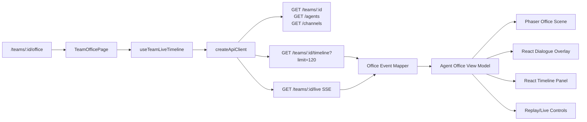
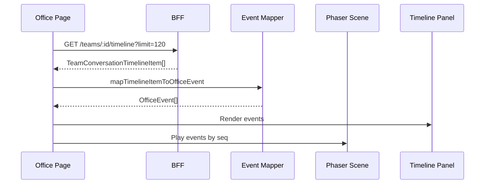
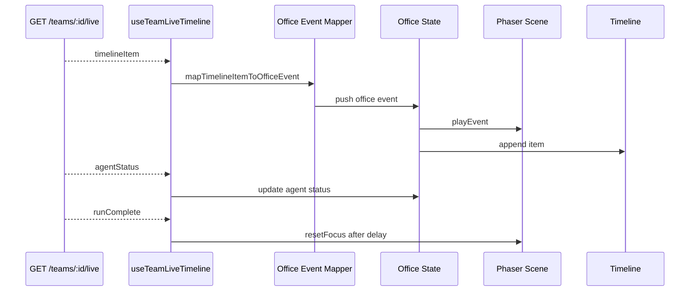

Abaixo está a versão consolidada, juntando o melhor dos dois planos, com as correções que eu faria para virar uma **épica técnica implementável** no repositório `whitebeardit/agents-team-crafter`.

# Plano completo: Escritório Virtual de Agentes com Phaser

## 1. Decisão principal

Criar uma nova tela isolada dentro do frontend atual:

```text
/teams/[id]/office
```

Essa tela será o **Escritório Virtual do Time**, onde os agentes aparecem como personagens em uma simulação 2D, com movimento, foco visual, balões de fala, replay e live em tempo real.

Não criar outro frontend agora.

O app atual já tem Next.js, autenticação, workspace, API client, SSE, timeline e tela de grafo live. O plano que você trouxe acerta ao propor uma página isolada reaproveitando essa base existente .

---

# 2. Stack escolhida

## Usar Phaser

Instalar no frontend:

```bash
cd v0-team-ai-crafter
npm install phaser
```

Motivo:

Phaser é mais simples que Three.js para este caso, porque o requisito é um **game 2D/2.5D**, com:

* personagens;
* movimento;
* balões;
* destaques;
* opacidade/cinza;
* replay;
* linhas animadas;
* cenário de escritório.

Three.js só entraria depois se o objetivo virasse um escritório 3D.

---

# 3. Conceito de produto

A tela `/office` não será um editor.

Ela será uma visualização operacional e demonstrável do comportamento dos agentes.

Separação conceitual:

```text
/teams/[id]/graph   -> Como o time está configurado
/teams/[id]/office  -> Como o time está trabalhando
/runs               -> Histórico operacional das execuções
```

---

# 4. Experiência esperada

Quando o usuário executa ou acompanha um time:

```text
Usuário envia mensagem
        ↓
Coordenador recebe
        ↓
Coordenador pensa
        ↓
Coordenador chama especialista X
        ↓
Especialista responde
        ↓
Coordenador consolida
        ↓
Resposta final
```

Na tela:

```text
┌──────────────────────────────────────────────────────────────┐
│ Escritório Virtual: Atendimento Clínica                      │
├──────────────────────────────────────────────────────────────┤
│                                                              │
│                    🧑‍💼 Coordenador                           │
│            "Vou chamar o especialista de agenda."            │
│                                                              │
│      🤖 CRM             🤖 Agenda            🤖 Financeiro    │
│    cinza/off          colorido/ativo          cinza/off       │
│                                                              │
│ Timeline                                                     │
│ 12:00 Usuário enviou mensagem                                │
│ 12:01 Coordenador analisou intenção                          │
│ 12:02 Coordenador chamou Agenda                              │
│ 12:03 Agenda retornou horários disponíveis                   │
└──────────────────────────────────────────────────────────────┘
```

Regra visual principal:

Quando o coordenador falar com o especialista X:

* coordenador fica colorido;
* especialista X fica colorido;
* os demais agentes ficam em cinza/opacidade menor;
* aparece uma linha/arco animado entre eles;
* aparece balão de fala;
* a timeline lateral registra o evento.

---

# 5. Arquitetura da solução



A parte mais importante é reaproveitar o que já existe. A tela atual de grafo já usa replay com `/teams/:id/timeline?limit=120`, consome `api.streamTeamLive`, trata `onTimelineItem`, `onAgentStatus`, `onCoordinatorDelta` e `onRunComplete` .

---

# 6. Estrutura de arquivos proposta

```text
v0-team-ai-crafter/
  app/
    (app)/
      teams/
        [id]/
          office/
            page.tsx

  components/
    office/
      team-office-page-client.tsx
      agent-office.tsx
      agent-office-game.tsx
      agent-office-scene.ts
      agent-office-overlay.tsx
      agent-office-timeline-panel.tsx
      agent-office-controls.tsx
      agent-office-status-bar.tsx

  lib/
    live/
      use-team-live-timeline.ts
      timeline-view-model.ts

    office/
      office-types.ts
      office-layout.ts
      office-event-mapper.ts
      office-view-model.ts
      office-simulation-fixtures.ts
      office-controller.ts
```

---

# 7. Responsabilidades por camada

## 7.1 `page.tsx`

Arquivo:

```text
app/(app)/teams/[id]/office/page.tsx
```

Responsabilidade:

* renderizar a página;
* manter a rota autenticada dentro do layout atual;
* delegar a lógica para `TeamOfficePageClient`.

Exemplo:

```tsx
import { TeamOfficePageClient } from "@/components/office/team-office-page-client"

export default function TeamOfficePage() {
  return <TeamOfficePageClient />
}
```

---

## 7.2 `team-office-page-client.tsx`

Responsável por:

* pegar `teamId` via `useParams`;
* pegar token/workspace via `useWorkspaceStore`;
* criar `api` com `createApiClient`;
* carregar time, agentes e canais;
* inicializar replay;
* conectar live;
* montar layout da página.

Essa camada **não deve manipular Phaser diretamente**. Ela envia estado/eventos para o controller.

---

## 7.3 `use-team-live-timeline.ts`

Arquivo:

```text
lib/live/use-team-live-timeline.ts
```

Esse hook deve extrair a lógica live que hoje está dentro da página de grafo.

Responsável por:

* carregar replay inicial;
* conectar `api.streamTeamLive`;
* deduplicar eventos por `item.id`;
* ordenar por `seq`;
* expor estado limpo para qualquer tela.

Assinatura sugerida:

```ts
export function useTeamLiveTimeline(input: {
  teamId: string
  api: ReturnType<typeof createApiClient> | null
  enabled: boolean
  replayLimit?: number
}) {
  return {
    items,
    liveAgentState,
    liveMirrorLines,
    liveMirrorStreamText,
    connected,
    reconnecting,
    error,
    clear,
  }
}
```

Isso permitirá reutilizar o mesmo live em:

```text
/teams/[id]/graph
/teams/[id]/office
```

---

## 7.4 `office-event-mapper.ts`

Converte eventos da timeline real para eventos visuais.

O tipo atual `TeamConversationTimelineItem` já tem `actorId`, `kind`, `content`, `seq`, `timestamp`, `meta` e `correlation` .

Criar:

```ts
export function mapTimelineItemToOfficeEvent(
  item: TeamConversationTimelineItem,
  context: {
    coordinatorId: string
  }
): OfficeEvent {
  const fromAgentId = readString(item.meta?.fromAgentId)
  const toAgentId = readString(item.meta?.toAgentId)

  if (item.kind === "handoff") {
    return {
      id: item.id,
      seq: item.seq,
      timestamp: item.timestamp,
      type: "agent_handoff",
      fromAgentId: fromAgentId ?? context.coordinatorId,
      toAgentId: toAgentId ?? item.actorId,
      actorId: item.actorId,
      message: readString(item.meta?.displayText) ?? item.content,
      original: item,
    }
  }

  if (item.kind === "thinking") {
    return {
      id: item.id,
      seq: item.seq,
      timestamp: item.timestamp,
      type: "agent_thinking",
      actorId: item.actorId,
      message: item.content,
      original: item,
    }
  }

  if (item.kind === "output") {
    return {
      id: item.id,
      seq: item.seq,
      timestamp: item.timestamp,
      type: "agent_response",
      actorId: item.actorId,
      message: item.content,
      original: item,
    }
  }

  if (item.kind === "tool_call") {
    return {
      id: item.id,
      seq: item.seq,
      timestamp: item.timestamp,
      type: "tool_call",
      actorId: item.actorId,
      message: item.content,
      original: item,
    }
  }

  if (item.kind === "error") {
    return {
      id: item.id,
      seq: item.seq,
      timestamp: item.timestamp,
      type: "error",
      actorId: item.actorId,
      message: item.content,
      original: item,
    }
  }

  return {
    id: item.id,
    seq: item.seq,
    timestamp: item.timestamp,
    type: "activity",
    actorId: item.actorId,
    message: item.content,
    original: item,
  }
}
```

---

# 8. Tipos novos

Arquivo:

```text
lib/office/office-types.ts
```

```ts
import type { TeamConversationTimelineItem } from "@/lib/types"

export type OfficeAgentRole = "coordinator" | "specialist"

export type OfficeAgentStatus =
  | "idle"
  | "thinking"
  | "walking"
  | "speaking"
  | "waiting"
  | "done"
  | "error"

export type OfficeEventType =
  | "user_message"
  | "agent_thinking"
  | "agent_handoff"
  | "agent_response"
  | "tool_call"
  | "tool_result"
  | "activity"
  | "run_complete"
  | "error"

export type OfficeAgentVisualState = {
  agentId: string
  name: string
  role: OfficeAgentRole
  status: OfficeAgentStatus
  x: number
  y: number
  active: boolean
  dimmed: boolean
  currentBubble?: string
  category?: string
}

export type OfficeEvent = {
  id: string
  seq: number
  timestamp: string
  type: OfficeEventType
  fromAgentId?: string
  toAgentId?: string
  actorId?: string
  message: string
  original?: TeamConversationTimelineItem
}

export type OfficeInteraction = {
  fromAgentId?: string
  toAgentId?: string
  message?: string
  startedAt: number
  kind: OfficeEventType
}

export type AgentOfficeState = {
  agents: OfficeAgentVisualState[]
  events: OfficeEvent[]
  activeInteraction?: OfficeInteraction
  selectedEventId?: string
  mode: "simulation" | "replay" | "live"
  playback: {
    playing: boolean
    speed: 1 | 2 | 4
    cursorSeq?: number
  }
}
```

---

# 9. Contrato recomendado para o backend

Este é o ponto mais importante para a experiência ficar boa.

Hoje o tipo aceita `meta?: Record<string, unknown>` na timeline . Então dá para enriquecer sem quebrar contrato.

## Evento handoff ideal

```json
{
  "kind": "handoff",
  "actorId": "coordinator-agent-id",
  "content": "Chamando especialista de Agenda",
  "meta": {
    "fromAgentId": "coordinator-agent-id",
    "toAgentId": "agenda-specialist-id",
    "displayText": "Verifique disponibilidade para amanhã às 15h.",
    "interactionType": "handoff"
  }
}
```

## Evento resposta ideal

```json
{
  "kind": "output",
  "actorId": "agenda-specialist-id",
  "content": "Encontrei horários disponíveis às 15h e 16h.",
  "meta": {
    "fromAgentId": "agenda-specialist-id",
    "toAgentId": "coordinator-agent-id",
    "displayText": "Encontrei horários disponíveis às 15h e 16h.",
    "interactionType": "response"
  }
}
```

Sem esse enriquecimento, o frontend ainda funciona, mas terá que inferir relações com menos precisão.

---

# 10. Layout visual dos agentes

Arquivo:

```text
lib/office/office-layout.ts
```

Estratégia inicial:

* coordenador no centro;
* especialistas em semicírculo ou círculo;
* canais no topo;
* timeline na lateral direita;
* sem pathfinding complexo no MVP.

Exemplo:

```ts
export function buildOfficeLayout(input: {
  coordinatorId: string
  agents: Array<{
    id: string
    name: string
    role: "coordinator" | "specialist"
    category?: string
  }>
}) {
  const center = { x: 520, y: 280 }

  const coordinator = input.agents.find((a) => a.id === input.coordinatorId)
  const specialists = input.agents.filter((a) => a.id !== input.coordinatorId)

  const result = []

  if (coordinator) {
    result.push({
      agentId: coordinator.id,
      name: coordinator.name,
      role: "coordinator" as const,
      x: center.x,
      y: center.y,
      active: false,
      dimmed: false,
      status: "idle" as const,
      category: coordinator.category,
    })
  }

  const radius = 260
  const startAngle = Math.PI * 0.15
  const endAngle = Math.PI * 0.85

  specialists.forEach((agent, index) => {
    const t = specialists.length <= 1 ? 0.5 : index / (specialists.length - 1)
    const angle = startAngle + (endAngle - startAngle) * t

    result.push({
      agentId: agent.id,
      name: agent.name,
      role: "specialist" as const,
      x: center.x + Math.cos(angle) * radius,
      y: center.y + Math.sin(angle) * radius,
      active: false,
      dimmed: false,
      status: "idle" as const,
      category: agent.category,
    })
  })

  return result
}
```

---

# 11. Divisão entre Phaser e React

Essa é uma correção importante.

## Phaser deve cuidar de:

* cenário;
* agentes;
* movimento;
* linhas animadas;
* glow/pulse;
* opacidade/cinza;
* câmera;
* sprites ou avatares.

## React deve cuidar de:

* timeline lateral;
* botões;
* replay controls;
* modo live/simulação;
* balões ricos de diálogo;
* textos longos;
* acessibilidade;
* links para runs/agentes.

Ou seja:

```text
Phaser = mundo visual
React = interface, texto e controles
```

Isso evita sofrer com texto responsivo dentro do canvas.

---

# 12. Controller entre React e Phaser

Não recomendo o React manipular a cena diretamente a cada render.

Criar:

```text
lib/office/office-controller.ts
```

```ts
import type { OfficeEvent } from "./office-types"

export type AgentOfficeController = {
  playEvent(event: OfficeEvent): void
  focusAgents(fromAgentId?: string, toAgentId?: string): void
  resetFocus(): void
  setAgentsDimmed(dimmed: boolean): void
  destroy(): void
}
```

O componente React chama o controller:

```ts
controller.current?.playEvent(event)
```

A cena Phaser executa:

* animação;
* destaque;
* movimento;
* linha;
* reset.

---

# 13. Componente Phaser client-only

Arquivo:

```text
components/office/agent-office-game.tsx
```

Phaser deve ser carregado somente no browser.

No componente pai:

```tsx
import dynamic from "next/dynamic"

const AgentOfficeGame = dynamic(
  () => import("@/components/office/agent-office-game"),
  { ssr: false }
)
```

O wrapper:

```tsx
"use client"

import { useEffect, useRef } from "react"
import Phaser from "phaser"
import type { AgentOfficeController, OfficeAgentVisualState, OfficeEvent } from "@/lib/office/office-types"

export default function AgentOfficeGame({
  agents,
  events,
  activeEvent,
  onControllerReady,
}: {
  agents: OfficeAgentVisualState[]
  events: OfficeEvent[]
  activeEvent?: OfficeEvent
  onControllerReady?: (controller: AgentOfficeController) => void
}) {
  const containerRef = useRef<HTMLDivElement | null>(null)
  const gameRef = useRef<Phaser.Game | null>(null)

  useEffect(() => {
    if (!containerRef.current || gameRef.current) return

    const config: Phaser.Types.Core.GameConfig = {
      type: Phaser.AUTO,
      parent: containerRef.current,
      width: 1100,
      height: 680,
      backgroundColor: "#0f172a",
      scene: [AgentOfficeScene],
      scale: {
        mode: Phaser.Scale.RESIZE,
        autoCenter: Phaser.Scale.CENTER_BOTH,
      },
    }

    gameRef.current = new Phaser.Game(config)

    return () => {
      gameRef.current?.destroy(true)
      gameRef.current = null
    }
  }, [])

  return <div ref={containerRef} className="h-full w-full" />
}
```

---

# 14. Cena Phaser

Arquivo:

```text
components/office/agent-office-scene.ts
```

Responsabilidades:

* desenhar background;
* criar agentes;
* manter `Map<agentId, container>`;
* aplicar foco;
* aplicar cinza/opacidade;
* mover agente;
* desenhar linha animada;
* emitir posição dos agentes para overlay HTML.

Pseudoestrutura:

```ts
export class AgentOfficeScene extends Phaser.Scene {
  private agents = new Map<string, Phaser.GameObjects.Container>()
  private agentPositions = new Map<string, { x: number; y: number }>()
  private activeLine?: Phaser.GameObjects.Graphics

  create() {
    this.createOfficeBackground()
  }

  setAgents(agents: OfficeAgentVisualState[]) {
    for (const agent of agents) {
      this.createOrUpdateAgent(agent)
    }
  }

  playEvent(event: OfficeEvent) {
    if (event.type === "agent_handoff") {
      this.focusAgents(event.fromAgentId, event.toAgentId)
      this.drawInteractionLine(event.fromAgentId, event.toAgentId)
      this.pulseAgent(event.fromAgentId)
      this.pulseAgent(event.toAgentId)
    }

    if (event.type === "agent_response") {
      this.focusAgents(event.actorId, event.fromAgentId)
      this.pulseAgent(event.actorId)
    }

    if (event.type === "error") {
      this.markAgentError(event.actorId)
    }
  }

  focusAgents(fromAgentId?: string, toAgentId?: string) {
    for (const [agentId, container] of this.agents.entries()) {
      const focused = agentId === fromAgentId || agentId === toAgentId

      container.setAlpha(focused ? 1 : 0.35)

      if (focused) {
        // glow/pulse/tint normal
      } else {
        // tint cinza
      }
    }
  }

  resetFocus() {
    for (const [, container] of this.agents.entries()) {
      container.setAlpha(1)
      container.clearTint?.()
    }
    this.activeLine?.destroy()
    this.activeLine = undefined
  }
}
```

---

# 15. Overlay HTML para diálogo

Arquivo:

```text
components/office/agent-office-overlay.tsx
```

Responsável por:

* balão do agente atual;
* texto do evento;
* truncamento;
* tooltip ou expand;
* posicionamento aproximado sobre o canvas.

Exemplo visual:

```text
┌────────────────────────────────────┐
│ Coordenador                        │
│ Vou chamar o especialista de CRM...│
└────────────────────────────────────┘
```

Regra:

* balão mostra no máximo 140–180 caracteres;
* timeline mostra o texto completo;
* pensamentos internos longos não devem poluir a cena;
* priorizar `meta.displayText`, depois `content`.

---

# 16. Timeline lateral

Arquivo:

```text
components/office/agent-office-timeline-panel.tsx
```

Mostra eventos em ordem:

```text
12:00 input        Usuário enviou mensagem
12:01 thinking     Coordenador analisando intenção
12:02 handoff      Coordenador → Agenda
12:03 output       Agenda → Coordenador
12:04 output       Resposta final
```

Funcionalidades:

* evento atual destacado;
* clique em evento executa replay daquele ponto;
* filtro por agente;
* mostrar tipo do evento;
* mostrar erro claramente;
* mostrar `runId`/correlation se existir.

---

# 17. Controles

Arquivo:

```text
components/office/agent-office-controls.tsx
```

Controles mínimos:

```text
[Simulação] [Replay] [Live] [Pausar] [1x] [2x] [4x] [Limpar]
```

Comportamento:

* **Simulação:** usa fixtures locais;
* **Replay:** usa `/teams/:id/timeline?limit=120`;
* **Live:** usa `GET /teams/:id/live`;
* **Pausar:** pausa execução visual, mas não necessariamente desconecta SSE;
* **Limpar:** limpa foco/timeline visual local.

---

# 18. Modo Simulação

Arquivo:

```text
lib/office/office-simulation-fixtures.ts
```

Criar fixture para demo sem depender de execução real.

Exemplo:

```ts
export function buildDemoOfficeEvents(input: {
  coordinatorId: string
  specialistIds: string[]
}): OfficeEvent[] {
  const crm = input.specialistIds[0]
  const agenda = input.specialistIds[1] ?? crm

  return [
    {
      id: "demo-1",
      seq: 1,
      timestamp: new Date().toISOString(),
      type: "user_message",
      message: "Quero agendar atendimento para Maria.",
    },
    {
      id: "demo-2",
      seq: 2,
      timestamp: new Date().toISOString(),
      type: "agent_handoff",
      fromAgentId: input.coordinatorId,
      toAgentId: crm,
      message: "Verifique se Maria já existe no CRM.",
    },
    {
      id: "demo-3",
      seq: 3,
      timestamp: new Date().toISOString(),
      type: "agent_response",
      fromAgentId: crm,
      toAgentId: input.coordinatorId,
      actorId: crm,
      message: "Maria encontrada. Cliente ativo.",
    },
    {
      id: "demo-4",
      seq: 4,
      timestamp: new Date().toISOString(),
      type: "agent_handoff",
      fromAgentId: input.coordinatorId,
      toAgentId: agenda,
      message: "Agora verifique horários disponíveis.",
    },
  ]
}
```

Esse modo é essencial para demo comercial e para desenvolvimento.

---

# 19. Modo Replay

Fluxo:



O replay deve:

* ordenar por `seq`;
* ignorar duplicados;
* permitir pausar;
* permitir velocidade 1x, 2x e 4x;
* permitir clicar em um evento.

---

# 20. Modo Live

Fluxo:



O API client já tem suporte a `streamTeamLive` com handlers para eventos SSE como `agentStatus`, `coordinatorDelta`, `runComplete`, `inboundUserMessage` e `timelineItem` .

---

# 21. Regra de foco visual

Arquivo:

```text
lib/office/office-view-model.ts
```

```ts
export function applyOfficeFocus(
  agents: OfficeAgentVisualState[],
  fromAgentId?: string,
  toAgentId?: string
): OfficeAgentVisualState[] {
  return agents.map((agent) => {
    const focused =
      agent.agentId === fromAgentId ||
      agent.agentId === toAgentId

    return {
      ...agent,
      active: focused,
      dimmed: Boolean(fromAgentId || toAgentId) && !focused,
      status: focused ? "speaking" : "idle",
    }
  })
}
```

Regra:

* se existe interação ativa, só dois agentes ficam destacados;
* se não existe interação ativa, todos voltam ao neutro;
* em erro, agente pode ficar vermelho/alerta;
* em tool call, agente pode ficar com ícone de ferramenta.

---

# 22. Navegação

Adicionar botão discreto no detalhe do time e/ou no grafo:

```text
Ver Escritório Virtual
```

Destino:

```text
/teams/{team.id}/office
```

Não adicionar no menu lateral no MVP.

Depois, se virar funcionalidade central, pode entrar no menu como:

```text
Escritório
```

---

# 23. Fases de entrega

## Fase 0 — Preparação

Entregas:

* instalar `phaser`;
* criar estrutura de pastas;
* criar rota `/teams/[id]/office`;
* carregar página sem quebrar build.

Critério de aceite:

* rota abre no app autenticado;
* volta para detalhe do time;
* não quebra `/teams/[id]/graph`.

---

## Fase 1 — Simulação visual offline

Entregas:

* Phaser renderiza escritório simples;
* agentes aparecem em posições fixas;
* coordenador no centro;
* especialistas ao redor;
* botão “Simular”;
* fixture local toca uma sequência;
* foco visual funcionando;
* demais agentes ficam cinza;
* balão aparece via React overlay;
* timeline lateral mostra eventos.

Critério de aceite:

* sem depender de SSE;
* sem depender de execução real;
* serve para demo visual.

---

## Fase 2 — Replay com timeline real

Entregas:

* carregar `/teams/:id/timeline?limit=120`;
* mapear `TeamConversationTimelineItem` para `OfficeEvent`;
* reproduzir eventos por `seq`;
* controles de replay;
* evento atual destacado na timeline.

Critério de aceite:

* usuário consegue assistir uma execução passada;
* eventos duplicados são ignorados;
* eventos sem `actorId` não quebram a UI.

---

## Fase 3 — Live real

Entregas:

* usar `api.streamTeamLive`;
* processar `onTimelineItem`;
* processar `onAgentStatus`;
* processar `onRunComplete`;
* atualizar Phaser em tempo real;
* limpar foco ao final da execução;
* mostrar estado de conexão/reconexão.

Critério de aceite:

* quando um novo evento chega via SSE, a cena reage;
* live não trava se o SSE cair;
* reconexão segue padrão já usado na tela de grafo.

---

## Fase 4 — Contrato de eventos aprimorado

Entregas:

* backend passa `meta.fromAgentId`;
* backend passa `meta.toAgentId`;
* backend passa `meta.displayText`;
* mapper usa `meta` antes de inferir.

Critério de aceite:

* handoff sempre destaca coordenador e especialista corretos;
* resposta do especialista destaca especialista e coordenador;
* timeline visual não depende de heurística frágil.

---

## Fase 5 — UX refinada

Entregas:

* tela cheia;
* sprites melhores;
* salas/mesas;
* animação de digitação;
* linha pulsante;
* modo apresentação;
* filtros por agente;
* clique no agente mostra detalhes;
* clique no evento posiciona replay.

Critério de aceite:

* usável como demo comercial;
* usável como ferramenta de debug;
* visual consistente com a identidade Whitebeard.

---

# 24. Testes

## Testes mínimos

* rota `/teams/[id]/office` renderiza;
* página não quebra sem eventos;
* página não quebra sem especialistas;
* página não quebra se SSE falhar;
* botão Simulação toca eventos;
* botão Replay carrega timeline;
* botão Live inicia stream;
* componente Phaser é destruído no unmount.

## Playwright

Criar teste básico:

```text
v0-team-ai-crafter/e2e/team-office.spec.ts
```

Cenários:

```text
- abre o escritório virtual de um time
- mostra canvas ou fallback
- mostra timeline lateral
- executa modo simulação
- alterna para replay sem quebrar
```

---

# 25. Riscos e mitigação

## Risco 1: Phaser aumentar bundle

Mitigação:

* carregar com `dynamic(..., { ssr: false })`;
* só carregar na rota `/office`;
* não importar Phaser em componentes globais.

## Risco 2: SSR quebrar

Mitigação:

* Phaser apenas em componente client-only;
* nada de `window`, `document`, canvas ou Phaser fora de `useEffect`.

## Risco 3: eventos atuais não identificarem bem origem/destino

Mitigação:

* começar com inferência;
* depois enriquecer `meta.fromAgentId` e `meta.toAgentId`.

## Risco 4: balão no canvas ficar ruim

Mitigação:

* balões em React overlay;
* Phaser só cuida da posição e do mundo.

## Risco 5: confundir com editor de grafo

Mitigação:

* `/graph` continua editor;
* `/office` é visualização/replay/live;
* sem edição de composição no escritório.

---

# 26. Definition of Done

A feature pode ser considerada pronta quando:

1. Existe rota `/teams/[id]/office`.
2. A página carrega time, coordenador e especialistas reais.
3. O Phaser renderiza o escritório.
4. O modo Simulação funciona.
5. O modo Replay usa timeline real.
6. O modo Live usa `GET /teams/:id/live`.
7. Quando há handoff, coordenador e especialista ficam destacados.
8. Os demais agentes ficam em cinza/opacidade reduzida.
9. O balão de fala aparece.
10. A timeline lateral mostra os eventos.
11. A página não quebra sem eventos.
12. A página não quebra se o SSE cair.
13. O canvas é destruído corretamente no unmount.
14. A tela de grafo atual continua funcionando.
15. Existe botão “Escritório Virtual” no detalhe do time ou no grafo.

---

# 27. Resumo executivo

A implementação ideal é:

```text
Phaser + rota /teams/[id]/office + hook compartilhado de live/timeline + React overlay.
```

O projeto atual já tem a base mais difícil: times, agentes, workspace, API client, SSE e timeline. A nova feature deve ser uma **camada visual de game** em cima dos eventos existentes.

A ordem correta é:

```text
Simulação → Replay → Live → Contrato enriquecido → UX comercial
```

Assim você reduz risco, valida a experiência rápido e depois conecta com o runtime real dos agentes.
