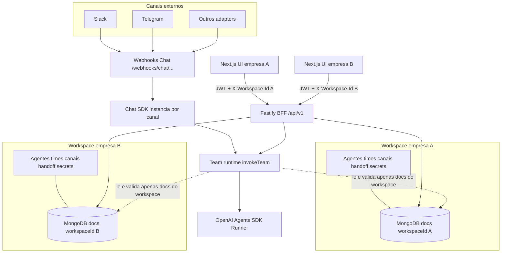

# Team Agents AI Crafter — Wiki de arquitetura

**Propósito:** mapa mental único do produto multi-tenant: camadas, fluxos e onde cada peça vive no código.  
**Público:** desenvolvedores e operações que integram ou evoluem a plataforma.

---

## Sumário

- [Visão geral](#visão-geral)
- [Diagrama de alto nível](#diagrama-de-alto-nível-multi-tenant)
- [Glossário](#glossário)
- [Documentação por camada](#documentação-por-camada)
- [Especificações na raiz do repositório](#especificações-na-raiz-do-repositório)

---

## Visão geral

O produto é uma **plataforma SaaS multi-tenant**: cada **empresa** corresponde a um **workspace** com dados e segredos isolados na mesma instância da API e da base de dados. A **individualização** acontece por configuração persistida (agentes, times e grafos, canais Chat SDK, integrações BYOK, regras de handoff) — não por fork de código.

Dois caminhos principais alimentam o **runtime de agentes**:

1. **Aplicação web (Next.js)** — utilizador autenticado com JWT; pedidos REST incluem o workspace ativo via header `X-Workspace-Id`.
2. **Canais externos (Slack, Telegram, …)** — webhooks públicos roteados por `workspaceId` e documento de canal; o Chat SDK encaminha mensagens para **`invokeTeam`** (mesmo motor que `POST /teams/:id/run`).

---

## Diagrama de alto nível (multi-tenant)

O diagrama abaixo mostra **dois tenants** como exemplo; em produção existem N workspaces com o mesmo padrão de isolamento.

**Leitura:** cada empresa **individualiza** o produto através dos seus documentos no MongoDB (e segredos cifrados) para aquele `workspaceId`. O backend **nunca** mistura dados entre workspaces nas rotas tenant-scoped; o **team runtime** resolve time/coordenador e orquestra especialistas como tools no contexto do workspace corrente. Detalhes de isolamento e segredos: [MULTI_TENANT.md](../../docs/MULTI_TENANT.md).

---

## Glossário

| Termo | Significado |
|--------|-------------|
| **Workspace** | Tenant lógico (organização). Identificador usado em APIs e persistência: `workspaceId`. |
| **Membro** | Utilizador associado a um workspace com papel (`owner`, `admin`, `member`). Sem membership válida → `403` nas rotas de negócio. |
| **Canal (Chat SDK)** | Registo persistido que liga uma plataforma externa (Slack, Telegram, …) ao workspace; inclui `config` e segredos cifrados por canal. |
| **Agente** | Definição versionada (instruções, capacidades, handoff) pertencente a um workspace. |
| **Handoff (legado)** | Regras DSL / grafo podem informar UI ou evoluções; **não** é o motor principal da API (especialistas = tools do coordenador). |
| **Team runtime** | `invokeTeam`: carrega time, valida coordenador, expõe especialistas como tools ao coordenador, chama `OpenAIAgentsRuntimeProvider`. |

---

## Documentação por camada

| Documento | Conteúdo |
|-----------|----------|
| [frontend.md](./frontend.md) | Next.js App Router, cliente API, stores e fluxo auth → workspace ativo. |
| [backend-api.md](./backend-api.md) | Fastify, módulos e rotas sob `/api/v1`, autenticação e tenant. |
| [data-layer.md](./data-layer.md) | MongoDB como fonte de verdade, `workspaceId`, cifra de segredos. |
| [chat-sdk.md](./chat-sdk.md) | Webhooks, adapters, estado Redis/memory, ligação ao runtime. |
| [agents-and-handoff.md](./agents-and-handoff.md) | Team runtime, coordenador, tools de especialistas, OpenAI Agents SDK. |

**Contrato de schemas (OpenAI):** ao alterar presets de business tools ou o registo de `internal_action`, seguir a regra do repositório em [`.cursor/rules/openai-tool-json-schema.mdc`](../../.cursor/rules/openai-tool-json-schema.mdc) — object schemas expostos à API devem incluir sempre `properties`.

---

## Especificações na raiz do repositório

Documentação aprofundada que **não** duplicamos aqui — use como referência normativa:

| Ficheiro | Tema |
|----------|------|
| [`backend/src/app/routes.ts`](../../backend/src/app/routes.ts) | Registo canónico de todas as rotas sob `/api/v1` (evita drift com READMEs longos). |
| [MULTI_TENANT.md](../../docs/MULTI_TENANT.md) | Princípios multi-tenant, segredos, APIs de integrações. |
| [BACKEND_STACK.md](../../docs/BACKEND_STACK.md) | Fastify, variáveis de ambiente do BFF. |
| [CHAT_SDK_TEAM_TRIGGER.md](../../docs/CHAT_SDK_TEAM_TRIGGER.md) | URLs de webhook por plataforma, segredos Slack, fluxo de disparo. |
| [HANDOFF_DSL.md](../../docs/HANDOFF_DSL.md) | DSL de regras e evolução PolicyEngine. |
| [ADR-0001-agents-runtime-handoff-deterministico.md](../../docs/ADR-0001-agents-runtime-handoff-deterministico.md) | Decisão arquitetural: handoff no backend, SDK como motor de linguagem. |

---

## Ver também

- [README principal da aplicação web](../README.md) — instalação, variáveis `NEXT_PUBLIC_*`, rotas da UI e contrato REST resumido.
