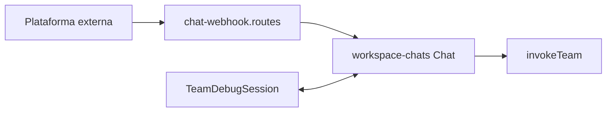

# Chat SDK e canais

**Propósito:** explicar como mensagens externas entram no BFF, como o `Chat` é instanciado por workspace/canal e como isso desemboca no runtime de agentes.  
**Público:** desenvolvedores de integrações e backend.

---

## Sumário

- [Visão geral](#visão-geral)
- [Plataformas suportadas](#plataformas-suportadas)
- [Webhooks e URLs](#webhooks-e-urls)
- [Estado: Redis vs memória](#estado-redis-vs-memória)
- [Fluxo até ao runtime](#fluxo-até-ao-runtime)
- [Ver também](#ver-também)

---

## Visão geral

O produto usa o pacote **`chat`** com adapters **`@chat-adapter/*`** para falar com Slack, Telegram, Discord, Teams, Google Chat, GitHub, Linear, WhatsApp, etc. A fábrica e o binding de eventos estão em [`backend/src/modules/chat-sdk/infra/workspace-chats.ts`](../../backend/src/modules/chat-sdk/infra/workspace-chats.ts).

Cada **canal** persistido no MongoDB (`Channel`) representa uma instância configurada (tokens, IDs de team Slack, modo webhook Telegram, …). Os webhooks **não** usam JWT de utilizador: o encaminhamento identifica **`workspaceId`** e **canal** a partir do path e da configuração.

---

## Plataformas suportadas

Enumeração de plataformas (segmento de URL / nome do adapter): [`backend/src/modules/channels/domain/chat-sdk-platform.ts`](../../backend/src/modules/channels/domain/chat-sdk-platform.ts) — `slack`, `discord`, `teams`, `telegram`, `gchat`, `github`, `linear`, `whatsapp`.

---

## Webhooks e URLs

Registo de rotas: [`backend/src/modules/chat-sdk/interfaces/chat-webhook.routes.ts`](../../backend/src/modules/chat-sdk/interfaces/chat-webhook.routes.ts).

Especificação completa (paths, Slack vs plataformas com `:channelId`, WhatsApp challenge): **[CHAT_SDK_TEAM_TRIGGER.md](../../docs/CHAT_SDK_TEAM_TRIGGER.md)**.

Resumo:

- **Slack** — `POST /api/v1/webhooks/chat/:workspaceId/slack`; resolução do documento `Channel` por `config.slackTeamId` e `team_id` do payload.
- **Outras** — `POST /api/v1/webhooks/chat/:workspaceId/:platform/:channelId` com `channelId` = ObjectId do documento `Channel` no MongoDB.

A UI expõe `webhookUrl` calculada com o host do pedido em `GET /channels` e `GET /channels/:id`.

---

## Estado: Redis vs memória

Em [`workspace-chats.ts`](../../backend/src/modules/chat-sdk/infra/workspace-chats.ts), `createStateAdapter`:

- Se **`REDIS_URL`** estiver definida — `@chat-adapter/state-redis` com prefixo `chat-sdk:{workspaceId}:` (isolamento por tenant no keyspace).
- Caso contrário — `@chat-adapter/state-memory` (adequado a desenvolvimento; não distribuído).

---

## Fluxo até ao runtime

1. Provedor externo chama o webhook.
2. O BFF valida assinatura / parâmetros conforme plataforma (detalhes no doc de triggers).
3. Carrega segredos do canal (cifrados ou fallback env em demo) e constrói `Chat` + adapter.
4. Em menções / threads subscritas, o handler inbound chama **`invokeTeam`** (mesmo motor que `POST /teams/:id/run`) com `TeamInvocation` (`trigger: chat`), após resolver canal → time → coordenador; metadados de canal entram só no contexto do coordenador ([`format-coordinator-user-message`](../../backend/src/modules/team-runtime/application/format-coordinator-user-message.ts)).
5. **Sessão de debug / auditoria (MongoDB)** — O mesmo fio lógico que o console (UUID) é mapeado para um `conversationId` estabelecido: `inbound:<plataforma>:<thread.id>` (com hash se o id exceder 128 caracteres) via [`inbound-conversation-id.ts`](../../backend/src/modules/chat-sdk/infra/inbound-conversation-id.ts). Antes de cada `invokeTeam` carrega-se o histórico em [`team-debug-session.repository.getRecentTurns`](../../backend/src/modules/team-runtime/infra/team-debug-session.repository.ts); após resposta de sucesso, [`appendExchange`](../../backend/src/modules/team-runtime/infra/team-debug-session.repository.ts) regista o par utilizador/assistente, como em `POST /teams/:id/run` com `conversationId`. Isto alimenta `GET /teams/:id/debug-sessions` (lista e abrir turnos) para Telegram e restantes canais do Chat SDK, não só para mensagens da consola.

---

## Ver também

- [AGENTS.md](./AGENTS.md) — diagrama global.
- [agents-and-handoff.md](./agents-and-handoff.md) — team runtime e coordenador.
- [data-layer.md](./data-layer.md) — modelo `Channel` e segredos.
- [CHAT_SDK_TEAM_TRIGGER.md](../../docs/CHAT_SDK_TEAM_TRIGGER.md) — referência operacional completa.
