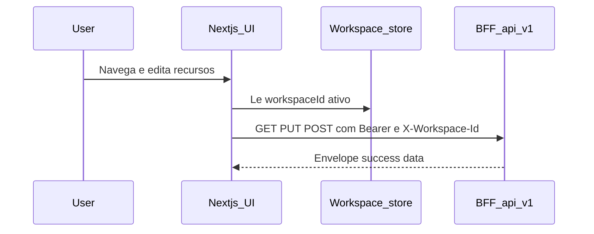

# Camada frontend (Next.js)

**Propósito:** descrever como a UI consome o BFF, propaga o tenant ativo e organiza rotas.  
**Público:** desenvolvedores frontend e full-stack.

---

## Sumário

- [Visão geral](#visão-geral)
- [Estrutura de pastas](#estrutura-de-pastas)
- [Rotas de verticais na UI](#rotas-de-verticais-na-ui)
- [Fluxo de dados](#fluxo-de-dados)
- [Cliente HTTP e tenant](#cliente-http-e-tenant)
- [Limites e garantias](#limites-e-garantias)
- [Ver também](#ver-também)

---

## Visão geral

A aplicação em [`v0-team-ai-crafter/`](../) é **Next.js (App Router)**. Áreas autenticadas vivem sob `app/(app)/` (dashboard, agentes, times, grafos, templates, canais, **agenda**, **CRM**, observabilidade, definições). O utilizador escolhe ou assume um **workspace**; todas as chamadas de negócio ao BFF enviam esse contexto no header **`X-Workspace-Id`**, juntamente com **`Authorization: Bearer`** após login.

A URL base da API vem de `NEXT_PUBLIC_API_URL` (normalmente `http://localhost:3001/api/v1` em desenvolvimento).

---

## Estrutura de pastas

Referência rápida (detalhe completo no [README](../README.md)):

| Área        | Caminho             | Função                                                             |
| ----------- | ------------------- | ------------------------------------------------------------------ |
| Rotas       | `app/(app)/*`       | Superfícies autenticadas por domínio (dashboard, agents, teams, …) |
| Componentes | `components/*`      | UI por domínio + `components/ui` (shadcn)                          |
| API client  | `lib/api/client.ts` | `fetch` com envelope, refresh token, headers de auth e tenant      |
| Estado      | `lib/store/*`       | Ex.: workspace e auth                                              |
| Tipos       | `lib/types/*`       | Alinhamento com contratos expostos pelo BFF                        |

---

## Rotas de verticais na UI

Alguns domínios de negócio expõem **página dedicada** sob `app/(app)/<rota>/` (além do núcleo times/agentes/canais). A lista canónica de entradas do menu lateral está em [`components/layout/app-navigation.tsx`](../components/layout/app-navigation.tsx).

| Rota             | Função (resumo)                     |
| ---------------- | ----------------------------------- |
| `/schedule`      | Agenda (scheduling)                 |
| `/crm`           | CRM — parties/clientes do workspace |
| `/observability` | Observabilidade operacional         |

**Política:** não é obrigatório que cada pack do BFF tenha rota própria no Next; verticais adicionais (care, finance, clinical, …) podem surgir como páginas quando a UI for priorizada — até lá o fluxo típico continua a ser **time + tools + canais** com contratos no BFF. Ao adicionar uma nova rota de produto, atualize este doc e o [README](../README.md) (tabela **Rotas da Aplicação** e árvore `app/(app)/`).

---

## Fluxo de dados

1. **Login / registo** — obtém tokens; o cliente guarda credenciais (padrão usado pelo store de auth).
2. **Seleção de workspace** — o utilizador define o workspace ativo (lista vinda do BFF); o ID é lido pelo cliente em cada pedido tenant-scoped.
3. **Pedidos REST** — `createApiClient` monta headers: `Authorization`, e se `tenant !== false`, `X-Workspace-Id` quando disponível.
4. **401** — tentativa de refresh via `POST /auth/refresh`; em falha, limpa auth.

Fluxo visual (simplificado):

---

## Cliente HTTP e tenant

Implementação: [`lib/api/client.ts`](../lib/api/client.ts).

- **`getBaseUrl()`** — lê `NEXT_PUBLIC_API_URL`, remove barras finais.
- **`request()`** — por omissão `tenant: true`: exige `X-Workspace-Id` quando o store fornece `workspaceId`.
- **Rotas sem tenant** — passar `{ tenant: false }` nos métodos `get`/`post`/`put`/`del` quando aplicável (ex.: auth antes de haver workspace).

Respostas esperadas: envelope `{ success, data, meta }` ou erro estruturado; o cliente lança `ApiError` em falhas HTTP ou envelope inválido.

---

## Limites e garantias

- O **isolamento entre empresas** não é garantido só pelo frontend: o BFF valida membership e filtra por `workspaceId` no servidor.
- Segredos de integração **não** pertencem ao `.env` do browser; configuram-se na UI e persistem cifrados no backend (ver [data-layer.md](./data-layer.md) e [MULTI_TENANT.md](../../docs/MULTI_TENANT.md)).

---

## Ver também

- [AGENTS.md](./AGENTS.md) — índice e diagrama multi-tenant.
- [backend-api.md](./backend-api.md) — rotas e middleware de tenant no BFF.
- [README](../README.md) — variáveis de ambiente e tabela de rotas da aplicação.
